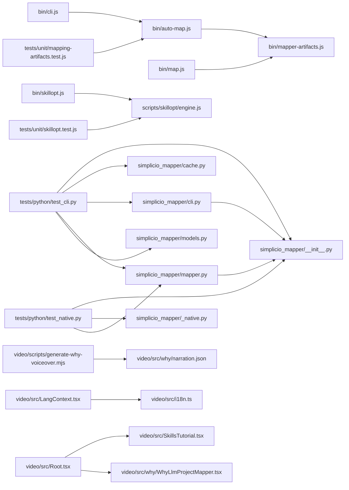

# @wesleysimplicio/llm-project-mapper Architecture Inventory

Generated from `.simplicio` machine-readable artifacts. Statements below are derived from repository structure, imports, symbols and deterministic heuristics.

## Coverage

- Files: 284
- Modules: 17
- Layers: 10
- Symbols: 450
- Relationships: 803
- Tests: 38

## Modules

- `.`: 28 files; layers: asset, config, documentation
- `.agents`: 6 files; layers: documentation, ui
- `.claude`: 7 files; layers: asset
- `.codex`: 5 files; layers: asset, config
- `.github`: 18 files; layers: asset, code, documentation, ui
- `.skills`: 46 files; layers: asset, documentation, test, ui
- `.specs`: 16 files; layers: documentation, test
- `bin`: 7 files; layers: code, entrypoint
- `docs`: 15 files; layers: documentation, entrypoint
- `docs-site`: 39 files; layers: asset, code, config, documentation
- `presentation`: 2 files; layers: documentation
- `rust`: 4 files; layers: code, config, documentation
- `scripts`: 15 files; layers: documentation, script, test
- `simplicio_mapper`: 6 files; layers: code, domain, entrypoint, model
- `tests`: 16 files; layers: documentation, test
- `video`: 45 files; layers: asset, code, config, documentation, entrypoint, ui
- `vscode-extension`: 9 files; layers: asset, code, config, documentation, test

## Layers

- `asset`: 46 files across 8 modules
- `code`: 42 files across 7 modules
- `config`: 13 files across 6 modules
- `documentation`: 140 files across 13 modules
- `domain`: 1 files across 1 modules
- `entrypoint`: 6 files across 4 modules
- `model`: 1 files across 1 modules
- `script`: 15 files across 1 modules
- `test`: 38 files across 5 modules
- `ui`: 11 files across 4 modules

## Dependency Sketch

## Top Symbols

- `sanitize` (function) in `.github/workflows-templates/telemetry-worker.js:30`
- `readSafe` (function) in `bin/auto-map.js:22`
- `exists` (function) in `bin/auto-map.js:30`
- `slugify` (function) in `bin/auto-map.js:34`
- `humanizeName` (function) in `bin/auto-map.js:42`
- `safeTitle` (function) in `bin/auto-map.js:51`
- `commandExists` (function) in `bin/auto-map.js:56`
- `walk` (function) in `bin/auto-map.js:63`
- `collectTextFiles` (function) in `bin/auto-map.js:84`
- `parsePackageJson` (function) in `bin/auto-map.js:94`
- `detectPackageManager` (function) in `bin/auto-map.js:102`
- `detectUrls` (function) in `bin/auto-map.js:109`
- `firstDefined` (function) in `bin/auto-map.js:154`
- `inferInstallCommand` (function) in `bin/auto-map.js:161`
- `inferCommands` (function) in `bin/auto-map.js:172`
- `quote` (function) in `bin/auto-map.js:175`
- `inferDatabase` (function) in `bin/auto-map.js:235`
- `inferAuthFlow` (function) in `bin/auto-map.js:245`
- `inferTeam` (function) in `bin/auto-map.js:256`
- `inferDomain` (function) in `bin/auto-map.js:272`
- `getGitRemote` (function) in `bin/auto-map.js:284`
- `collectTopDirectories` (function) in `bin/auto-map.js:298`
- `collectEntities` (function) in `bin/auto-map.js:309`
- `collectFeatures` (function) in `bin/auto-map.js:333`
- `collectTodos` (function) in `bin/auto-map.js:350`
- `collectIntegrations` (function) in `bin/auto-map.js:366`
- `inferSystemType` (function) in `bin/auto-map.js:387`
- `renderVision` (function) in `bin/auto-map.js:394`
- `renderDomain` (function) in `bin/auto-map.js:450`
- `renderPersonas` (function) in `bin/auto-map.js:519`
- `renderDesign` (function) in `bin/auto-map.js:556`
- `renderPatterns` (function) in `bin/auto-map.js:619`
- `renderBacklog` (function) in `bin/auto-map.js:652`
- `renderSprint` (function) in `bin/auto-map.js:668`
- `renderSprintTask` (function) in `bin/auto-map.js:702`
- `renderLocalSetup` (function) in `bin/auto-map.js:730`
- `renderArchitectureMap` (function) in `bin/auto-map.js:792`
- `renderDomainMap` (function) in `bin/auto-map.js:853`
- `renderFeatureNotes` (function) in `bin/auto-map.js:898`
- `renderEvidenceReadme` (function) in `bin/auto-map.js:922`
