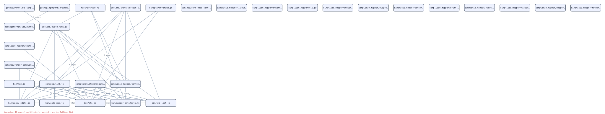

# Call Graph

Edges are deterministic or heuristic. Review `confidence` before using a relationship as proof.

## Call Graph Diagram

```mermaid
flowchart TB
  github_workflows_templates_telemetry_worker_js[".github/workflows-templates/telemetry-worker.js"]
  bin_apply_edits_js["bin/apply-edits.js"]
  bin_auto_map_js["bin/auto-map.js"]
  bin_cli_js["bin/cli.js"]
  bin_map_js["bin/map.js"]
  bin_mapper_artifacts_js["bin/mapper-artifacts.js"]
  bin_skillopt_js["bin/skillopt.js"]
  packaging_npm_bin_simplicio_mapper_js["packaging/npm/bin/simplicio-mapper.js"]
  packaging_npm_lib_python_shim_js["packaging/npm/lib/python-shim.js"]
  rust_src_lib_rs["rust/src/lib.rs"]
  scripts_build_hamt_py["scripts/build_hamt.py"]
  scripts_check_version_sync_js["scripts/check-version-sync.js"]
  scripts_coverage_js["scripts/coverage.js"]
  scripts_lint_js["scripts/lint.js"]
  scripts_render_simplicio_comment_js["scripts/render-simplicio-comment.js"]
  scripts_skillopt_engine_js["scripts/skillopt/engine.js"]
  scripts_sync_docs_site_mjs["scripts/sync-docs-site.mjs"]
  simplicio_mapper___init___py["simplicio_mapper/__init__.py"]
  simplicio_mapper_business_py["simplicio_mapper/business.py"]
  simplicio_mapper_cache_py["simplicio_mapper/cache.py"]
  simplicio_mapper_cli_py["simplicio_mapper/cli.py"]
  simplicio_mapper_context_cache_py["simplicio_mapper/context_cache.py"]
  simplicio_mapper_context_pack_py["simplicio_mapper/context_pack.py"]
  simplicio_mapper_diagrams_py["simplicio_mapper/diagrams.py"]
  simplicio_mapper_docsync_py["simplicio_mapper/docsync.py"]
  simplicio_mapper_drift_py["simplicio_mapper/drift.py"]
  simplicio_mapper_flows_py["simplicio_mapper/flows.py"]
  simplicio_mapper_history_py["simplicio_mapper/history.py"]
  simplicio_mapper_mapper_py["simplicio_mapper/mapper.py"]
  simplicio_mapper_mechanical_edit_py["simplicio_mapper/mechanical_edit.py"]
  github_workflows_templates_telemetry_worker_js --> simplicio_mapper_context_cache_py
  bin_apply_edits_js --> bin_auto_map_js
  bin_apply_edits_js -->|2 edges| bin_cli_js
  bin_apply_edits_js --> bin_map_js
  bin_apply_edits_js -->|2 edges| bin_skillopt_js
  bin_apply_edits_js --> scripts_skillopt_engine_js
  bin_apply_edits_js --> simplicio_mapper_context_cache_py
  bin_auto_map_js -->|5 edges| bin_cli_js
  bin_auto_map_js -->|6 edges| bin_mapper_artifacts_js
  bin_auto_map_js --> scripts_lint_js
  bin_auto_map_js --> simplicio_mapper_context_cache_py
  bin_cli_js --> bin_apply_edits_js
  bin_cli_js -->|6 edges| bin_auto_map_js
  bin_cli_js --> bin_map_js
  bin_cli_js -->|2 edges| bin_mapper_artifacts_js
  bin_cli_js -->|2 edges| bin_skillopt_js
  bin_cli_js --> scripts_lint_js
  bin_cli_js --> simplicio_mapper_cache_py
  bin_cli_js -->|2 edges| simplicio_mapper_context_cache_py
  bin_map_js --> bin_apply_edits_js
  bin_map_js -->|2 edges| bin_cli_js
  bin_map_js -->|2 edges| bin_mapper_artifacts_js
  bin_map_js -->|2 edges| bin_skillopt_js
  bin_map_js --> scripts_lint_js
  bin_map_js --> scripts_render_simplicio_comment_js
  bin_mapper_artifacts_js -->|5 edges| bin_auto_map_js
  bin_mapper_artifacts_js -->|4 edges| bin_cli_js
  bin_mapper_artifacts_js --> scripts_lint_js
  bin_mapper_artifacts_js --> scripts_skillopt_engine_js
  bin_mapper_artifacts_js -->|2 edges| simplicio_mapper_context_cache_py
  bin_skillopt_js -->|2 edges| bin_apply_edits_js
  bin_skillopt_js -->|3 edges| bin_cli_js
  bin_skillopt_js -->|2 edges| bin_map_js
  bin_skillopt_js --> scripts_lint_js
  bin_skillopt_js -->|2 edges| scripts_skillopt_engine_js
  packaging_npm_bin_simplicio_mapper_js -->|2 edges| packaging_npm_lib_python_shim_js
  rust_src_lib_rs --> bin_mapper_artifacts_js
  rust_src_lib_rs --> scripts_build_hamt_py
  rust_src_lib_rs --> simplicio_mapper_context_cache_py
  scripts_build_hamt_py --> bin_apply_edits_js
  scripts_build_hamt_py --> bin_auto_map_js
  scripts_build_hamt_py -->|2 edges| bin_cli_js
  scripts_build_hamt_py --> bin_mapper_artifacts_js
  scripts_build_hamt_py --> bin_skillopt_js
  scripts_build_hamt_py --> simplicio_mapper_context_cache_py
  scripts_check_version_sync_js --> bin_apply_edits_js
  scripts_check_version_sync_js -->|2 edges| bin_cli_js
  scripts_check_version_sync_js --> bin_skillopt_js
  scripts_check_version_sync_js --> scripts_lint_js
  scripts_check_version_sync_js --> simplicio_mapper_context_cache_py
  scripts_coverage_js --> bin_cli_js
  scripts_coverage_js --> scripts_lint_js
  scripts_lint_js --> bin_apply_edits_js
  scripts_lint_js --> bin_auto_map_js
  scripts_lint_js -->|3 edges| bin_cli_js
  scripts_lint_js --> bin_mapper_artifacts_js
  scripts_lint_js --> bin_skillopt_js
  scripts_render_simplicio_comment_js --> bin_apply_edits_js
  scripts_render_simplicio_comment_js --> bin_cli_js
  scripts_render_simplicio_comment_js --> bin_map_js
  %% truncated: 22 node(s) and 82 edge(s) omitted above max_nodes/max_edges — see the full list below
```

Full list (diagram truncated)

- .github/workflows-templates/telemetry-worker.js (`.github/workflows-templates/telemetry-worker.js`)
- bin/apply-edits.js (`bin/apply-edits.js`)
- bin/auto-map.js (`bin/auto-map.js`)
- bin/cli.js (`bin/cli.js`)
- bin/map.js (`bin/map.js`)
- bin/mapper-artifacts.js (`bin/mapper-artifacts.js`)
- bin/skillopt.js (`bin/skillopt.js`)
- packaging/npm/bin/simplicio-mapper.js (`packaging/npm/bin/simplicio-mapper.js`)
- packaging/npm/lib/python-shim.js (`packaging/npm/lib/python-shim.js`)
- rust/src/lib.rs (`rust/src/lib.rs`)
- scripts/build_hamt.py (`scripts/build_hamt.py`)
- scripts/check-version-sync.js (`scripts/check-version-sync.js`)
- scripts/coverage.js (`scripts/coverage.js`)
- scripts/lint.js (`scripts/lint.js`)
- scripts/render-simplicio-comment.js (`scripts/render-simplicio-comment.js`)
- scripts/skillopt/engine.js (`scripts/skillopt/engine.js`)
- scripts/sync-docs-site.mjs (`scripts/sync-docs-site.mjs`)
- simplicio_mapper/__init__.py (`simplicio_mapper/__init__.py`)
- simplicio_mapper/business.py (`simplicio_mapper/business.py`)
- simplicio_mapper/cache.py (`simplicio_mapper/cache.py`)
- simplicio_mapper/cli.py (`simplicio_mapper/cli.py`)
- simplicio_mapper/context_cache.py (`simplicio_mapper/context_cache.py`)
- simplicio_mapper/context_pack.py (`simplicio_mapper/context_pack.py`)
- simplicio_mapper/diagrams.py (`simplicio_mapper/diagrams.py`)
- simplicio_mapper/docsync.py (`simplicio_mapper/docsync.py`)
- simplicio_mapper/drift.py (`simplicio_mapper/drift.py`)
- simplicio_mapper/flows.py (`simplicio_mapper/flows.py`)
- simplicio_mapper/history.py (`simplicio_mapper/history.py`)
- simplicio_mapper/mapper.py (`simplicio_mapper/mapper.py`)
- simplicio_mapper/mechanical_edit.py (`simplicio_mapper/mechanical_edit.py`)
- simplicio_mapper/models.py (`simplicio_mapper/models.py`)
- simplicio_mapper/query.py (`simplicio_mapper/query.py`)
- simplicio_mapper/survey.py (`simplicio_mapper/survey.py`)
- tests/e2e/build-hamt-catalog.spec.ts (`tests/e2e/build-hamt-catalog.spec.ts`)
- tests/e2e/cli.spec.ts (`tests/e2e/cli.spec.ts`)
- tests/e2e/flowchart.spec.ts (`tests/e2e/flowchart.spec.ts`)
- tests/e2e/skillopt.spec.ts (`tests/e2e/skillopt.spec.ts`)
- tests/e2e/tier-languages.spec.ts (`tests/e2e/tier-languages.spec.ts`)
- tests/e2e/two-tier-mapper.spec.ts (`tests/e2e/two-tier-mapper.spec.ts`)
- tests/fixtures/mech-edit-host/sample.py (`tests/fixtures/mech-edit-host/sample.py`)
- tests/fixtures/mech-edit-host/sample.ts (`tests/fixtures/mech-edit-host/sample.ts`)
- tests/fixtures/parity-host/src/greet.js (`tests/fixtures/parity-host/src/greet.js`)
- tests/fixtures/parity-host/src/index.js (`tests/fixtures/parity-host/src/index.js`)
- tests/fixtures/parity-host/tests/server-fixture.js (`tests/fixtures/parity-host/tests/server-fixture.js`)
- tests/python/test_business.py (`tests/python/test_business.py`)
- tests/python/test_cli.py (`tests/python/test_cli.py`)
- tests/python/test_cli_coverage.py (`tests/python/test_cli_coverage.py`)
- tests/python/test_survey.py (`tests/python/test_survey.py`)
- tests/unit/apply-edits.test.js (`tests/unit/apply-edits.test.js`)
- tests/unit/cli-install.test.js (`tests/unit/cli-install.test.js`)
- tests/unit/mapping-artifacts.test.js (`tests/unit/mapping-artifacts.test.js`)
- video/scripts/generate-why-voiceover.mjs (`video/scripts/generate-why-voiceover.mjs`)

## Relationships

- calls: `.github/workflows-templates/telemetry-worker.js:31` -> `.github/workflows-templates/telemetry-worker.js::sanitize` (confidence 0.58)
- calls: `.github/workflows-templates/telemetry-worker.js:58` -> `simplicio_mapper/context_cache.py::get` (confidence 0.58)
- calls: `.github/workflows-templates/telemetry-worker.js:58` -> `tests/python/test_cli.py::get` (confidence 0.58)
- calls: `bin/apply-edits.js:58` -> `bin/apply-edits.js::EditError` (confidence 0.58)
- calls: `bin/apply-edits.js:362` -> `bin/apply-edits.js::applyEdits` (confidence 0.58)
- calls: `bin/apply-edits.js:95` -> `bin/apply-edits.js::computePlan` (confidence 0.58)
- calls: `bin/apply-edits.js:156` -> `bin/apply-edits.js::countOccurrences` (confidence 0.58)
- calls: `bin/apply-edits.js:339` -> `bin/apply-edits.js::main` (confidence 0.58)
- calls: `bin/apply-edits.js:309` -> `bin/apply-edits.js::parseArgs` (confidence 0.58)
- calls: `bin/apply-edits.js:72` -> `bin/apply-edits.js::readIfExists` (confidence 0.58)
- calls: `bin/apply-edits.js:168` -> `bin/apply-edits.js::replaceN` (confidence 0.58)
- calls: `bin/apply-edits.js:81` -> `bin/apply-edits.js::requireString` (confidence 0.58)
- calls: `bin/apply-edits.js:93` -> `bin/apply-edits.js::resolveSafe` (confidence 0.58)
- calls: `bin/apply-edits.js:119` -> `bin/auto-map.js::exists` (confidence 0.58)
- calls: `bin/apply-edits.js:119` -> `bin/cli.js::exists` (confidence 0.58)
- calls: `bin/apply-edits.js:339` -> `bin/cli.js::main` (confidence 0.58)
- calls: `bin/apply-edits.js:309` -> `bin/map.js::parseArgs` (confidence 0.58)
- calls: `bin/apply-edits.js:339` -> `bin/skillopt.js::main` (confidence 0.58)
- calls: `bin/apply-edits.js:309` -> `bin/skillopt.js::parseArgs` (confidence 0.58)
- calls: `bin/apply-edits.js:252` -> `scripts/skillopt/engine.js::applyEdits` (confidence 0.58)
- calls: `bin/apply-edits.js:272` -> `simplicio_mapper/context_cache.py::get` (confidence 0.58)
- calls: `bin/apply-edits.js:272` -> `tests/python/test_cli.py::get` (confidence 0.58)
- calls: `bin/apply-edits.js:342` -> `tests/unit/apply-edits.test.js::write` (confidence 0.58)
- calls: `bin/auto-map.js:1240` -> `bin/auto-map.js::autoMapProject` (confidence 0.58)
- calls: `bin/auto-map.js:1180` -> `bin/auto-map.js::buildProfile` (confidence 0.58)
- calls: `bin/auto-map.js:1173` -> `bin/auto-map.js::collectCorpus` (confidence 0.58)
- calls: `bin/auto-map.js:310` -> `bin/auto-map.js::collectEntities` (confidence 0.58)
- calls: `bin/auto-map.js:334` -> `bin/auto-map.js::collectFeatures` (confidence 0.58)
- calls: `bin/auto-map.js:367` -> `bin/auto-map.js::collectIntegrations` (confidence 0.58)
- calls: `bin/auto-map.js:85` -> `bin/auto-map.js::collectTextFiles` (confidence 0.58)
- calls: `bin/auto-map.js:351` -> `bin/auto-map.js::collectTodos` (confidence 0.58)
- calls: `bin/auto-map.js:299` -> `bin/auto-map.js::collectTopDirectories` (confidence 0.58)
- calls: `bin/auto-map.js:57` -> `bin/auto-map.js::commandExists` (confidence 0.58)
- calls: `bin/auto-map.js:1109` -> `bin/auto-map.js::defaultPersonas` (confidence 0.58)
- calls: `bin/auto-map.js:103` -> `bin/auto-map.js::detectPackageManager` (confidence 0.58)
- calls: `bin/auto-map.js:110` -> `bin/auto-map.js::detectUrls` (confidence 0.58)
- calls: `bin/auto-map.js:31` -> `bin/auto-map.js::exists` (confidence 0.58)
- calls: `bin/auto-map.js:155` -> `bin/auto-map.js::firstDefined` (confidence 0.58)
- calls: `bin/auto-map.js:285` -> `bin/auto-map.js::getGitRemote` (confidence 0.58)
- calls: `bin/auto-map.js:43` -> `bin/auto-map.js::humanizeName` (confidence 0.58)
- calls: `bin/auto-map.js:246` -> `bin/auto-map.js::inferAuthFlow` (confidence 0.58)
- calls: `bin/auto-map.js:173` -> `bin/auto-map.js::inferCommands` (confidence 0.58)
- calls: `bin/auto-map.js:236` -> `bin/auto-map.js::inferDatabase` (confidence 0.58)
- calls: `bin/auto-map.js:273` -> `bin/auto-map.js::inferDomain` (confidence 0.58)
- calls: `bin/auto-map.js:162` -> `bin/auto-map.js::inferInstallCommand` (confidence 0.58)
- calls: `bin/auto-map.js:388` -> `bin/auto-map.js::inferSystemType` (confidence 0.58)
- calls: `bin/auto-map.js:257` -> `bin/auto-map.js::inferTeam` (confidence 0.58)
- calls: `bin/auto-map.js:1148` -> `bin/auto-map.js::looksStarterManaged` (confidence 0.58)
- calls: `bin/auto-map.js:95` -> `bin/auto-map.js::parsePackageJson` (confidence 0.58)
- calls: `bin/auto-map.js:225` -> `bin/auto-map.js::quote` (confidence 0.58)
- calls: `bin/auto-map.js:23` -> `bin/auto-map.js::readSafe` (confidence 0.58)
- calls: `bin/auto-map.js:793` -> `bin/auto-map.js::renderArchitectureMap` (confidence 0.58)
- calls: `bin/auto-map.js:653` -> `bin/auto-map.js::renderBacklog` (confidence 0.58)
- calls: `bin/auto-map.js:557` -> `bin/auto-map.js::renderDesign` (confidence 0.58)
- calls: `bin/auto-map.js:451` -> `bin/auto-map.js::renderDomain` (confidence 0.58)
- calls: `bin/auto-map.js:854` -> `bin/auto-map.js::renderDomainMap` (confidence 0.58)
- calls: `bin/auto-map.js:1094` -> `bin/auto-map.js::renderE2EReadme` (confidence 0.58)
- calls: `bin/auto-map.js:923` -> `bin/auto-map.js::renderEvidenceReadme` (confidence 0.58)
- calls: `bin/auto-map.js:899` -> `bin/auto-map.js::renderFeatureNotes` (confidence 0.58)
- calls: `bin/auto-map.js:992` -> `bin/auto-map.js::renderInspection` (confidence 0.58)
- calls: `bin/auto-map.js:731` -> `bin/auto-map.js::renderLocalSetup` (confidence 0.58)
- calls: `bin/auto-map.js:620` -> `bin/auto-map.js::renderPatterns` (confidence 0.58)
- calls: `bin/auto-map.js:520` -> `bin/auto-map.js::renderPersonas` (confidence 0.58)
- calls: `bin/auto-map.js:669` -> `bin/auto-map.js::renderSprint` (confidence 0.58)
- calls: `bin/auto-map.js:703` -> `bin/auto-map.js::renderSprintTask` (confidence 0.58)
- calls: `bin/auto-map.js:1029` -> `bin/auto-map.js::renderStartScript` (confidence 0.58)
- calls: `bin/auto-map.js:1068` -> `bin/auto-map.js::renderTestScript` (confidence 0.58)
- calls: `bin/auto-map.js:952` -> `bin/auto-map.js::renderTroubleshooting` (confidence 0.58)
- calls: `bin/auto-map.js:395` -> `bin/auto-map.js::renderVision` (confidence 0.58)
- calls: `bin/auto-map.js:52` -> `bin/auto-map.js::safeTitle` (confidence 0.58)
- calls: `bin/auto-map.js:35` -> `bin/auto-map.js::slugify` (confidence 0.58)
- calls: `bin/auto-map.js:1161` -> `bin/auto-map.js::substituteTokensInFile` (confidence 0.58)
- calls: `bin/auto-map.js:64` -> `bin/auto-map.js::walk` (confidence 0.58)
- calls: `bin/auto-map.js:1152` -> `bin/auto-map.js::writeIfSafe` (confidence 0.58)
- calls: `bin/auto-map.js:57` -> `bin/cli.js::commandExists` (confidence 0.58)
- calls: `bin/auto-map.js:31` -> `bin/cli.js::exists` (confidence 0.58)
- calls: `bin/auto-map.js:1315` -> `bin/cli.js::log` (confidence 0.58)
- calls: `bin/auto-map.js:23` -> `bin/cli.js::readSafe` (confidence 0.58)
- calls: `bin/auto-map.js:64` -> `bin/cli.js::walk` (confidence 0.58)
- calls: `bin/auto-map.js:310` -> `bin/mapper-artifacts.js::collectEntities` (confidence 0.58)
- calls: `bin/auto-map.js:85` -> `bin/mapper-artifacts.js::collectTextFiles` (confidence 0.58)
- calls: `bin/auto-map.js:23` -> `bin/mapper-artifacts.js::readSafe` (confidence 0.58)
- calls: `bin/auto-map.js:64` -> `bin/mapper-artifacts.js::walk` (confidence 0.58)
- calls: `bin/auto-map.js:1316` -> `bin/mapper-artifacts.js::writeMappingArtifacts` (confidence 0.58)
- imports: `bin/auto-map.js` -> `bin/mapper-artifacts.js` (confidence 0.82)
- calls: `bin/auto-map.js:1315` -> `scripts/lint.js::log` (confidence 0.58)
- calls: `bin/auto-map.js:321` -> `simplicio_mapper/context_cache.py::get` (confidence 0.58)
- calls: `bin/auto-map.js:321` -> `tests/python/test_cli.py::get` (confidence 0.58)
- calls: `bin/cli.js:1245` -> `bin/apply-edits.js::main` (confidence 0.58)
- calls: `bin/cli.js:1295` -> `bin/auto-map.js::autoMapProject` (confidence 0.58)
- calls: `bin/cli.js:545` -> `bin/auto-map.js::commandExists` (confidence 0.58)
- calls: `bin/cli.js:606` -> `bin/auto-map.js::exists` (confidence 0.58)
- calls: `bin/cli.js:542` -> `bin/auto-map.js::readSafe` (confidence 0.58)
- calls: `bin/cli.js:1031` -> `bin/auto-map.js::walk` (confidence 0.58)
- imports: `bin/cli.js` -> `bin/auto-map.js` (confidence 0.82)
- calls: `bin/cli.js:811` -> `bin/cli.js::ask` (confidence 0.58)
- calls: `bin/cli.js:682` -> `bin/cli.js::buildProjectsList` (confidence 0.58)
- calls: `bin/cli.js:1124` -> `bin/cli.js::chooseCli` (confidence 0.58)
- calls: `bin/cli.js:1132` -> `bin/cli.js::commandExists` (confidence 0.58)
- calls: `bin/cli.js:756` -> `bin/cli.js::copyTemplate` (confidence 0.58)
- calls: `bin/cli.js:1142` -> `bin/cli.js::copyToClipboard` (confidence 0.58)
- calls: `bin/cli.js:693` -> `bin/cli.js::detectExistingInstructionFiles` (confidence 0.58)
- calls: `bin/cli.js:717` -> `bin/cli.js::detectPreservedUserFiles` (confidence 0.58)
- calls: `bin/cli.js:632` -> `bin/cli.js::detectProductNameIn` (confidence 0.58)
- calls: `bin/cli.js:676` -> `bin/cli.js::detectProjectMode` (confidence 0.58)
- calls: `bin/cli.js:552` -> `bin/cli.js::detectStack` (confidence 0.58)
- calls: `bin/cli.js:603` -> `bin/cli.js::detectStackIn` (confidence 0.58)
- calls: `bin/cli.js:927` -> `bin/cli.js::dispatch` (confidence 0.58)
- calls: `bin/cli.js:438` -> `bin/cli.js::err` (confidence 0.58)
- calls: `bin/cli.js:1157` -> `bin/cli.js::execHandoff` (confidence 0.58)
- calls: `bin/cli.js:606` -> `bin/cli.js::exists` (confidence 0.58)
- calls: `bin/cli.js:553` -> `bin/cli.js::existsHere` (confidence 0.58)
- calls: `bin/cli.js:799` -> `bin/cli.js::handleGitignore` (confidence 0.58)
- calls: `bin/cli.js:893` -> `bin/cli.js::handleRuntimeScaffold` (confidence 0.58)
- calls: `bin/cli.js:390` -> `bin/cli.js::handoff` (confidence 0.58)
- calls: `bin/cli.js:591` -> `bin/cli.js::hasWorkspaceSignal` (confidence 0.58)
- calls: `bin/cli.js:562` -> `bin/cli.js::listCwd` (confidence 0.58)
- calls: `bin/cli.js:654` -> `bin/cli.js::listMonorepoDirs` (confidence 0.58)
- calls: `bin/cli.js:758` -> `bin/cli.js::loadProductPaths` (confidence 0.58)
- calls: `bin/cli.js:334` -> `bin/cli.js::log` (confidence 0.48)
- calls: `bin/cli.js:1006` -> `bin/cli.js::looksBinary` (confidence 0.58)
- calls: `bin/cli.js:705` -> `bin/cli.js::looksStarterManagedContent` (confidence 0.58)
- calls: `bin/cli.js:1245` -> `bin/cli.js::main` (confidence 0.58)
- calls: `bin/cli.js:425` -> `bin/cli.js::maybeNotifyUpdate` (confidence 0.58)
- calls: `bin/cli.js:488` -> `bin/cli.js::maybeSendTelemetry` (confidence 0.58)
- calls: `bin/cli.js:477` -> `bin/cli.js::persistTelemetryChoice` (confidence 0.58)
- calls: `bin/cli.js:338` -> `bin/cli.js::printHelp` (confidence 0.48)
- calls: `bin/cli.js:607` -> `bin/cli.js::read` (confidence 0.58)
- calls: `bin/cli.js:914` -> `bin/cli.js::readCatalog` (confidence 0.58)
- calls: `bin/cli.js:709` -> `bin/cli.js::readExistingMeta` (confidence 0.58)
- calls: `bin/cli.js:542` -> `bin/cli.js::readSafe` (confidence 0.58)
- calls: `bin/cli.js:1166` -> `bin/cli.js::requireCmd` (confidence 0.58)
- calls: `bin/cli.js:919` -> `bin/cli.js::snapshot` (confidence 0.58)
- calls: `bin/cli.js:1053` -> `bin/cli.js::stamp` (confidence 0.58)
- calls: `bin/cli.js:1043` -> `bin/cli.js::substitute` (confidence 0.58)
- calls: `bin/cli.js:1011` -> `bin/cli.js::substituteInFile` (confidence 0.58)
- calls: `bin/cli.js:461` -> `bin/cli.js::telemetryEnabled` (confidence 0.58)
- calls: `bin/cli.js:828` -> `bin/cli.js::upsertGitignore` (confidence 0.58)
- calls: `bin/cli.js:1031` -> `bin/cli.js::walk` (confidence 0.58)
- calls: `bin/cli.js:878` -> `bin/cli.js::writeFileIfMissing` (confidence 0.58)
- calls: `bin/cli.js:1073` -> `bin/cli.js::writeMeta` (confidence 0.58)
- calls: `bin/cli.js:338` -> `bin/map.js::printHelp` (confidence 0.48)
- calls: `bin/cli.js:542` -> `bin/mapper-artifacts.js::readSafe` (confidence 0.58)
- calls: `bin/cli.js:1031` -> `bin/mapper-artifacts.js::walk` (confidence 0.58)
- calls: `bin/cli.js:1245` -> `bin/skillopt.js::main` (confidence 0.58)
- calls: `bin/cli.js:338` -> `bin/skillopt.js::printHelp` (confidence 0.48)
- calls: `bin/cli.js:334` -> `scripts/lint.js::log` (confidence 0.48)
- calls: `bin/cli.js:1308` -> `simplicio_mapper/cache.py::close` (confidence 0.58)
- calls: `bin/cli.js:443` -> `simplicio_mapper/context_cache.py::get` (confidence 0.58)
- calls: `bin/cli.js:357` -> `simplicio_mapper/context_cache.py::keys` (confidence 0.48)
- calls: `bin/cli.js:443` -> `tests/python/test_cli.py::get` (confidence 0.58)
- calls: `bin/cli.js:607` -> `tests/unit/apply-edits.test.js::read` (confidence 0.58)
- calls: `bin/cli.js:538` -> `tests/unit/apply-edits.test.js::write` (confidence 0.58)
- calls: `bin/hook-runner.js:17` -> `bin/hook-runner.js::runHook` (confidence 0.58)
- calls: `bin/map.js:37` -> `bin/apply-edits.js::parseArgs` (confidence 0.58)
- calls: `bin/map.js:17` -> `bin/cli.js::log` (confidence 0.58)
- calls: `bin/map.js:16` -> `bin/cli.js::printHelp` (confidence 0.58)
- calls: `bin/map.js:37` -> `bin/map.js::parseArgs` (confidence 0.58)
- calls: `bin/map.js:16` -> `bin/map.js::printHelp` (confidence 0.58)
- calls: `bin/map.js:8` -> `bin/map.js::readJsonSafe` (confidence 0.58)
- calls: `bin/map.js:91` -> `bin/map.js::runMapCli` (confidence 0.58)
- calls: `bin/map.js:73` -> `bin/map.js::runOnce` (confidence 0.58)
- calls: `bin/map.js:82` -> `bin/mapper-artifacts.js::writeMappingArtifacts` (confidence 0.58)
- imports: `bin/map.js` -> `bin/mapper-artifacts.js` (confidence 0.82)
- calls: `bin/map.js:37` -> `bin/skillopt.js::parseArgs` (confidence 0.58)
- calls: `bin/map.js:16` -> `bin/skillopt.js::printHelp` (confidence 0.58)
- calls: `bin/map.js:17` -> `scripts/lint.js::log` (confidence 0.58)
- calls: `bin/map.js:8` -> `scripts/render-simplicio-comment.js::readJsonSafe` (confidence 0.58)
- calls: `bin/mapper-artifacts.js:307` -> `bin/auto-map.js::collectEntities` (confidence 0.58)
- calls: `bin/mapper-artifacts.js:191` -> `bin/auto-map.js::collectTextFiles` (confidence 0.58)
- calls: `bin/mapper-artifacts.js:69` -> `bin/auto-map.js::exists` (confidence 0.58)
- calls: `bin/mapper-artifacts.js:61` -> `bin/auto-map.js::readSafe` (confidence 0.58)
- calls: `bin/mapper-artifacts.js:77` -> `bin/auto-map.js::walk` (confidence 0.58)
- calls: `bin/mapper-artifacts.js:69` -> `bin/cli.js::exists` (confidence 0.58)
- calls: `bin/mapper-artifacts.js:918` -> `bin/cli.js::log` (confidence 0.58)
- calls: `bin/mapper-artifacts.js:61` -> `bin/cli.js::readSafe` (confidence 0.58)
- calls: `bin/mapper-artifacts.js:77` -> `bin/cli.js::walk` (confidence 0.58)
- calls: `bin/mapper-artifacts.js:684` -> `bin/mapper-artifacts.js::addEdge` (confidence 0.58)
- calls: `bin/mapper-artifacts.js:733` -> `bin/mapper-artifacts.js::buildArchitectureInventory` (confidence 0.58)
- calls: `bin/mapper-artifacts.js:821` -> `bin/mapper-artifacts.js::buildArtifacts` (confidence 0.58)
- calls: `bin/mapper-artifacts.js:663` -> `bin/mapper-artifacts.js::buildCallGraph` (confidence 0.58)
- calls: `bin/mapper-artifacts.js:386` -> `bin/mapper-artifacts.js::buildFileInventory` (confidence 0.58)
- calls: `bin/mapper-artifacts.js:418` -> `bin/mapper-artifacts.js::buildPrecedentItems` (confidence 0.58)
- calls: `bin/mapper-artifacts.js:592` -> `bin/mapper-artifacts.js::buildSymbolIndex` (confidence 0.58)
- calls: `bin/mapper-artifacts.js:647` -> `bin/mapper-artifacts.js::callExpressions` (confidence 0.58)
- calls: `bin/mapper-artifacts.js:615` -> `bin/mapper-artifacts.js::candidateImportTargets` (confidence 0.58)
- calls: `bin/mapper-artifacts.js:323` -> `bin/mapper-artifacts.js::collectArchitectureSignals` (confidence 0.58)
- calls: `bin/mapper-artifacts.js:307` -> `bin/mapper-artifacts.js::collectEntities` (confidence 0.58)
- calls: `bin/mapper-artifacts.js:191` -> `bin/mapper-artifacts.js::collectTextFiles` (confidence 0.58)
- calls: `bin/mapper-artifacts.js:363` -> `bin/mapper-artifacts.js::detectChangedFiles` (confidence 0.58)
- calls: `bin/mapper-artifacts.js:411` -> `bin/mapper-artifacts.js::extractSnippet` (confidence 0.58)
- calls: `bin/mapper-artifacts.js:173` -> `bin/mapper-artifacts.js::gitStatusMap` (confidence 0.58)
- calls: `bin/mapper-artifacts.js:344` -> `bin/mapper-artifacts.js::groupModules` (confidence 0.58)
- calls: `bin/mapper-artifacts.js:287` -> `bin/mapper-artifacts.js::importanceFor` (confidence 0.58)
- calls: `bin/mapper-artifacts.js:96` -> `bin/mapper-artifacts.js::languageFor` (confidence 0.58)
- calls: `bin/mapper-artifacts.js:558` -> `bin/mapper-artifacts.js::layersForFile` (confidence 0.58)
- calls: `bin/mapper-artifacts.js:452` -> `bin/mapper-artifacts.js::lineNumber` (confidence 0.58)
- calls: `bin/mapper-artifacts.js:377` -> `bin/mapper-artifacts.js::loadPreviousMap` (confidence 0.58)
- calls: `bin/mapper-artifacts.js:588` -> `bin/mapper-artifacts.js::moduleNameForPath` (confidence 0.58)
- calls: `bin/mapper-artifacts.js:656` -> `bin/mapper-artifacts.js::nearestSymbol` (confidence 0.58)
- calls: `bin/mapper-artifacts.js:57` -> `bin/mapper-artifacts.js::normalizeRel` (confidence 0.58)
- calls: `bin/mapper-artifacts.js:206` -> `bin/mapper-artifacts.js::parseImports` (confidence 0.58)
- calls: `bin/mapper-artifacts.js:165` -> `bin/mapper-artifacts.js::parseJsonSafe` (confidence 0.58)
- calls: `bin/mapper-artifacts.js:250` -> `bin/mapper-artifacts.js::parseSymbols` (confidence 0.58)
- calls: `bin/mapper-artifacts.js:61` -> `bin/mapper-artifacts.js::readSafe` (confidence 0.58)
- calls: `bin/mapper-artifacts.js:575` -> `bin/mapper-artifacts.js::responsibilityForFile` (confidence 0.58)
- calls: `bin/mapper-artifacts.js:266` -> `bin/mapper-artifacts.js::rolesFor` (confidence 0.58)
- calls: `bin/mapper-artifacts.js:73` -> `bin/mapper-artifacts.js::sha256` (confidence 0.58)
- calls: `bin/mapper-artifacts.js:610` -> `bin/mapper-artifacts.js::stripKnownExt` (confidence 0.58)
- calls: `bin/mapper-artifacts.js:456` -> `bin/mapper-artifacts.js::symbolDefinitionsForFile` (confidence 0.58)
- calls: `bin/mapper-artifacts.js:299` -> `bin/mapper-artifacts.js::tokenWords` (confidence 0.58)
- calls: `bin/mapper-artifacts.js:77` -> `bin/mapper-artifacts.js::walk` (confidence 0.58)
- calls: `bin/mapper-artifacts.js:891` -> `bin/mapper-artifacts.js::writeJsonStable` (confidence 0.58)
- calls: `bin/mapper-artifacts.js:898` -> `bin/mapper-artifacts.js::writeMappingArtifacts` (confidence 0.58)
- calls: `bin/mapper-artifacts.js:918` -> `scripts/lint.js::log` (confidence 0.58)
- calls: `bin/mapper-artifacts.js:619` -> `scripts/skillopt/engine.js::normalize` (confidence 0.58)
- calls: `bin/mapper-artifacts.js:311` -> `simplicio_mapper/context_cache.py::get` (confidence 0.58)
- calls: `bin/mapper-artifacts.js:857` -> `simplicio_mapper/context_cache.py::keys` (confidence 0.58)
- calls: `bin/mapper-artifacts.js:311` -> `tests/python/test_cli.py::get` (confidence 0.58)
- calls: `bin/skillopt.js:109` -> `bin/apply-edits.js::main` (confidence 0.58)
- calls: `bin/skillopt.js:52` -> `bin/apply-edits.js::parseArgs` (confidence 0.58)
- calls: `bin/skillopt.js:22` -> `bin/cli.js::log` (confidence 0.58)
- calls: `bin/skillopt.js:109` -> `bin/cli.js::main` (confidence 0.58)
- calls: `bin/skillopt.js:21` -> `bin/cli.js::printHelp` (confidence 0.58)
- calls: `bin/skillopt.js:52` -> `bin/map.js::parseArgs` (confidence 0.58)
- calls: `bin/skillopt.js:21` -> `bin/map.js::printHelp` (confidence 0.58)
- calls: `bin/skillopt.js:82` -> `bin/skillopt.js::countAcceptedEdits` (confidence 0.58)
- calls: `bin/skillopt.js:109` -> `bin/skillopt.js::main` (confidence 0.58)
- calls: `bin/skillopt.js:52` -> `bin/skillopt.js::parseArgs` (confidence 0.58)
- calls: `bin/skillopt.js:21` -> `bin/skillopt.js::printHelp` (confidence 0.58)
- calls: `bin/skillopt.js:78` -> `bin/skillopt.js::readJson` (confidence 0.58)
- calls: `bin/skillopt.js:88` -> `bin/skillopt.js::writeReceipt` (confidence 0.58)
- calls: `bin/skillopt.js:22` -> `scripts/lint.js::log` (confidence 0.58)
- calls: `bin/skillopt.js:154` -> `scripts/skillopt/engine.js::optimize` (confidence 0.58)
- imports: `bin/skillopt.js` -> `scripts/skillopt/engine.js` (confidence 0.82)
- calls: `bin/skillopt.js:78` -> `tests/unit/mapping-artifacts.test.js::readJson` (confidence 0.58)
- calls: `packaging/npm/bin/simplicio-mapper.js:6` -> `packaging/npm/lib/python-shim.js::ensureAndRun` (confidence 0.48)
- imports: `packaging/npm/bin/simplicio-mapper.js` -> `packaging/npm/lib/python-shim.js` (confidence 0.82)
- calls: `packaging/npm/lib/python-shim.js:105` -> `packaging/npm/lib/python-shim.js::ensureAndRun` (confidence 0.58)
- calls: `packaging/npm/lib/python-shim.js:93` -> `packaging/npm/lib/python-shim.js::ensureInstalled` (confidence 0.58)
- calls: `packaging/npm/lib/python-shim.js:85` -> `packaging/npm/lib/python-shim.js::ensureVirtualenv` (confidence 0.58)
- calls: `packaging/npm/lib/python-shim.js:65` -> `packaging/npm/lib/python-shim.js::entrypointCandidates` (confidence 0.58)
- calls: `packaging/npm/lib/python-shim.js:35` -> `packaging/npm/lib/python-shim.js::findPython` (confidence 0.58)
- calls: `packaging/npm/lib/python-shim.js:27` -> `packaging/npm/lib/python-shim.js::probe` (confidence 0.58)
- calls: `packaging/npm/lib/python-shim.js:76` -> `packaging/npm/lib/python-shim.js::resolveEntrypoint` (confidence 0.58)
- calls: `packaging/npm/lib/python-shim.js:8` -> `packaging/npm/lib/python-shim.js::run` (confidence 0.58)
- calls: `packaging/npm/lib/python-shim.js:51` -> `packaging/npm/lib/python-shim.js::sanitizePackageName` (confidence 0.58)
- calls: `packaging/npm/lib/python-shim.js:59` -> `packaging/npm/lib/python-shim.js::venvPython` (confidence 0.58)
- calls: `packaging/npm/lib/python-shim.js:55` -> `packaging/npm/lib/python-shim.js::venvRoot` (confidence 0.58)
- calls: `packaging/npm/lib/python-shim.js:8` -> `video/scripts/generate-why-voiceover.mjs::run` (confidence 0.58)
- calls: `rust/src/lib.rs:16` -> `bin/mapper-artifacts.js::sha256` (confidence 0.48)
- calls: `rust/src/lib.rs:21` -> `scripts/build_hamt.py::finalize` (confidence 0.48)
- calls: `rust/src/lib.rs:41` -> `simplicio_mapper/context_cache.py::get` (confidence 0.48)
- calls: `rust/src/lib.rs:41` -> `tests/python/test_cli.py::get` (confidence 0.48)
- calls: `scripts/build_hamt.py:261` -> `bin/apply-edits.js::main` (confidence 0.58)
- calls: `scripts/build_hamt.py:267` -> `bin/auto-map.js::exists` (confidence 0.58)
- calls: `scripts/build_hamt.py:267` -> `bin/cli.js::exists` (confidence 0.58)
- calls: `scripts/build_hamt.py:261` -> `bin/cli.js::main` (confidence 0.58)
- calls: `scripts/build_hamt.py:245` -> `bin/mapper-artifacts.js::sha256` (confidence 0.58)
- calls: `scripts/build_hamt.py:261` -> `bin/skillopt.js::main` (confidence 0.58)
- calls: `scripts/build_hamt.py:198` -> `scripts/build_hamt.py::Leaf` (confidence 0.58)
- calls: `scripts/build_hamt.py:160` -> `scripts/build_hamt.py::blank_node` (confidence 0.58)
- calls: `scripts/build_hamt.py:214` -> `scripts/build_hamt.py::build_catalog` (confidence 0.58)
- calls: `scripts/build_hamt.py:52` -> `scripts/build_hamt.py::canonical_json` (confidence 0.58)
- calls: `scripts/build_hamt.py:113` -> `scripts/build_hamt.py::finalize` (confidence 0.58)
- calls: `scripts/build_hamt.py:40` -> `scripts/build_hamt.py::hash_hex` (confidence 0.58)
- calls: `scripts/build_hamt.py:79` -> `scripts/build_hamt.py::heading_anchor` (confidence 0.58)
- calls: `scripts/build_hamt.py:164` -> `scripts/build_hamt.py::insert_leaf` (confidence 0.58)
- calls: `scripts/build_hamt.py:84` -> `scripts/build_hamt.py::parse_agent_terms` (confidence 0.58)
- calls: `scripts/build_hamt.py:104` -> `scripts/build_hamt.py::parse_agents` (confidence 0.58)
- calls: `scripts/build_hamt.py:253` -> `scripts/build_hamt.py::parse_args` (confidence 0.58)
- calls: `scripts/build_hamt.py:56` -> `scripts/build_hamt.py::parse_scalar` (confidence 0.58)
- calls: `scripts/build_hamt.py:44` -> `scripts/build_hamt.py::slot_path` (confidence 0.58)
- calls: `scripts/build_hamt.py:35` -> `scripts/build_hamt.py::yool_hash` (confidence 0.58)
- calls: `scripts/build_hamt.py:118` -> `simplicio_mapper/context_cache.py::get` (confidence 0.58)
- calls: `scripts/build_hamt.py:118` -> `tests/python/test_cli.py::get` (confidence 0.58)
- calls: `scripts/check-version-sync.js:42` -> `bin/apply-edits.js::main` (confidence 0.58)
- calls: `scripts/check-version-sync.js:51` -> `bin/cli.js::log` (confidence 0.58)
- calls: `scripts/check-version-sync.js:42` -> `bin/cli.js::main` (confidence 0.58)
- calls: `scripts/check-version-sync.js:42` -> `bin/skillopt.js::main` (confidence 0.58)
- calls: `scripts/check-version-sync.js:33` -> `scripts/check-version-sync.js::readInitVersion` (confidence 0.58)
- calls: `scripts/check-version-sync.js:19` -> `scripts/check-version-sync.js::readPackageVersion` (confidence 0.58)
- calls: `scripts/check-version-sync.js:24` -> `scripts/check-version-sync.js::readPyprojectVersion` (confidence 0.58)
- calls: `scripts/check-version-sync.js:51` -> `scripts/lint.js::log` (confidence 0.58)
- calls: `scripts/check-version-sync.js:51` -> `simplicio_mapper/context_cache.py::keys` (confidence 0.58)
- calls: `scripts/coverage.js:62` -> `bin/cli.js::log` (confidence 0.58)
- calls: `scripts/coverage.js:54` -> `scripts/coverage.js::metric` (confidence 0.58)
- calls: `scripts/coverage.js:62` -> `scripts/lint.js::log` (confidence 0.58)
- calls: `scripts/coverage.js:34` -> `tests/unit/apply-edits.test.js::write` (confidence 0.48)
- calls: `scripts/lint.js:168` -> `bin/apply-edits.js::main` (confidence 0.58)
- calls: `scripts/lint.js:50` -> `bin/auto-map.js::walk` (confidence 0.58)
- calls: `scripts/lint.js:40` -> `bin/cli.js::log` (confidence 0.58)
- calls: `scripts/lint.js:168` -> `bin/cli.js::main` (confidence 0.58)
- calls: `scripts/lint.js:50` -> `bin/cli.js::walk` (confidence 0.58)
- calls: `scripts/lint.js:50` -> `bin/mapper-artifacts.js::walk` (confidence 0.58)
- calls: `scripts/lint.js:168` -> `bin/skillopt.js::main` (confidence 0.58)
- calls: `scripts/lint.js:61` -> `scripts/lint.js::lintJavaScript` (confidence 0.58)
- calls: `scripts/lint.js:78` -> `scripts/lint.js::lintJson` (confidence 0.58)
- calls: `scripts/lint.js:145` -> `scripts/lint.js::lintMarkdown` (confidence 0.58)
- calls: `scripts/lint.js:118` -> `scripts/lint.js::lintPowerShell` (confidence 0.58)
