# Flow Inventory

Auto-generated from the call graph. A flow starts at a detected entry point (CLI command, `main`, bin/ script) and follows `calls` edges to the effects it produces (filesystem, network, subprocess, cache/DB).

> Steps and effects are **observed** from static analysis (evidence `path:line`). Dynamic dispatch (e.g. a string-keyed command table) is not followed by the call graph and may under-report steps — see `confidence`.

## Coverage

- Entry points detected: 8
- Entry points with a derived flow: 5
- Total flows: 8

## `bin.apply.edits`

- Kind: cli-command
- Entry: `bin/apply-edits.js` (`bin/apply-edits.js::EditError`)
- Confidence: observed
- Layers touched: entrypoint

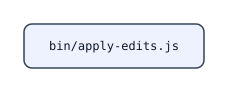

#### Steps

Full list

- bin/apply-edits.js (`bin/apply-edits.js`)

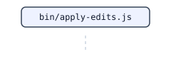

#### Call Sequence

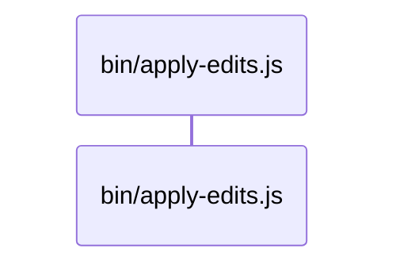

Full list

1. bin/apply-edits.js

**Effects**

| Type | Evidence |
| --- | --- |
| reads filesystem | `bin/apply-edits.js:74` |
| reads filesystem | `bin/apply-edits.js:348` |
| writes filesystem | `bin/apply-edits.js:292` |

## `bin.build.hamt.catalog`

- Kind: cli-command
- Entry: `bin/build-hamt-catalog`
- Confidence: heuristic
- Layers touched: entrypoint

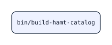

#### Steps

Full list

- bin/build-hamt-catalog (`bin/build-hamt-catalog`)

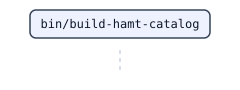

#### Call Sequence

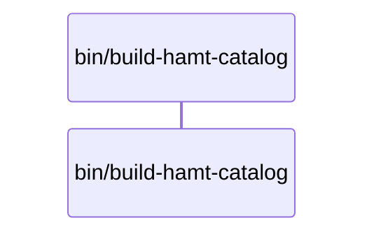

Full list

1. bin/build-hamt-catalog

_No observable effects detected for this flow._

## `bin.cli`

- Kind: cli-command
- Entry: `bin/cli.js` (`bin/cli.js::printHelp`)
- Confidence: observed
- Layers touched: code, entrypoint

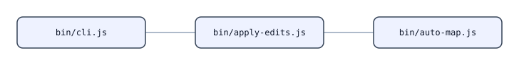

#### Steps

Full list

- bin/apply-edits.js (`bin/apply-edits.js`)
- bin/auto-map.js (`bin/auto-map.js`)
- bin/cli.js (`bin/cli.js`)

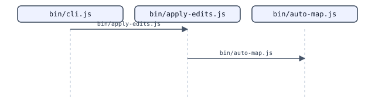

#### Call Sequence

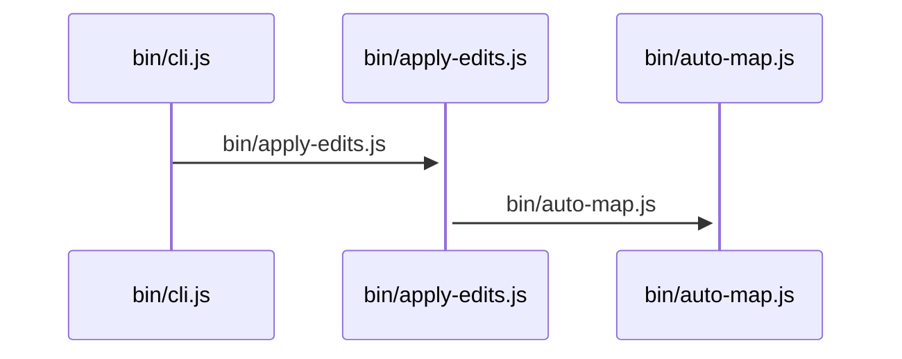

Full list

1. bin/cli.js
2. bin/apply-edits.js
3. bin/auto-map.js

**Effects**

| Type | Evidence |
| --- | --- |
| reads filesystem | `bin/apply-edits.js:74` |
| reads filesystem | `bin/apply-edits.js:348` |
| reads filesystem | `bin/auto-map.js:25` |
| reads filesystem | `bin/cli.js:434` |
| reads filesystem | `bin/cli.js:466` |
| reads filesystem | `bin/cli.js:542` |
| reads filesystem | `bin/cli.js:749` |
| reads filesystem | `bin/cli.js:1014` |
| writes filesystem | `bin/apply-edits.js:292` |
| writes filesystem | `bin/auto-map.js:1157` |
| writes filesystem | `bin/auto-map.js:1169` |
| writes filesystem | `bin/cli.js:453` |
| writes filesystem | `bin/cli.js:481` |
| writes filesystem | `bin/cli.js:829` |
| writes filesystem | `bin/cli.js:839` |
| writes filesystem | `bin/cli.js:848` |
| writes filesystem | `bin/cli.js:889` |
| writes filesystem | `bin/cli.js:1027` |
| writes filesystem | `bin/cli.js:1114` |

## `bin.skillopt`

- Kind: cli-command
- Entry: `bin/skillopt.js` (`bin/skillopt.js::printHelp`)
- Confidence: observed
- Layers touched: code, entrypoint

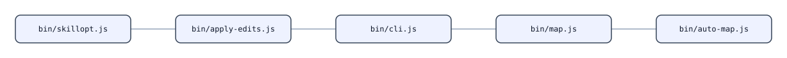

#### Steps

Full list

- bin/apply-edits.js (`bin/apply-edits.js`)
- bin/auto-map.js (`bin/auto-map.js`)
- bin/cli.js (`bin/cli.js`)
- bin/map.js (`bin/map.js`)
- bin/skillopt.js (`bin/skillopt.js`)

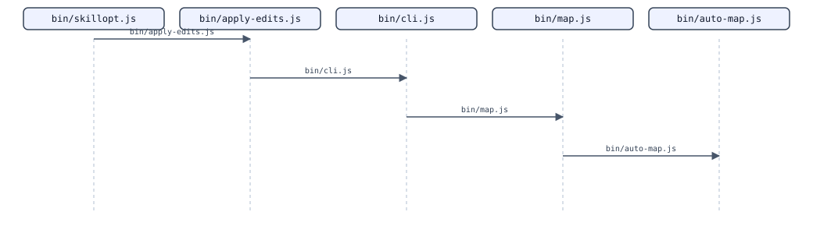

#### Call Sequence

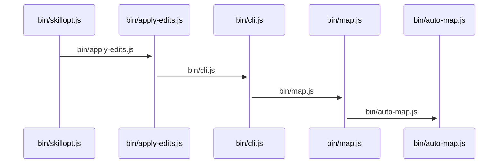

Full list

1. bin/skillopt.js
2. bin/apply-edits.js
3. bin/cli.js
4. bin/map.js
5. bin/auto-map.js

**Effects**

| Type | Evidence |
| --- | --- |
| reads filesystem | `bin/apply-edits.js:74` |
| reads filesystem | `bin/apply-edits.js:348` |
| reads filesystem | `bin/auto-map.js:25` |
| reads filesystem | `bin/cli.js:434` |
| reads filesystem | `bin/cli.js:466` |
| reads filesystem | `bin/cli.js:542` |
| reads filesystem | `bin/cli.js:749` |
| reads filesystem | `bin/cli.js:1014` |
| reads filesystem | `bin/map.js:10` |
| reads filesystem | `bin/skillopt.js:79` |
| reads filesystem | `bin/skillopt.js:145` |
| writes filesystem | `bin/apply-edits.js:292` |
| writes filesystem | `bin/auto-map.js:1157` |
| writes filesystem | `bin/auto-map.js:1169` |
| writes filesystem | `bin/cli.js:453` |
| writes filesystem | `bin/cli.js:481` |
| writes filesystem | `bin/cli.js:829` |
| writes filesystem | `bin/cli.js:839` |
| writes filesystem | `bin/cli.js:848` |
| writes filesystem | `bin/cli.js:889` |
| writes filesystem | `bin/cli.js:1027` |
| writes filesystem | `bin/cli.js:1114` |
| writes filesystem | `bin/skillopt.js:105` |
| writes filesystem | `bin/skillopt.js:163` |
| writes filesystem | `bin/skillopt.js:167` |

## `docs.api.examples.cli`

- Kind: entrypoint
- Entry: `docs/api-examples/cli.md`
- Confidence: heuristic
- Layers touched: documentation, entrypoint

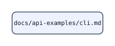

#### Steps

Full list

- docs/api-examples/cli.md (`docs/api-examples/cli.md`)

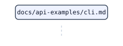

#### Call Sequence

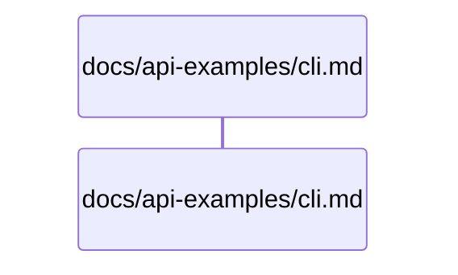

Full list

1. docs/api-examples/cli.md

_No observable effects detected for this flow._

## `simplicio.mapper.cli`

- Kind: entrypoint
- Entry: `simplicio_mapper/cli.py` (`simplicio_mapper/cli.py::_read_json_safe`)
- Confidence: observed
- Layers touched: code, entrypoint

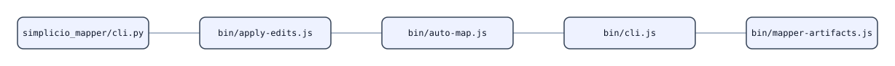

#### Steps

Full list

- bin/apply-edits.js (`bin/apply-edits.js`)
- bin/auto-map.js (`bin/auto-map.js`)
- bin/cli.js (`bin/cli.js`)
- bin/mapper-artifacts.js (`bin/mapper-artifacts.js`)
- simplicio_mapper/cli.py (`simplicio_mapper/cli.py`)

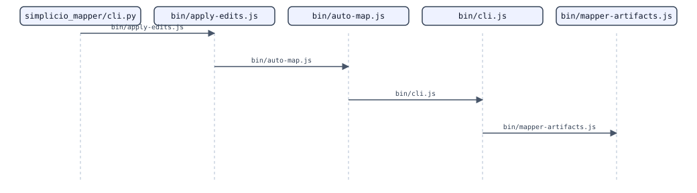

#### Call Sequence

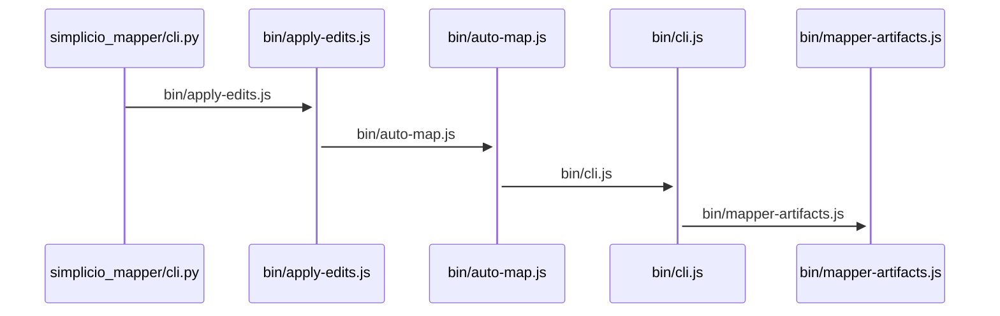

Full list

1. simplicio_mapper/cli.py
2. bin/apply-edits.js
3. bin/auto-map.js
4. bin/cli.js
5. bin/mapper-artifacts.js

**Effects**

| Type | Evidence |
| --- | --- |
| reads filesystem | `bin/apply-edits.js:74` |
| reads filesystem | `bin/apply-edits.js:348` |
| reads filesystem | `bin/auto-map.js:25` |
| reads filesystem | `bin/cli.js:434` |
| reads filesystem | `bin/cli.js:466` |
| reads filesystem | `bin/cli.js:542` |
| reads filesystem | `bin/cli.js:749` |
| reads filesystem | `bin/cli.js:1014` |
| reads filesystem | `bin/mapper-artifacts.js:63` |
| reads filesystem | `bin/mapper-artifacts.js:380` |
| reads filesystem | `simplicio_mapper/cli.py:721` |
| reads filesystem | `simplicio_mapper/cli.py:1018` |
| reads filesystem | `simplicio_mapper/cli.py:1107` |
| reads filesystem | `simplicio_mapper/cli.py:1141` |
| reads filesystem | `simplicio_mapper/cli.py:1466` |
| writes filesystem | `bin/apply-edits.js:292` |
| writes filesystem | `bin/auto-map.js:1157` |
| writes filesystem | `bin/auto-map.js:1169` |
| writes filesystem | `bin/cli.js:453` |
| writes filesystem | `bin/cli.js:481` |
| writes filesystem | `bin/cli.js:829` |
| writes filesystem | `bin/cli.js:839` |
| writes filesystem | `bin/cli.js:848` |
| writes filesystem | `bin/cli.js:889` |
| writes filesystem | `bin/cli.js:1027` |
| writes filesystem | `bin/cli.js:1114` |
| writes filesystem | `bin/mapper-artifacts.js:894` |
| writes filesystem | `simplicio_mapper/cli.py:32` |
| writes filesystem | `simplicio_mapper/cli.py:393` |
| writes filesystem | `simplicio_mapper/cli.py:507` |
| writes filesystem | `simplicio_mapper/cli.py:508` |
| writes filesystem | `simplicio_mapper/cli.py:1690` |
| writes filesystem | `simplicio_mapper/cli.py:1692` |
| writes filesystem | `simplicio_mapper/cli.py:1722` |
| writes filesystem | `simplicio_mapper/cli.py:1723` |
| writes filesystem | `simplicio_mapper/cli.py:1724` |
| writes filesystem | `simplicio_mapper/cli.py:1730` |
| writes filesystem | `simplicio_mapper/cli.py:1732` |
| writes filesystem | `simplicio_mapper/cli.py:1735` |
| writes filesystem | `simplicio_mapper/cli.py:1818` |
| writes filesystem | `simplicio_mapper/cli.py:1819` |
| writes filesystem | `simplicio_mapper/cli.py:1820` |
| writes filesystem | `simplicio_mapper/cli.py:1825` |
| writes filesystem | `simplicio_mapper/cli.py:1827` |
| writes filesystem | `simplicio_mapper/cli.py:1830` |
| writes filesystem | `simplicio_mapper/cli.py:1856` |
| writes filesystem | `simplicio_mapper/cli.py:1858` |
| writes filesystem | `simplicio_mapper/cli.py:1864` |
| writes filesystem | `simplicio_mapper/cli.py:1891` |
| writes filesystem | `simplicio_mapper/cli.py:1892` |
| writes filesystem | `simplicio_mapper/cli.py:1893` |
| writes filesystem | `simplicio_mapper/cli.py:1898` |
| writes filesystem | `simplicio_mapper/cli.py:1900` |
| writes filesystem | `simplicio_mapper/cli.py:2439` |
| spawns subprocess | `simplicio_mapper/cli.py:426` |
| spawns subprocess | `simplicio_mapper/cli.py:435` |
| spawns subprocess | `simplicio_mapper/cli.py:442` |
| spawns subprocess | `simplicio_mapper/cli.py:457` |
| spawns subprocess | `simplicio_mapper/cli.py:1999` |
| spawns subprocess | `simplicio_mapper/cli.py:2004` |

## `tests.fixtures.parity.host.src.index`

- Kind: entrypoint
- Entry: `tests/fixtures/parity-host/src/index.js` (`tests/fixtures/parity-host/src/index.js::startServer`)
- Confidence: observed
- Layers touched: code, entrypoint, test

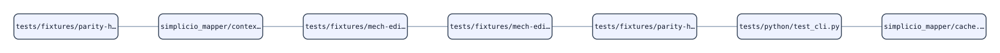

#### Steps

Full list

- simplicio_mapper/cache.py (`simplicio_mapper/cache.py`)
- simplicio_mapper/context_cache.py (`simplicio_mapper/context_cache.py`)
- tests/fixtures/mech-edit-host/sample.py (`tests/fixtures/mech-edit-host/sample.py`)
- tests/fixtures/mech-edit-host/sample.ts (`tests/fixtures/mech-edit-host/sample.ts`)
- tests/fixtures/parity-host/src/greet.js (`tests/fixtures/parity-host/src/greet.js`)
- tests/fixtures/parity-host/src/index.js (`tests/fixtures/parity-host/src/index.js`)
- tests/python/test_cli.py (`tests/python/test_cli.py`)

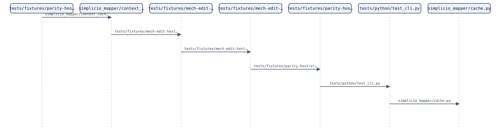

#### Call Sequence

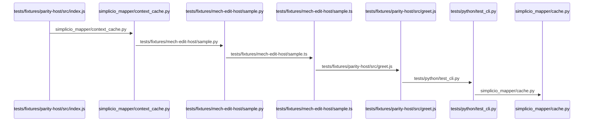

Full list

1. tests/fixtures/parity-host/src/index.js
2. simplicio_mapper/context_cache.py
3. tests/fixtures/mech-edit-host/sample.py
4. tests/fixtures/mech-edit-host/sample.ts
5. tests/fixtures/parity-host/src/greet.js
6. tests/python/test_cli.py
7. simplicio_mapper/cache.py

**Effects**

| Type | Evidence |
| --- | --- |
| touches cache/DB | `simplicio_mapper/cache.py:9` |
| touches cache/DB | `simplicio_mapper/cache.py:12` |
| touches cache/DB | `simplicio_mapper/cache.py:27` |
| touches cache/DB | `tests/python/test_cli.py:24` |
| touches cache/DB | `tests/python/test_cli.py:53` |
| touches cache/DB | `tests/python/test_cli.py:56` |
| touches cache/DB | `tests/python/test_cli.py:686` |
| writes filesystem | `simplicio_mapper/context_cache.py:81` |
| writes filesystem | `simplicio_mapper/context_cache.py:82` |
| spawns subprocess | `tests/python/test_cli.py:265` |
| spawns subprocess | `tests/python/test_cli.py:888` |
| spawns subprocess | `tests/python/test_cli.py:889` |
| spawns subprocess | `tests/python/test_cli.py:890` |
| spawns subprocess | `tests/python/test_cli.py:893` |
| spawns subprocess | `tests/python/test_cli.py:894` |

## `video.src.index`

- Kind: entrypoint
- Entry: `video/src/index.ts`
- Confidence: heuristic
- Layers touched: entrypoint

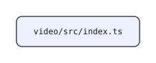

#### Steps

Full list

- video/src/index.ts (`video/src/index.ts`)

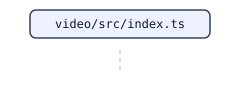

#### Call Sequence

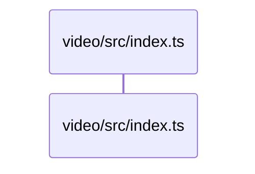

Full list

1. video/src/index.ts

_No observable effects detected for this flow._
