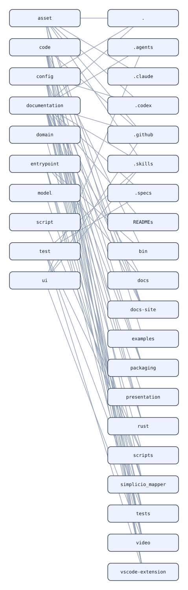

# Architecture Layers

#### Layers -> Modules

```mermaid
flowchart LR
  module["."]
  module_agents[".agents"]
  module_claude[".claude"]
  module_codex[".codex"]
  module_github[".github"]
  module_skills[".skills"]
  module_specs[".specs"]
  module_READMEs["READMEs"]
  layer_asset["asset"]
  module_bin["bin"]
  layer_code["code"]
  layer_config["config"]
  module_docs["docs"]
  module_docs_site["docs-site"]
  layer_documentation["documentation"]
  layer_domain["domain"]
  layer_entrypoint["entrypoint"]
  module_examples["examples"]
  layer_model["model"]
  module_packaging["packaging"]
  module_presentation["presentation"]
  module_rust["rust"]
  layer_script["script"]
  module_scripts["scripts"]
  module_simplicio_mapper["simplicio_mapper"]
  layer_test["test"]
  module_tests["tests"]
  layer_ui["ui"]
  module_video["video"]
  module_vscode_extension["vscode-extension"]
  layer_asset --> module
  layer_asset --> module_claude
  layer_asset --> module_codex
  layer_asset --> module_github
  layer_asset --> module_skills
  layer_asset --> module_docs_site
  layer_asset --> module_examples
  layer_asset --> module_video
  layer_asset --> module_vscode_extension
  layer_code --> module_github
  layer_code --> module_bin
  layer_code --> module_docs_site
  layer_code --> module_packaging
  layer_code --> module_rust
  layer_code --> module_simplicio_mapper
  layer_code --> module_video
  layer_code --> module_vscode_extension
  layer_config --> module
  layer_config --> module_codex
  layer_config --> module_docs_site
  layer_config --> module_packaging
  layer_config --> module_rust
  layer_config --> module_tests
  layer_config --> module_video
  layer_config --> module_vscode_extension
  layer_documentation --> module
  layer_documentation --> module_agents
  layer_documentation --> module_github
  layer_documentation --> module_skills
  layer_documentation --> module_specs
  layer_documentation --> module_READMEs
  layer_documentation --> module_docs
  layer_documentation --> module_docs_site
  layer_documentation --> module_packaging
  layer_documentation --> module_presentation
  layer_documentation --> module_rust
  layer_documentation --> module_scripts
  layer_documentation --> module_tests
  layer_documentation --> module_video
  layer_documentation --> module_vscode_extension
  layer_domain --> module_simplicio_mapper
  layer_entrypoint --> module_bin
  layer_entrypoint --> module_docs
  layer_entrypoint --> module_simplicio_mapper
  layer_entrypoint --> module_tests
  layer_entrypoint --> module_video
  layer_model --> module_simplicio_mapper
  layer_script --> module_scripts
  layer_test --> module_skills
  layer_test --> module_specs
  layer_test --> module_scripts
  layer_test --> module_tests
  layer_test --> module_vscode_extension
  layer_ui --> module_agents
  layer_ui --> module_github
  layer_ui --> module_skills
  layer_ui --> module_video
```

Full list

- . (`module:.`)
- .agents (`module:.agents`)
- .claude (`module:.claude`)
- .codex (`module:.codex`)
- .github (`module:.github`)
- .skills (`module:.skills`)
- .specs (`module:.specs`)
- READMEs (`module:READMEs`)
- asset (`layer:asset`)
- bin (`module:bin`)
- code (`layer:code`)
- config (`layer:config`)
- docs (`module:docs`)
- docs-site (`module:docs-site`)
- documentation (`layer:documentation`)
- domain (`layer:domain`)
- entrypoint (`layer:entrypoint`)
- examples (`module:examples`)
- model (`layer:model`)
- packaging (`module:packaging`)
- presentation (`module:presentation`)
- rust (`module:rust`)
- script (`layer:script`)
- scripts (`module:scripts`)
- simplicio_mapper (`module:simplicio_mapper`)
- test (`layer:test`)
- tests (`module:tests`)
- ui (`layer:ui`)
- video (`module:video`)
- vscode-extension (`module:vscode-extension`)

## asset

- Files: 59
- Modules: ., .claude, .codex, .github, .skills, docs-site, examples, video, vscode-extension

- `.claude/hooks/post-edit.ps1`
- `.claude/hooks/post-edit.sh`
- `.claude/hooks/pre-commit.ps1`
- `.claude/hooks/pre-commit.sh`
- `.claude/hooks/session-start-skills.ps1`
- `.claude/hooks/session-start-skills.sh`
- `.claude/settings.json`
- `.codex/hooks.json`
- `.codex/hooks/pre-commit.ps1`
- `.codex/hooks/pre-commit.sh`
- `.codex/hooks/session-start-skills.ps1`
- `.gitattributes`
- `.github/CODEOWNERS`
- `.github/workflows-templates/llm-project-mapper-init.yml`
- `.github/workflows/ci.yml`
- `.github/workflows/docs-site.yml`
- `.github/workflows/docs-sync.yml`
- `.github/workflows/dod.yml`
- `.github/workflows/publish-pypi.yml`
- `.github/workflows/python-ci.yml`
- `.github/workflows/python-lint.yml`
- `.github/workflows/scaffold-self-check.yml`
- `.gitignore`
- `.llm-project-mapper.json`
- `.skills/UPSTREAM-LICENSE`
- `.skills/UPSTREAM-LICENSE-superpowers`
- `.skills/skillopt/example.suite.json`
- `LICENSE`
- `action.yml`
- `bootstrap.ps1`
- `bootstrap.sh`
- `docs-site/docs/community/_category_.json`
- `docs-site/docs/concepts/_category_.json`
- `docs-site/docs/guide/_category_.json`
- `docs-site/docs/quickstart/_category_.json`
- `docs-site/docs/reference/_category_.json`
- `docs-site/src/css/custom.css`
- `docs-site/versioned_docs/version-0.2.0/community/_category_.json`
- `docs-site/versioned_docs/version-0.2.0/concepts/_category_.json`
- `docs-site/versioned_docs/version-0.2.0/guide/_category_.json`
- `docs-site/versioned_docs/version-0.2.0/quickstart/_category_.json`
- `docs-site/versioned_docs/version-0.2.0/reference/_category_.json`
- `docs-site/versioned_docs/version-0.7.3/community/_category_.json`
- `docs-site/versioned_docs/version-0.7.3/concepts/_category_.json`
- `docs-site/versioned_docs/version-0.7.3/guide/_category_.json`
- `docs-site/versioned_docs/version-0.7.3/quickstart/_category_.json`
- `docs-site/versioned_docs/version-0.7.3/reference/_category_.json`
- `docs-site/versioned_sidebars/version-0.2.0-sidebars.json`
- `docs-site/versioned_sidebars/version-0.7.3-sidebars.json`
- `docs-site/versions.json`
- `examples/brown-hilbert-addresses.json`
- `package-lock.json`
- `template-manifest.json`
- `video/.gitignore`
- `video/package-lock.json`
- `video/src/why/narration.json`
- `vscode-extension/.gitignore`
- `vscode-extension/LICENSE`
- `vscode-extension/package-lock.json`

## code

- Files: 55
- Modules: .github, bin, docs-site, packaging, rust, simplicio_mapper, video, vscode-extension

- `.github/workflows-templates/telemetry-worker.js`
- `bin/auto-map.js`
- `bin/hook-runner.js`
- `bin/map.js`
- `bin/mapper-artifacts.js`
- `docs-site/sidebars.cjs`
- `packaging/npm/bin/simplicio-mapper.js`
- `packaging/npm/lib/python-shim.js`
- `rust/src/lib.rs`
- `simplicio_mapper/__init__.py`
- `simplicio_mapper/_native.py`
- `simplicio_mapper/business.py`
- `simplicio_mapper/cache.py`
- `simplicio_mapper/context_cache.py`
- `simplicio_mapper/context_pack.py`
- `simplicio_mapper/diagrams.py`
- `simplicio_mapper/docsync.py`
- `simplicio_mapper/drift.py`
- `simplicio_mapper/flows.py`
- `simplicio_mapper/history.py`
- `simplicio_mapper/mapper.py`
- `simplicio_mapper/mechanical_edit.py`
- `simplicio_mapper/query.py`
- `simplicio_mapper/survey.py`
- `video/scripts/generate-why-voiceover.mjs`
- `video/scripts/regression.mjs`
- `video/src/LangContext.tsx`
- `video/src/Root.tsx`
- `video/src/SkillsTutorial.tsx`
- `video/src/i18n.ts`
- `video/src/scenes/BestPractices.tsx`
- `video/src/scenes/Catalog.tsx`
- `video/src/scenes/CommitsSkill.tsx`
- `video/src/scenes/CreateYourOwn.tsx`
- `video/src/scenes/HowToInvoke.tsx`
- `video/src/scenes/Intro.tsx`
- `video/src/scenes/Outro.tsx`
- `video/src/scenes/PlaywrightSkill.tsx`
- `video/src/scenes/WhatAreSkills.tsx`
- `video/src/theme.ts`
- `video/src/why/LangContext.tsx`
- `video/src/why/WhyLlmProjectMapper.tsx`
- `video/src/why/audio.ts`
- `video/src/why/i18n.ts`
- `video/src/why/scenes/Anatomy.tsx`
- `video/src/why/scenes/CTA.tsx`
- `video/src/why/scenes/Hook.tsx`
- `video/src/why/scenes/MultiAgent.tsx`
- `video/src/why/scenes/PainList.tsx`
- `video/src/why/scenes/PainTyping.tsx`
- `video/src/why/scenes/Productivity.tsx`
- `video/src/why/scenes/Reveal.tsx`
- `video/src/why/scenes/SideBySide.tsx`
- `vscode-extension/src/extension.ts`
- `vscode-extension/src/scan.ts`

## config

- Files: 15
- Modules: ., .codex, docs-site, packaging, rust, tests, video, vscode-extension

- `.codex/config.toml`
- `docs-site/docusaurus.config.cjs`
- `docs-site/package.json`
- `package.json`
- `packaging/npm/package.json`
- `playwright.config.ts`
- `pyproject.toml`
- `rust/Cargo.toml`
- `rust/pyproject.toml`
- `tests/fixtures/parity-host/package.json`
- `video/package.json`
- `video/remotion.config.ts`
- `video/tsconfig.json`
- `vscode-extension/package.json`
- `vscode-extension/tsconfig.json`

## documentation

- Files: 177
- Modules: ., .agents, .github, .skills, .specs, READMEs, docs, docs-site, packaging, presentation, rust, scripts, tests, video, vscode-extension

- `.agents/README.md`
- `.agents/_template.agent.md`
- `.agents/architect.agent.md`
- `.agents/ralph-loop.agent.md`
- `.agents/reviewer.agent.md`
- `.agents/tdd.agent.md`
- `.github/ISSUE_TEMPLATE/bug.md`
- `.github/ISSUE_TEMPLATE/feature.md`
- `.github/PULL_REQUEST_TEMPLATE.md`
- `.github/copilot-instructions.md`
- `.github/copilot/agents/_template.agent.md`
- `.github/copilot/agents/architect.agent.md`
- `.github/copilot/agents/ralph-loop.agent.md`
- `.github/copilot/agents/reviewer.agent.md`
- `.github/copilot/agents/tdd.agent.md`
- `.github/workflows-templates/README.md`
- `.skills/NOTICE.md`
- `.skills/README.md`
- `.skills/_template/SKILL.md`
- `.skills/animejs/SKILL.md`
- `.skills/brainstorming/SKILL.md`
- `.skills/brainstorming/visual-companion.md`
- `.skills/caveman/SKILL.md`
- `.skills/contribute-catalog/SKILL.md`
- `.skills/conventional-commits/SKILL.md`
- `.skills/css-animations/SKILL.md`
- `.skills/everything-claude-code/SKILL.md`
- `.skills/gsap/SKILL.md`
- `.skills/hyperframes-cli/SKILL.md`
- `.skills/hyperframes-media/SKILL.md`
- `.skills/hyperframes-registry/SKILL.md`
- `.skills/hyperframes/SKILL.md`
- `.skills/lottie/SKILL.md`
- `.skills/playwright-e2e/SKILL.md`
- `.skills/ralph-loop/SKILL.md`
- `.skills/remotion-to-hyperframes/SKILL.md`
- `.skills/rtk-cli/SKILL.md`
- `.skills/skillopt/SKILL.md`
- `.skills/skillopt/example.skill.md`
- `.skills/subagent-driven-development/SKILL.md`
- `.skills/subagent-driven-development/code-quality-reviewer-prompt.md`
- `.skills/subagent-driven-development/implementer-prompt.md`
- `.skills/subagent-driven-development/spec-reviewer-prompt.md`
- `.skills/systematic-debugging/SKILL.md`
- `.skills/systematic-debugging/condition-based-waiting.md`
- `.skills/systematic-debugging/defense-in-depth.md`
- `.skills/systematic-debugging/root-cause-tracing.md`
- `.skills/tailwind/SKILL.md`
- `.skills/test-driven-development/SKILL.md`
- `.skills/test-driven-development/testing-anti-patterns.md`
- `.skills/three/SKILL.md`
- `.skills/typegpu/SKILL.md`
- `.skills/using-superpowers/SKILL.md`
- `.skills/using-superpowers/references/codex-tools.md`
- `.skills/using-superpowers/references/copilot-tools.md`
- `.skills/verification-before-completion/SKILL.md`
- `.skills/waapi/SKILL.md`
- `.skills/website-to-hyperframes/SKILL.md`
- `.skills/writing-plans/SKILL.md`
- `.specs/README.md`

## domain

- Files: 1
- Modules: simplicio_mapper

- `simplicio_mapper/models.py`

## entrypoint

- Files: 8
- Modules: bin, docs, simplicio_mapper, tests, video

- `bin/apply-edits.js`
- `bin/build-hamt-catalog`
- `bin/cli.js`
- `bin/skillopt.js`
- `docs/api-examples/cli.md`
- `simplicio_mapper/cli.py`
- `tests/fixtures/parity-host/src/index.js`
- `video/src/index.ts`

## model

- Files: 1
- Modules: simplicio_mapper

- `simplicio_mapper/models.py`

## script

- Files: 17
- Modules: scripts

- `scripts/README.md`
- `scripts/build_hamt.py`
- `scripts/check-placeholders.sh`
- `scripts/check-version-sync.js`
- `scripts/coverage.js`
- `scripts/evidence.ps1`
- `scripts/evidence.sh`
- `scripts/lint.js`
- `scripts/render-simplicio-comment.js`
- `scripts/skillopt/engine.js`
- `scripts/start.ps1`
- `scripts/start.sh`
- `scripts/sync-docs-site.mjs`
- `scripts/test.ps1`
- `scripts/test.sh`
- `scripts/update-starter.ps1`
- `scripts/update-starter.sh`

## test

- Files: 70
- Modules: .skills, .specs, scripts, tests, vscode-extension

- `.skills/subagent-driven-development/spec-reviewer-prompt.md`
- `.skills/test-driven-development/SKILL.md`
- `.skills/test-driven-development/testing-anti-patterns.md`
- `.specs/README.md`
- `.specs/architecture/ADR-001-example.md`
- `.specs/architecture/ADR-002-python-rust-hybrid.md`
- `.specs/architecture/ADR-003-two-tier-async-mapper.md`
- `.specs/architecture/ADR-004-template-vs-product-content-manifest.md`
- `.specs/architecture/ADR-template.md`
- `.specs/architecture/DESIGN.md`
- `.specs/architecture/PATTERNS.md`
- `.specs/product/DOMAIN.md`
- `.specs/product/PERSONAS.md`
- `.specs/product/VISION.md`
- `.specs/product/flow-documentation-spec.md`
- `.specs/sprints/BACKLOG.md`
- `.specs/sprints/sprint-01/01-example.task.md`
- `.specs/sprints/sprint-01/SPRINT.md`
- `.specs/sprints/task-template.md`
- `.specs/workflow/CONTRIBUTING.md`
- `.specs/workflow/RELEASE.md`
- `.specs/workflow/WORKFLOW.md`
- `scripts/test.ps1`
- `scripts/test.sh`
- `tests/e2e/README.md`
- `tests/e2e/build-hamt-catalog.spec.ts`
- `tests/e2e/cli.spec.ts`
- `tests/e2e/flowchart.spec.ts`
- `tests/e2e/skillopt.spec.ts`
- `tests/e2e/smoke.spec.ts`
- `tests/e2e/tier-languages.spec.ts`
- `tests/e2e/two-tier-mapper.spec.ts`
- `tests/fixtures/ctx-pack-host/sample.json`
- `tests/fixtures/ctx-pack-host/sample.md`
- `tests/fixtures/ctx-pack-host/sample.py`
- `tests/fixtures/ctx-pack-host/sample.ts`
- `tests/fixtures/mech-edit-host/sample.json`
- `tests/fixtures/mech-edit-host/sample.md`
- `tests/fixtures/mech-edit-host/sample.py`
- `tests/fixtures/mech-edit-host/sample.ts`
- `tests/fixtures/parity-host/package.json`
- `tests/fixtures/parity-host/src/greet.js`
- `tests/fixtures/parity-host/src/index.js`
- `tests/fixtures/parity-host/tests/server-fixture.js`
- `tests/python/test_business.py`
- `tests/python/test_cli.py`
- `tests/python/test_cli_coverage.py`
- `tests/python/test_context_pack.py`
- `tests/python/test_diagrams.py`
- `tests/python/test_docsync.py`
- `tests/python/test_drift.py`
- `tests/python/test_flows.py`
- `tests/python/test_history.py`
- `tests/python/test_mechanical_edit.py`
- `tests/python/test_native.py`
- `tests/python/test_parity.py`
- `tests/python/test_query.py`
- `tests/python/test_survey.py`
- `tests/unit/apply-edits.test.js`
- `tests/unit/build-hamt-catalog.test.js`

## ui

- Files: 11
- Modules: .agents, .github, .skills, video

- `.agents/reviewer.agent.md`
- `.github/copilot/agents/reviewer.agent.md`
- `.skills/subagent-driven-development/code-quality-reviewer-prompt.md`
- `.skills/subagent-driven-development/spec-reviewer-prompt.md`
- `video/src/components/AnimatedText.tsx`
- `video/src/components/BackgroundFX.tsx`
- `video/src/components/Bullet.tsx`
- `video/src/components/Card.tsx`
- `video/src/components/CodeBlock.tsx`
- `video/src/components/SceneTransition.tsx`
- `video/src/components/Terminal.tsx`
