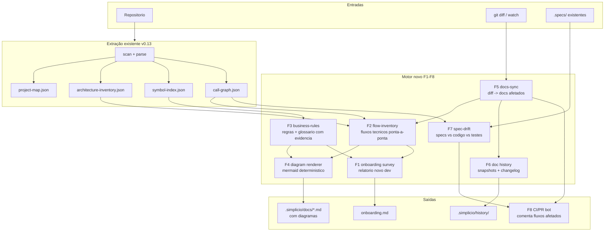

# Spec — Motor de Documentação Viva (Flow Documentation Engine)

> Status: proposto · Versão: 0.1 · Dono: @wesleysimplicio
> Rastreabilidade: cada capacidade (F1–F8) vira uma issue profunda no GitHub e
> entra no `BACKLOG.md`. Este documento é a fonte da verdade do design; as
> issues são a fonte da verdade de execução.

---

## 1. Problema

O simplicio-mapper hoje responde bem "**o que existe** no repo" (project map,
architecture inventory, symbol index, call graph, docs em markdown). Ele ainda
não responde as perguntas que um **dev novo na empresa** faz no primeiro dia:

- "Qual é o fluxo ponta-a-ponta quando o usuário faz X?"
- "Quais são as regras de negócio e onde elas moram no código?"
- "O que eu leio primeiro? Em que ordem?"
- "Esse doc está atualizado em relação ao código?"
- "O que mudou na arquitetura entre a semana passada e hoje?"

Evidências do gap (dogfood no próprio repo, v0.13.0):

- `.simplicio/docs/flowchart.md` cobre apenas o fluxo web
  screen→service→endpoint; em repos não-web (como este) reporta
  `Screens: 0 · Backend flows: 0` — cobertura de fluxo zero.
- Os docs gerados (`architecture.md`, `modules.md`, `layers.md`) são listas e
  contagens, sem diagramas e sem narrativa de fluxo.
- Não existe noção de fluxo de **negócio** (regras, estados, jornadas), só
  estrutura técnica.
- Não existe sincronização dirigida por diff: mudar código não aponta quais
  docs/fluxos ficaram obsoletos.
- Não existe histórico: o `.simplicio/` atual sobrescreve o anterior; não há
  como responder "o que mudou na arquitetura entre v1 e v2".
- Não existe verificação spec↔código: `.specs/` pode divergir do código sem
  nenhum alarme (o próprio `BACKLOG.md` deste repo ficou meses com conteúdo
  placeholder de template sem ninguém notar).

## 2. Visão

**Todo repositório com simplicio-mapper tem documentação de fluxo técnico e de
negócio que um dev novo consegue ler no primeiro dia, que se ajusta sozinha
quando o código muda, e que guarda histórico de como a arquitetura evoluiu.**

O norte de produto é o teste do "novo dev": rodar um comando e receber o
levantamento completo que hoje exige semanas de tribal knowledge.

## 3. Pipeline proposto

## 4. Capacidades

### F1 — Onboarding survey (`survey`)

Um comando que gera o levantamento completo "dev novo na empresa":
`onboarding.md` narrativo com stack, entry points, ordem de leitura sugerida,
fluxos principais (F2), regras de negócio (F3), glossário, comandos de
dev/test/build detectados e mapa de "quem chama o quê". Consolida os artefatos
já existentes num relatório legível por humano, não só por agente.

### F2 — Inventário de fluxos técnicos (`flows`)

Generaliza o `flowchart` atual (hoje web-only) para qualquer stack: a partir
do call-graph e dos entry points, deriva fluxos ponta-a-ponta
entrypoint→camadas→efeitos (filesystem, rede, subprocessos, DB). Emite
`flow-inventory.json` (`simplicio.flow-inventory/v1`) + `flows.md` com um
diagrama mermaid por fluxo.

### F3 — Fluxos e regras de negócio (`business`)

Extrai regras de negócio **observáveis** com evidência (`arquivo:linha`):
validações, máquinas de estado, gates de permissão, side-effects. Gera
`business-flows.md` + glossário de linguagem ubíqua (termos de domínio
extraídos de nomes de entidades/funções/docs). Nunca inventa semântica: só
reporta o que tem evidência estática, no mesmo espírito do flowchart atual.

### F4 — Diagramas mermaid determinísticos

Todo doc gerado ganha diagrama: flowchart de módulos (visão C4-ish
context/container/component), sequence diagram por fluxo (derivado do
call-graph), state diagram quando houver máquina de estados, ER quando houver
entidades. Determinístico (mesma entrada → mesmo diagrama, ordenação estável)
e com guardrail de tamanho (diagrama > N nós é particionado, nunca ilegível).

### F5 — Docs-sync dirigido por diff (`sync`)

`simplicio-mapper sync` recebe um diff (git range, staged, ou watch) e:
1. mapeia arquivos alterados → símbolos → fluxos → docs afetados;
2. regenera **só** os docs afetados (incremental);
3. emite `simplicio.docs-sync/v1` com a lista `affected_flows`,
   `affected_docs`, `stale_docs`. Integra com hooks (pre-commit/post-merge) e
   com o `--watch` existente.

### F6 — Histórico de documentação (`history`, `diff`)

`.simplicio/history/` guarda snapshots versionados (hash do mapa + timestamp +
resumo do delta). `simplicio-mapper diff <ref-a> <ref-b>` responde "o que
mudou na arquitetura": módulos novos, dependências novas, fluxos alterados,
símbolos removidos. Gera `architecture-changelog.md` append-only. Retenção
configurável (garbage collector, alinhado ao guardrail de disco da spec
YOOL §11.2).

### F7 — Spec-drift e rastreabilidade (`drift`)

Valida `.specs/` contra o código real: matriz spec ↔ símbolos ↔ testes ↔
docs. Detecta specs órfãs (nada no código referencia), código órfão (nenhuma
spec cobre), placeholders de template não preenchidos e docs stale (F5). Exit
code para CI; contrato `simplicio.spec-drift/v1`.

### F8 — Integração CI/PR (bot de fluxos afetados)

GitHub Action reutilizável que roda `sync` + `drift` no diff do PR e comenta:
quais fluxos o PR toca, quais docs precisam de atualização, diff de
arquitetura (F6) entre base e head. Torna a documentação parte do gate de
review sem esforço manual.

## 5. Contratos novos

| Contrato | Comando | Conteúdo |
|---|---|---|
| `simplicio.flow-inventory/v1` | `flows` | fluxos ponta-a-ponta com steps, camadas e efeitos |
| `simplicio.business-rules/v1` | `business` | regras com evidência `file:line` + glossário |
| `simplicio.docs-sync/v1` | `sync` | fluxos/docs afetados por um diff |
| `simplicio.doc-history/v1` | `history`/`diff` | snapshots e delta entre versões do mapa |
| `simplicio.spec-drift/v1` | `drift` | matriz de rastreabilidade + violações |
| `simplicio.onboarding/v1` | `survey` | payload estruturado do relatório de onboarding |

Todos seguem as regras já estabelecidas em `SIMPLICIO_INTEGRATION.md`:
payload JSON estável, aditivo, com `schema` versionado; paridade Python/Node
onde o comando existir nos dois; exit codes de orquestração (0 sucesso/fresh,
1 falha).

## 6. Princípios

1. **Evidência antes de inferência** — todo item de fluxo/regra aponta para
   `arquivo:linha`; heurística é marcada como heurística (mesmo contrato do
   flowchart atual).
2. **Determinismo** — mesma árvore de código → mesmos docs, byte a byte.
   Diagramas com ordenação estável.
3. **Incremental por padrão** — sync só toca o que o diff afeta; full rebuild
   é opt-in.
4. **Histórico é append-only** — snapshots nunca são reescritos; retenção via
   GC configurável.
5. **Stack-neutral** — nada de assumir web; fluxo é entrypoint→efeito em
   qualquer linguagem que o extractor cubra.
6. **Humano e agente como consumidores iguais** — todo JSON tem visão
   markdown; todo markdown deriva de JSON.

## 7. Priorização sugerida

| Fase | Capacidades | Racional |
|---|---|---|
| 1 | F2 (flows) + F4 (mermaid) | destrava valor visível imediato; base para o resto |
| 2 | F5 (sync) + F6 (history) | "docs que se ajustam sozinhas com histórico" — pedido central |
| 3 | F1 (survey) + F3 (business) | relatório novo-dev completo depende de F2/F3 |
| 4 | F7 (drift) + F8 (CI/PR) | fecha o loop de governança spec-driven |

## 8. Fora de escopo (desta spec)

- Publicação remota de wiki (continua opt-in via `export-docs`).
- Inferência semântica por LLM dentro do mapper — o mapper permanece
  determinístico; consumo por LLM acontece fora.
- UI web própria; a visão continua sendo markdown + docs-site existente.
