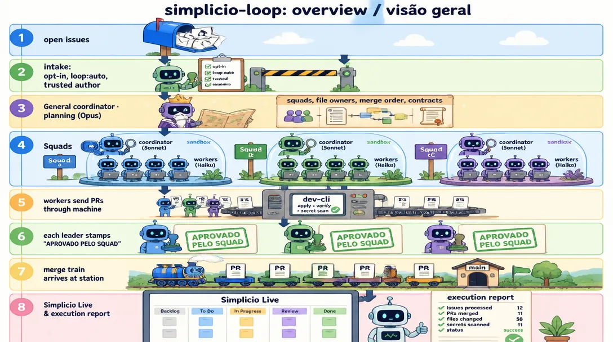
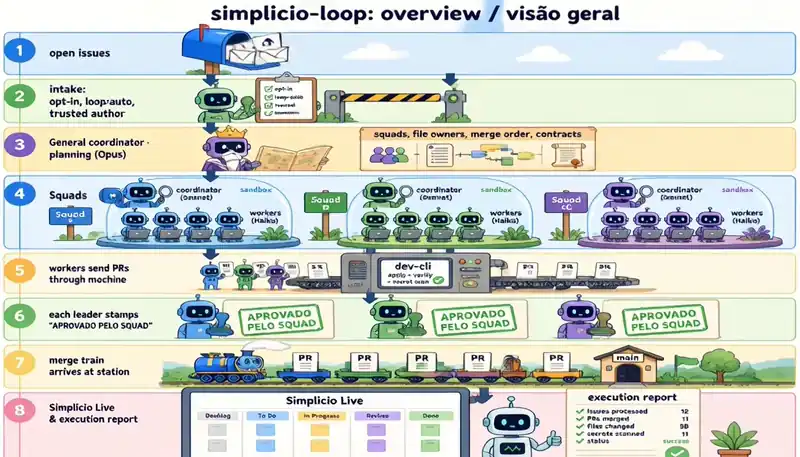
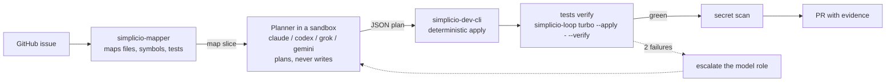
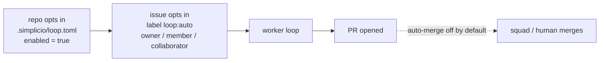
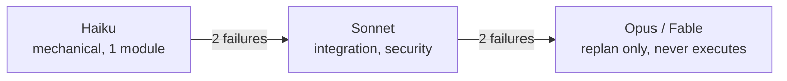
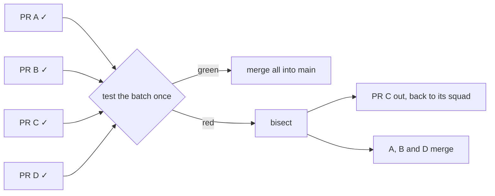
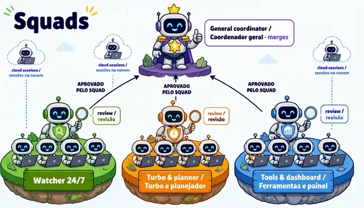
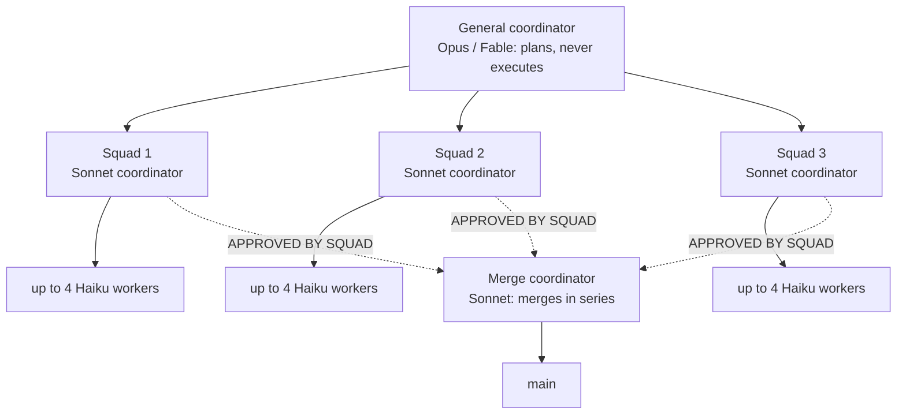
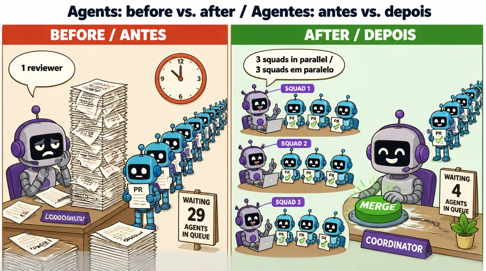
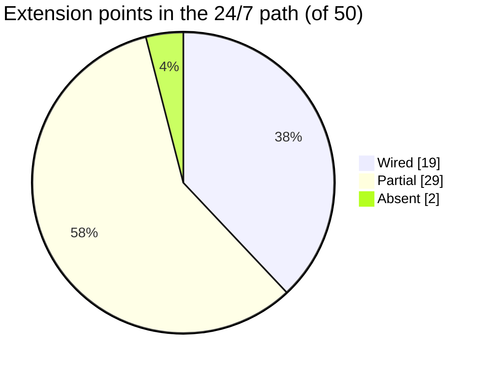

# 🔁 simplicio-loop

<p align="center">
  <a href="docs/REPOSITORY_GOVERNANCE.md"></a>
  <a href="https://github.com/simpletibr/simplicio-loop/stargazers"></a>
  <a href="docs/EXTENSION_POINTS_SERVICE.md"></a>
  <a href="LICENSE"></a>
  <a href="https://discord.gg/wM6tr7xVb"></a>
</p>

<p align="center">
  <a href="README.md">🇬🇧 English</a> |
  <a href="READMEs/README.pt-BR.md">🇧🇷 Português</a> |
  <a href="READMEs/README.es-ES.md">🇪🇸 Español</a> |
  <a href="READMEs/README.fr-FR.md">🇫🇷 Français</a> |
  <a href="READMEs/README.de-DE.md">🇩🇪 Deutsch</a> |
  <a href="READMEs/README.it-IT.md">🇮🇹 Italiano</a> |
  <a href="READMEs/README.ja-JP.md">🇯🇵 日本語</a> |
  <a href="READMEs/README.ko-KR.md">🇰🇷 한국어</a> |
  <a href="READMEs/README.zh-CN.md">🇨🇳 简体中文</a> |
  <a href="READMEs/README.ru-RU.md">🇷🇺 Русский</a> |
  <a href="READMEs/README.pl-PL.md">🇵🇱 Polski</a> |
  <a href="READMEs/README.tr-TR.md">🇹🇷 Türkçe</a> |
  <a href="READMEs/README.nl-NL.md">🇳🇱 Nederlands</a> |
  <a href="READMEs/README.hi-IN.md">🇮🇳 हिन्दी</a> |
  <a href="READMEs/README.ar-SA.md">🇸🇦 العربية</a>
</p>

**simplicio-loop turns GitHub issues into tested PRs: it maps the repo, an AI plans, a deterministic editor applies, tests verify, squads review.**

<p align="center">
  
</p>

<p align="center">
  
</p>

## What it does



## Install

Needs Python 3.11+, `git`, and an authenticated `gh` for GitHub issues.

```bash
pip install simplicio-loop
simplicio-loop install            # skills + hooks in this project (--global: user-wide, --host <name>: another host)
simplicio-loop login              # sign in; shares the login with simplicio-runtime
simplicio-loop doctor             # check the installed stack
```

## Use it

**In Claude Code or VS Code:**

```text
/simplicio-loop finish all the open issues
```


**As a 24/7 watcher** (a service that watches `simpletibr/simplicio-*` repos and opens PRs):

```bash
simplicio-loop watch247 --once --dry-run          # one simulated tick, changes nothing
simplicio-loop watch247 login-check               # are the exec CLIs logged in?
# from a repo checkout, as root, after creating the non-root user simplicio-loop:
sudo cp packaging/systemd/simplicio-loop-247.service /etc/systemd/system/
sudo cp packaging/systemd/simplicio-loop-247.env.example /etc/simplicio-loop-247.env   # edit it, then chmod 600
sudo systemctl enable --now simplicio-loop-247
```



Details: [docs/WATCHER_247.md](docs/WATCHER_247.md).

## How it works

<p align="center">
  
</p>



<p align="center">
  
</p>



<p align="center">
  
</p>



<p align="center">
  
</p>

## The 50 extension points



[docs/EXTENSION_POINTS_SERVICE.md](docs/EXTENSION_POINTS_SERVICE.md) · [#1509](https://github.com/simpletibr/simplicio-loop/issues/1509)

## Learn more

- [INSTALL.md](INSTALL.md) · [docs/CLI_COMMANDS.md](docs/CLI_COMMANDS.md) · [docs/WATCHER_247.md](docs/WATCHER_247.md)
- [docs/MODEL_ROLES.md](docs/MODEL_ROLES.md) · [docs/DASHBOARD.md](docs/DASHBOARD.md) · [CHANGELOG.md](CHANGELOG.md)
- **Everything else: [docs/GUIDE.md](docs/GUIDE.md)** (skills, runtimes, the loop, token economy, safety, tests)
