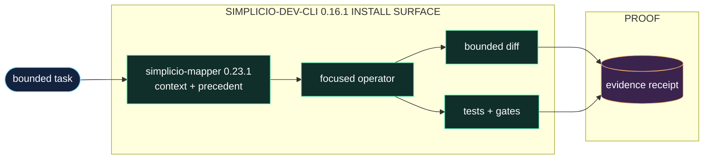

<h1 align="center">simplicio-cli</h1>

<p align="center">
  <strong>Turn a one-line task into a verified code change: mapper context, six-layer contract, diff, test, and evidence.</strong><br />
  <em>Commands stay in English so they can be copied exactly.</em>
</p>

<p align="center">
<a href="https://github.com/wesleysimplicio/simplicio-dev-cli/stargazers"></a>
<a href="https://pypi.org/project/simplicio-cli/"></a>
<a href="https://pypi.org/project/simplicio-cli/"></a>
<a href="LICENSE"></a>
</p>

<p align="center">
<a href="README.md">English</a> | <a href="READMEs/README.pt-BR.md">Português</a> | <a href="READMEs/README.es-ES.md">Español</a> | <a href="READMEs/README.ja-JP.md">日本語</a> | <a href="READMEs/README.ko-KR.md">한국어</a> | <a href="READMEs/README.zh-CN.md">简体中文</a> | <a href="READMEs/README.it-IT.md">Italiano</a> | <a href="READMEs/README.fr-FR.md">Français</a> | <a href="READMEs/README.ru-RU.md">Русский</a> | <a href="READMEs/README.pl-PL.md">Polski</a> | <a href="READMEs/README.hi-IN.md">हिन्दी</a> | <a href="READMEs/README.ar-SA.md">العربية</a> | <a href="READMEs/README.he-IL.md">עברית</a> | <a href="READMEs/README.ms-MY.md">Bahasa Melayu</a> | <a href="READMEs/README.id-ID.md">Bahasa Indonesia</a>
</p>

<p align="center">
  
</p>

<p align="center">
  
</p>

[Watch the English Ink Press product video](assets/video/simplicio-ink-press-en-v1.mp4)

---

## The short version

Turn a one-line task into a verified code change: mapper context, six-layer contract, diff, test, and evidence.

> **Deterministic-only boundary:** `simplicio-py` never sends prompts or completions to a local model, OpenRouter, Anthropic, OpenAI-compatible endpoint, or CLI provider. It does not load or download model weights. Provider execution has been removed; the adapter only performs local contracts, edits, tests, and evidence.

> **Operational boundary:** no local or remote LLM is required. The supported mutation inputs are an explicit mechanical-edit plan, a Fast changeset, or a Runtime EffectTransaction proposal. The CLI validates, applies, tests, and records evidence.
>
> The provider/model benchmark and setup material later in this file is historical evidence only; those routes are no longer supported by the package.

## Project DNA

simplicio-dev-cli is the focused implementation and verification operator in the Simplicio ecosystem. It receives a decided task, loads repository context, applies a bounded diff, runs tests, and emits evidence that another operator can inspect. It is not the runtime, the mapper, or the LLM itself: it is the disciplined execution layer between a plan and a trustworthy change.

The new first screen is the doorway; the restored guide below is the workshop. This README should help a stranger understand the promise quickly and still give an operator enough depth to run, validate, and extend the project.

## Quick Start

```bash
pip install -U simplicio-cli
simplicio-py detect "hide the Delete button for non-admins"
simplicio-py task "hide the Delete button for non-admins"
simplicio-py --version --json
```

The JSON version handshake is the canonical identity surface for runtime/agent consumers. It
includes the package version, entrypoints, mapper version, and supported contract capabilities.

Auto-upgrade is now opt-in: set `SIMPLICIO_AUTO_UPGRADE=1` for session-start upgrades, or run `simplicio-py doctor --upgrade` explicitly.
Python consumers can expose the bundled mapper dependency directly with
`from simplicio import mapper_module, mapper_version` or `import simplicio.mapper_api`.

### Model boundary

Historical model and provider environment variables are ignored. `smoke` reports
the deterministic-only mode, while generation and planning calls fail closed with
the machine-readable reason `llm_execution_disabled` before network, model, or
provider CLI activity can occur.

## What it does

- Accepts a focused task from the runtime, agent, or CLI surface.
- Loads simplicio-mapper context and relevant precedent before an edit is attempted.
- Applies a bounded diff, runs the requested tests, and records a verification receipt.
- Leaves orchestration, model choice, and long-lived loop state to the surrounding Simplicio layers.

## The real product boundary

- The CLI turns an already-decided engineering intention into a controlled change.
- The mapper supplies context; the operator supplies execution and proof.
- A green-looking diff is not enough: tests and evidence are part of the result.

## How it works



## Proof and validation

- The package metadata and mapper handoff are covered by contract tests.
- Build, lint, test, and packaging gates are recorded with releases when available.
- The operator is designed to be called by simplicio-runtime, simplicio-loop, agents, or directly from the CLI.

## Simplicio ecosystem

- [simplicio-mapper](https://github.com/wesleysimplicio/simplicio-mapper) supplies repo context before interpretation.
- [simplicio-runtime](https://github.com/wesleysimplicio/simplicio-runtime) is the canonical task, MCP, and assistant entrypoint.
- [simplicio-loop](https://github.com/wesleysimplicio/simplicio-loop) is the proven task-flow reference the runtime reuses for evidence-gated execution.
- [simplicio-cli](https://github.com/wesleysimplicio/simplicio-dev-cli) executes focused code tasks with verification.
- [simplicio-sprint](https://github.com/wesleysimplicio/simplicio-sprint) turns cards into draft PR delivery loops.

## Documentation standard

- [docs/PYTHON_PACKAGE_INTERDEPENDENCE.md](docs/PYTHON_PACKAGE_INTERDEPENDENCE.md) —
  **generated, not hand-edited** (#101). Regenerate after touching
  `pyproject.toml`'s version/dependencies/extras:
  `python3 scripts/gen_package_interdependence.py`. The local gate enforces it
  hasn't drifted (`python3 scripts/gen_package_interdependence.py --check`, also
  covered by `tests/python/test_generated_docs.py`).
- [docs/LLM_USAGE_POLICY.md](docs/LLM_USAGE_POLICY.md)
- [docs/readme-globalization-standard.md](docs/readme-globalization-standard.md)

## Original Field Guide

The section below restores the project-specific README material that existed before the globalization pass. Keep this substance when refreshing the top-level narrative: add polish, do not erase operational memory.

**A focused execution operator for turning decided engineering tasks into verified deterministic changes.**

[](https://pypi.org/project/simplicio-cli/)
[](https://pypi.org/project/simplicio-cli/)
[](LICENSE)

[](output/imagegen/simplicio-cli-readme-hero.png)

> *"hide the Delete button for non-admins"* → diff + test + applied + verified.
> **No model or API key is required by the deterministic executor.** External coordinators may provide an explicit plan or changeset.

```bash
pip install simplicio-cli
```

---
### Recommended Default Stack (Official)

The recommended and supported way to use `simplicio-dev-cli` is inside the runtime-first Simplicio execution stack:

**simplicio-runtime + simplicio-loop + simplicio-dev-cli + agents/skills**

- `simplicio-runtime`: canonical task, MCP, and assistant entrypoint.
- `simplicio-loop`: the proven converge/drain task flow used today; runtime reuses it as the reference discipline for evidence-gated completion, durable execution journals, and worker coordination.
- `simplicio-dev-cli`: focused implementation/test executor that can call `simplicio edit` for deterministic writes once a change is decided.
- **Agents & Skills**: reusable capabilities from `.skills/`, `.agents/`, and the Simplicio starter (AGENTS.md, specs-as-code, etc.).

This combination is the **official default** across the Simplicio ecosystem. `simplicio-runtime` is the unified future-facing surface, while `simplicio-loop` remains the current production task flow used in company repos.

See the canonical policy:
- [docs/LLM_USAGE_POLICY.md](docs/LLM_USAGE_POLICY.md)

When bootstrapping a new project with the Simplicio starter, this stack is configured by default.


### Why it works — the numbers

Two complementary benchmarks measure different things. Read them in order.

#### 1. Execution benchmark — real project, real tasks, real test suite (the "does it work" answer)

**This is not regex pattern-matching. This is not a synthetic toy harness in
isolation.** Run against [`wesleysimplicio/sistema-sindico`](https://github.com/wesleysimplicio/sistema-sindico)
— a real condominium-management system in pure PHP 8, public on GitHub, with a
real PHPUnit suite (`vendor/bin/phpunit --configuration phpunit.xml.dist`).

For each task the model is asked for a **real engineering change** — add a new
method to an existing production class (permission helper, env parser,
rate-limit key builder, repository SQL builder, route introspection, etc.).
The generated file replaces the original in a working copy of the real repo;
a **hidden PHPUnit test** (never shown to the model, asserting BOTH true and
false states of the required behaviour) is dropped into
`tests/unit/Core/Hidden/`; the **entire production suite runs** (every
pre-existing test of the real codebase plus the hidden one). **Pass =
`phpunit` exit code 0** — the same green/red signal the project's CI would use
to merge a PR. The model's change must be *correct* (the new test passes) AND
must *not break existing behaviour* (every prior test still passes).

All sides emit the complete file (identical output shape); the only variable
is the wrapping prompt.

4 tasks · **9 models** (3 small · 3 mid · 3 frontier) · 2 sides = **36 runs per side**, scored by `vendor/bin/phpunit` exit code on 2026-05-28. Both sides emit the complete file; the only variable is whether the goal is wrapped in the simplicio contract:

| Tier | Model | Without simplicio | With simplicio | Gain |
|---|---|---|---|---|
| small | **Llama 3.2 1B** (`meta-llama/Llama-3.2-1B-Instruct`) | 0% | 0% | 0 pts |
| small | **Gemma 3n e4B** (`google/gemma-3n-E4B-it`) | 0% | 0% | 0 pts |
| small | **Gemma 3 4B** (`google/gemma-3-4b-it`) | 0% | **75%** | **+75 pts** |
| mid | **Qwen 2.5 7B** (`qwen/qwen-2.5-7b-instruct`) | 0% | **25%** | **+25 pts** |
| mid | **Llama 3.1 8B** (`meta-llama/Llama-3.1-8B-Instruct`) | 50% | **100%** | **+50 pts** |
| mid | **Gemma 3 12B** (`google/gemma-3-12b-it`) | 50% | **75%** | **+25 pts** |
| frontier | **Gemini 3.5 Flash** (`google/gemini-3.5-flash`) | 75% | **100%** | **+25 pts** |
| frontier | **Claude Opus 4.7** (`anthropic/claude-opus-4.7`) | 50% | **100%** | **+50 pts** |
| frontier | **GPT-5.5** (`openai/gpt-5.5`) | 75% | **100%** | **+25 pts** |
| **Headline (9 models · 4 tasks · 36 runs/side)** | | **33%** | **64%** | **+31 pts** |

> Every model with baseline capability to emit valid PHP gains **+25 to +75
> points** when the task is wrapped in the simplicio contract. The **two
> sub-2B/4B-MoE models score 0% on both sides** — they can't produce a
> parseable PHP file regardless of prompt — so the contract has nothing to
> amplify. Honest scope: simplicio multiplies capable models, it does not
> create capability in tiny ones. Three frontier models hit **100%** with the
> contract.

Full report: [`bench/results_exec_sindico.md`](bench/results_exec_sindico.md) ·
[`bench/results_exec_sindico.pdf`](bench/results_exec_sindico.pdf). Reproduce:
clone `sistema-sindico` (public), `composer install`, then
`BENCH_BASE_URL=… BENCH_API_KEY=… BENCH_MODELS=…
python3 bench/run_exec_sindico.py`. Hidden tests live under
`bench/sindico_hidden/`; harness in `bench/run_exec_sindico.py`.

#### 2. Contract-adherence benchmark — structural checks across many models

The tables below measure something **narrower and complementary**: did the
model produce **the right shape of actionable output** (target-file mention +
DIFF block + TEST block + contract-state keywords) on a raw one-line prompt
vs. the simplicio contract. Scoring is via **deterministic regex** on the
output — it's not a proof that the code compiles or passes runtime tests.
That's what the execution benchmark above is for. The two answer different
questions: this one measures *contract adherence at scale across many models*;
the execution one measures *runtime correctness on a real codebase*.

Same model. Same task. Only the prompt changes. **Measured, reproducible, deterministic.**
**Seventeen models tested across four runs** — three local Ollama models on an
M1 MacBook (8 GB), five sub-4B tiny models, six frontier 2026 models, and three
mid-tier 7B–12B open models. Every one gained at least **+14 points** when
wrapped in simplicio's 6-layer contract.

##### Hugging Face — recommended Qwen3-Coder defaults (HF router)

The served Qwen Coder recommendation now uses the Qwen3-Coder MoE family.
`Qwen/Qwen2.5-Coder-3B-Instruct` and
`Qwen/Qwen2.5-Coder-7B-Instruct` remain available as legacy fallback models for
historical comparisons and hardware that cannot host the MoE successors.

| Slot | Recommended model | Route | Notes |
|---|---|---|---|
| Efficient coder | `Qwen/Qwen3-Coder-30B-A3B-Instruct` | HF router | 30B total / ~3B active MoE successor to the 3B slot |
| High-ceiling coder | `Qwen/Qwen3-Coder-Next` | HF router | 80B total / ~3B active MoE successor to the 7B slot |

> Reproduce the new default set:
> `BENCH_BASE_URL=https://router.huggingface.co/v1 BENCH_API_KEY=<hf-token>
> BENCH_MODELS="Qwen/Qwen3-Coder-30B-A3B-Instruct,Qwen/Qwen3-Coder-Next"
> python3 bench/run_offline.py`.

Legacy Qwen2.5-Coder baseline, re-run on 2026-05-27 against the latest
`simplicio-mapper` artifacts (10 cases/side, 156 checks):

| Model | Without simplicio | With simplicio | Gain |
|---|---|---|---|
| **Qwen 2.5 Coder 7B** (`Qwen/Qwen2.5-Coder-7B-Instruct`) | 38% | **96%** | **+58 pts** |
| **Qwen 2.5 Coder 3B** (`Qwen/Qwen2.5-Coder-3B-Instruct`) | 34% | **94%** | **+60 pts** |
| **Qwen 2.5 Coder 1.5B** (`Qwen/Qwen2.5-Coder-1.5B-Instruct`, local CPU) | 30% | **92%** | **+62 pts** |
| **HF avg (3 models · 10 cases · 156 checks)** | **34%** | **94%** | **+60 pts (+172%)** |

> Monotonic from smaller to larger in the legacy baseline: pass-rate with
> simplicio climbs **92% → 94% → 96%** as the model grows, while the raw-prompt
> baseline stays at **30–38%**. Reproduce the legacy set:
> `BENCH_BASE_URL=https://router.huggingface.co/v1 BENCH_API_KEY=<hf-token>
> BENCH_MODELS="local:Qwen/Qwen2.5-Coder-1.5B-Instruct,Qwen/Qwen2.5-Coder-3B-Instruct,Qwen/Qwen2.5-Coder-7B-Instruct"
> python3 bench/run_offline.py`.

Side-by-side delta vs the previously published numbers (same regex methodology,
all 17 README models re-measured):
[`bench/results_comparison.md`](bench/results_comparison.md) ·
[`bench/results_comparison.pdf`](bench/results_comparison.pdf). Headline on the
14 models with clean data: **with simplicio averaged 86% → 88% (+2 pts); without
simplicio 36% → 36% (+1 pt)** — the new run reproduces the published numbers
within noise. Three frontier models (Claude Opus 4.7, Qwen 3.7 Max, DeepSeek V4
Pro) show `n/a` for the new column: their OpenRouter calls hit account-level
HTTP 402 / provider failures on >50% of requests this round, so the sample is
too small to publish; their old numbers still stand.

##### Local offline — Qwen3-Coder GGUF recommendation, Qwen2.5 legacy baseline

For local OpenAI-compatible servers, prefer the Qwen3-Coder GGUF builds when
the machine can host MoE weights:

| Slot | Recommended local weights | Notes |
|---|---|---|
| Efficient coder | `unsloth/Qwen3-Coder-30B-A3B-Instruct-GGUF` | Primary local successor for the 3B-active slot |
| High-ceiling coder | `unsloth/Qwen3-Coder-Next-GGUF` | 24 GB GPU-class successor for long-context work |

The last fully offline fallback baseline remains qwen2.5-coder on Ollama,
M1 8 GB, run on 2026-05-27 (30 runs/side, 156 checks):

| Model | Without simplicio | With simplicio | Gain |
|---|---|---|---|
| **Qwen 2.5 Coder 7B** (`qwen2.5-coder:7b`) | 36% | **92%** | **+56 pts** |
| **Qwen 2.5 Coder 3B** (`qwen2.5-coder:3b`) | 34% | **82%** | **+48 pts** |
| **Qwen 2.5 Coder 1.5B** (`qwen2.5-coder:1.5b`) | 32% | **88%** | **+56 pts** |
| **Local avg (3 models · 10 cases · 156 checks)** | **34%** | **87%** | **+53 pts (+156%)** |

> **Zero API key, zero network.** Bench ran fully offline against
> `http://localhost:11434/v1` (Ollama's OpenAI-compatible endpoint). A
> 1.5B-param model running on a 4-year-old laptop reaches **88%** pass-rate
> with simplicio's contract — same hardware, same model, raw prompt = 32%.
> Reproduce the legacy fallback: `BENCH_BASE_URL=http://localhost:11434/v1 BENCH_API_KEY=ollama
> BENCH_MODELS="qwen2.5-coder:7b" python3 bench/run_offline.py`.

##### Tiny models — sub-4B, run on 2026-05-26 (50 runs/side, 260 checks)

| Model | Without simplicio | With simplicio | Gain |
|---|---|---|---|
| **Gemma 3 4B** (`google/gemma-3-4b-it`) | 38% | **96%** | **+58 pts** |
| **Llama 3.2 3B** (`meta-llama/llama-3.2-3b-instruct`) | 28% | **73%** | **+45 pts** |
| **Gemma 3n e4B** (`google/gemma-3n-e4b-it`) | 44% | **88%** | **+44 pts** |
| **Phi-4 mini** (`microsoft/phi-4-mini-instruct`) | 36% | **73%** | **+37 pts** |
| **Llama 3.2 1B** (`meta-llama/llama-3.2-1b-instruct`) | 26% | **40%** | **+14 pts** |
| **Tiny avg (5 models · 10 cases · 260 checks)** | **35%** | **74%** | **+39 pts (+112%)** |

> **Not hosted on OpenRouter** (requested but skipped): Gemma 3 270M, Gemma 3 1B,
> Gemma 2 2B, Qwen3 0.6B, Qwen3 1.7B, Qwen2.5 0.5B, Qwen2.5 1.5B, Qwen 3B,
> Nemotron Nano 4B (OR's smallest Nemotron is 9B). Sub-4B substitutes used above.
> simplicio still gains **+14 to +58 points** even on a 1B-param model.

##### Frontier 2026 models — run on 2026-05-26 (60 runs/side, 312 checks)

| Model | Without simplicio | With simplicio | Gain |
|---|---|---|---|
| **GPT-5.5** (`openai/gpt-5.5`) | 38% | **100%** | **+62 pts** |
| **Kimi K2.6** (`moonshotai/kimi-k2.6`) | 40% | **100%** | **+60 pts** |
| **Gemini 3.5 Flash** (`google/gemini-3.5-flash`) | 42% | **100%** | **+58 pts** |
| **Qwen 3.7 Max** (`qwen/qwen3.7-max`) | 44% | **100%** | **+56 pts** |
| **Claude Opus 4.7** (`anthropic/claude-opus-4.7`) | 42% | **98%** | **+56 pts** |
| **DeepSeek V4 Pro** (`deepseek/deepseek-v4-pro`) | 44% | **96%** | **+52 pts** |
| **Frontier avg (6 models · 10 cases · 312 checks)** | **41%** | **99%** | **+58 pts (+136%)** |

##### Mid-tier 7B–12B open models — earlier run (v0.2.2, 30 runs/side, 156 checks)

| Model | Without simplicio | With simplicio | Gain |
|---|---|---|---|
| **Gemma 3 12B** (`google/gemma-3-12b-it`) | 34% | **92%** | **+58 pts** |
| **Llama 3.1 8B** (`meta-llama/llama-3.1-8b-instruct`) | 36% | **90%** | **+54 pts** |
| **Qwen 2.5 7B** (`qwen/qwen-2.5-7b-instruct`) | 34% | **88%** | **+54 pts** |
| **Mid-tier avg (3 models · 10 cases · 156 checks)** | **35%** | **90%** | **+55 pts (+156%)** |

> **Across all 17 models tested across four runs**, the average gain is **+51
> points**. Smallest: **+14 pts** (Llama 3.2 1B — the contract still moves a
> 1B-param model). Largest: **+62 pts** (GPT-5.5). The contract helps local
> Ollama models on a 4-year-old laptop, tiny sub-4B models, frontier reasoning
> models, and mid-tier 7B–12B alike — five of the six frontier models hit
> **100% pass-rate**.

#### Output-quality signals (rate across all 60 frontier runs)

| Signal | Raw prompt | With simplicio |
|---|---|---|
| **DIFF block present** | 36% | **98%** |
| Target file mentioned | 1% | **100%** |
| TEST block present | 88% | **98%** |

#### Cost — tokens & wall-clock (measured, not estimated)

Same provider, same models, same cases. Token counts pulled from the API
`usage` field; latency from `time.perf_counter()` around each call.

| Side | Tokens / run | Wall-clock / run | Total tokens (60 runs) | Total time |
|---|---|---|---|---|
| Raw prompt | 1,967 | 46.1s | 118,040 | 46m 07s |
| With simplicio | **3,168** | **57.6s** | **190,119** | **57m 33s** |
| Δ | **+61%** | **+24%** | +72,079 | +11m 26s |

simplicio wraps the objective in a 6-layer contract — more input tokens up
front, longer completions because the model produces the full DIFF + TEST +
EVIDENCE the contract demands instead of a one-line guess. The bill goes up,
but so does the **pass-rate (41% → 99%)** and the **DIFF-block rate (36% → 98%)** —
useful tokens, not chat.

> Six frontier models — GPT-5.5, Kimi K2.6, Gemini 3.5 Flash, Qwen 3.7 Max,
> Claude Opus 4.7, DeepSeek V4 Pro — gained **+52 to +62 points** when wrapped
> in simplicio's 6-layer contract. Without changing the model. Without
> fine-tuning. Five of six landed at **100% pass-rate with simplicio**.

Full report: [`bench/results.md`](bench/results.md) · [`bench/results.pdf`](bench/results.pdf) · raw outputs under `.simplicio/bench_runs/`.

---

### How it works

```
mapper        WHERE   project structure + latest state
precedent     HOW-1   the real snippet in THIS repo that already does it
skill-router  HOW-2   the ONE mapper skill that matches (ranked, not all)
simplicio     BUILD   stacks the 6 layers into one prompt (cache-friendly)
test          JUDGE   contract written as testable states
verify        PROOF   ran it — did it actually pass? loop-fix up to 3x
```

#### Rich mapper integration

When `simplicio-mapper` has generated `.simplicio/project-map.json` and
`.simplicio/precedent-index.json`, `simplicio-cli` consumes them directly:

- exact target file metadata, roles, imports and exports
- entry points, test files, modules, entities and architecture signals
- recent changes and changed-file context
- precedent snippets ranked from `precedent-index.json`

If those artifacts are missing, the CLI falls back to the older target-file
inspection path, so existing projects keep working.

#### Optional ECC advisory guidance

When explicitly enabled, the CLI asks the installed Mapper for the separate
`simplicio.ecc-guidance/v1` pack:

```bash
export SIMPLICIO_ECC_ROOT=/path/to/ECC
export SIMPLICIO_ECC_ENABLED=1
export SIMPLICIO_ECC_REQUIRED=1  # optional fail-closed mode
```

The pack is pinned, bounded and validated as `advisory-only`. Its text may
shape standalone prompt context, while task results retain only the
hash/provenance reference under `ecc_guidance_ref`; it never changes
`TaskSpec`, `PlanDAG`, effect authorization or execution policy.

#### Adaptive retry and observability

The retry loop now validates generated output before applying/testing it,
classifies failures, and sends targeted retry feedback. Bench and pipeline runs
can append lightweight JSONL records to `.simplicio/runs.jsonl` with prompt
variant, model/provider, estimated tokens, target, mode and failure class.

**TOON-encoded prompt context (`SIMPLICIO_PROMPT_TOON`, default on).** The
uniform-array context blocks injected into generation prompts — mapper
handoff `files[]`, project-map `Relevant files`, `Precedent candidates` — are
rendered as [TOON](https://github.com/toon-format/toon) instead of
hand-rolled bullets, ~27% fewer tokens on the same content (measured over
`bench/cases.json`, see `bench/results_toon_ab.md`), losslessly. Non-uniform
arrays fall back to compact JSON automatically. Set
`SIMPLICIO_PROMPT_TOON=0` to restore the legacy bullet rendering.

**Per-call usage events (`SIMPLICIO_LOG_ROOT`, opt-in).** Point this at a
project root and `generate()`/`planner_complete()` append one usage event to
`.simplicio/runs.jsonl` per provider call (cache hit or miss), labeling
whether the token count is real provider-reported usage or the canonical
estimator's guess. TOON activations and other measured token savings are
recorded to a separate append-only ledger,
`.simplicio/ledger/savings-events.jsonl` (`simplicio.savings-event/v1`), via
`simplicio.observability.record_savings_event()`.

#### Cross-vendor memory

`simplicio-dev-cli memory init|store|recall` is a markdown + git store under
`~/.simplicio/memory/` (override with `SIMPLICIO_MEMORY_DIR`) for handing
context off between agent vendors — a decision stored by one tool is
recallable by another. Recall is deterministic keyword search, no LLM call,
no network; real FTS5/vector-hybrid recall is a documented follow-up, not
claimed here.

**The idea in one line: don't ask the model to guess — hand it the path.**
Each layer terminates one decision the model would otherwise hallucinate.
Relevant > complete — inject the *right* context, never *all* of it.

---

### Install

```bash
pip install simplicio-cli           # from PyPI (pulls simplicio-mapper + simplicio-prompt)
# or
pip install -e .                    # from this repo
```

#### Install profiles (extras)

The base install (above) is just the executor/contract/mapper-context/
edit-verify core — **no PyTorch, no provider SDKs**. Everything else is an
opt-in extra, picked to match what the code actually imports (#99):

| Extra | Adds | When you need it |
|---|---|---|
| *(base)* | `numpy`, `simplicio-mapper`, `simplicio-prompt`, `httpx`, `orjson`, `diskcache`, `libcst` | mechanical edit, mapper handoff, doctor/runtime contracts, `claude-cli`/`codex-cli` shell-out providers, cache/token primitives. `numpy` stays in base because `task`/`run`'s precedent+skill-router cosine-similarity ranking imports it unconditionally — it's lightweight (no GPU/torch), unlike the embedding model itself. |
| `simplicio-cli[providers]` | `openai`, `anthropic` | native Anthropic models, or any OpenAI-compatible endpoint (OpenRouter, GLM, DeepSeek, ...) via `SIMPLICIO_MODEL`/`SIMPLICIO_BASE_URL`. |
| `simplicio-cli[ml]` | `sentence-transformers` (pulls PyTorch, ~3 GB) | semantic precedent/skill ranking once cached vectors run out (`all-MiniLM-L6-v2`). |
| `simplicio-cli[local]` | `llama-cpp-python`, `huggingface-hub` | offline in-process inference (default local GGUF, or any `local-llama/<repo>::<file>` model). |
| `simplicio-cli[bench]` | `fpdf2` | `bench` command's PDF report. |
| `simplicio-cli[all]` | union of the four above | everything. |

Missing an extra never crashes with a raw traceback — every optional import
is guarded and raises an actionable error naming the exact extra to install
(e.g. `pip install 'simplicio-cli[providers]'`).

#### CI and local quality gate

The blocking `.github/workflows/ci.yml` coverage job runs on pull requests
and pushes to `main`. The same gate is reproducible locally; attach its
command output to the pull request:

```bash
python -m pip install -e ".[dev]" build twine
ruff check . && ruff format --check . && mypy simplicio
pytest --cov=simplicio --cov-report=json:coverage.json
python3 scripts/coverage_gate.py --report coverage.json
python3 scripts/token_budget.py --check
python3 scripts/gen_package_interdependence.py --check  # generated-doc drift gate (#101)
simplicio-py --help                  # entrypoint smoke (x3)
simplicio-cli --help
simplicio-dev-cli --help

pip install -e ".[providers]" && python -c "import openai, anthropic"  # extras coverage
pip install build twine
python -m build                      # sdist + wheel
python -m twine check dist/*         # packaging smoke
```

The install ships **three Simplicio packages** that play distinct roles:

- **`simplicio-cli`** (this repo) — the 6-layer task contract + verify loop.
  The default wrapper for one-shot code edits. *Headline: +31 pts vs raw
  baseline on real PHPUnit (see Section 1).*
- **`simplicio-mapper`** — emits `.simplicio/project-map.json` and
  `precedent-index.json` so the CLI can target the right file/precedent
  without guessing.
- **`simplicio-prompt`** (≥1.7.0) — the Tuple-Space + Yool agent runtime
  kernel (`kernel.subagent_runtime.SubagentRuntime`) for orchestrated work:
  real parallel subagent fan-out on any OpenAI-compatible provider, with
  bounded lane concurrency, a receipt cache, jittered backoff and a
  circuit breaker. *On one-shot code tasks it's net-neutral and not the
  right tool (use simplicio-cli for those); on orchestrated multi-step /
  fan-out work it's the engine.* Our chosen fan-out default for this
  project is **N=200** subagents — the level where harder tasks start to
  recover from per-call noise (partial Qwen2.5-Coder-3B data:
  `env_get_int` at N=64 → 0 PHPUnit passes of 64; at higher N some tasks
  flip to passing). The fan-out benchmark
  (`bench/run_fanout.py`) measures both real PHPUnit pass-rate and a
  structural regex check on every subagent and surfaces the gap; full
  ongoing numbers in [`bench/results_fanout.md`](bench/results_fanout.md) ·
  [`bench/results_fanout.pdf`](bench/results_fanout.pdf). Set
  `BENCH_SINDICO_SRC` / `BENCH_SINDICO_WORK` when the local
  `sistema-sindico` checkout and work copy are not under `/tmp`.

Each is independently published on PyPI; ship them as a set so the CLI's
mapper-rich precedent ranking, contract-shaped prompts, and (when called
for) real subagent fan-out all work out of the box without extra setup.

---

### How you use it — pick your path

simplicio-cli has **three distinct entry points**. Same engine, three front doors — pick the one that matches what you already pay for:

| You have | Path | LLM call goes through | Need API key? |
|---|---|---|---|
| **Claude Code** (Pro / Max / Team / API) | Skill + hook auto-installed in `~/.claude/` | Claude Code itself, using your logged-in session | **No** |
| **Claude Code OAuth or Codex CLI / ChatGPT Plus** | `simplicio-py task` with `SIMPLICIO_MODEL=claude-cli/<m>` or `codex-cli/<m>` | Shell-out to `claude -p` / `codex exec` (subprocess uses your existing login) | **No** |
| **API key** for any provider (Anthropic, OpenAI, OpenRouter, GLM, DeepSeek, Ollama…) | `simplicio-py task` standalone CLI | The provider SDK directly | **Yes** — set `SIMPLICIO_API_KEY` |

**Most users land on Path 1.** `pip install simplicio-cli` puts `simplicio-py` on PATH; the first invocation auto-installs the skill + hook in `~/.claude/` (idempotent, opt-out via `SIMPLICIO_SKIP_AUTO_INIT=1`). From that moment, every code-edit prompt you type **inside Claude Code** is silently routed through simplicio's 6-layer contract — no extra config, no key, no cost beyond your existing Claude subscription.

**Path 2 — subscription shell-out (zero key).** If you have a Claude Pro/Max session (`claude login`) or a ChatGPT Plus + Codex CLI session (`codex login`) and want to drive simplicio from CI, scripts, or any context **outside** Claude Code, set `SIMPLICIO_MODEL=claude-cli/<model>` or `codex-cli/<model>`. `simplicio-py` spawns the CLI as a subprocess; the call rides your existing OAuth session — no API key required. A recursion guard (`SIMPLICIO_HOOK_GUARD=1`) is injected so the inner CLI does not re-fire the hook.

**Path 3 is for environments without any logged-in CLI** — a remote server, a build runner, a notebook, a different LLM provider. You bring an API key (Anthropic, OpenRouter, OpenAI, GLM, DeepSeek, Ollama…), `simplicio-py` calls the provider directly.

#### Path 1 example — inside Claude Code

After `pip install simplicio-cli && simplicio-py smoke` (which triggers auto-bootstrap), just type your task in Claude Code:

```
hide the Delete button for non-admins in src/app/screen/screen.component.html
```

Claude Code sees the skill (semantic match) and the hook hint (`[SIMPLICIO_PROMPT_HINT]` on stderr — deterministic classifier). It runs simplicio's 6-layer contract under the hood. You see the diff + tests + verification — same as before, just dramatically more accurate.

#### Path 2 example — subscription shell-out, zero key

You already pay for Claude Pro/Max or ChatGPT Plus + Codex CLI. simplicio
piggybacks on that login — no extra bill, no key to manage.

```bash
# Option A — Claude Code subscription (run `claude login` once)
export SIMPLICIO_MODEL=claude-cli/sonnet     # or claude-cli/opus, claude-cli/default
unset  SIMPLICIO_API_KEY                     # explicitly: no key needed

simplicio-py task "hide Delete button for non-admins" --stack angular \
  --target src/app/screen/screen.component.html

# Option B — Codex CLI subscription (run `codex login` once)
export SIMPLICIO_MODEL=codex-cli/gpt-5       # or codex-cli/default
simplicio-py task "..." --stack angular --target ...
```

How it works: `simplicio-py` shells out to `claude -p "<prompt>"` (or `codex exec "<prompt>"`) as a subprocess, captures stdout, runs the test loop. The inner CLI authenticates via your existing OAuth session in `~/.claude/` or `~/.codex/`. `simplicio-py` sets `SIMPLICIO_HOOK_GUARD=1` in the subprocess env so the inner Claude Code session does **not** re-fire its own UserPromptSubmit hook (no infinite recursion).

For orchestrators such as SendSprint, `simplicio-py task` also has a structured
contract:

```bash
simplicio-py task "hide Delete button for non-admins" \
  --stack angular \
  --target src/app/screen/screen.component.html \
  --dry-run-task \
  --json

simplicio-py task "front-only task" \
  --stack angular \
  --target src/app/screen/screen.component.html \
  --bound-paths "src/app/**" \
  --json
```

`--dry-run-task` generates the would-be diff/test output without applying or
testing it. `--json` returns `{task_id, applied, files_changed, tokens_used,
cost_usd, diff_summary, warnings}`. Repeat `--bound-paths <glob>` to reject
diffs outside the allowed edit surface; violations are reported in `warnings`
and the command exits non-zero.

See [structured blocked-precondition receipts](docs/blocked-preconditions.md) for the JSON `status`, `blocked_preconditions`, `reason`, and `next_surface` contract.
See [patch receipts](docs/patch-receipts.md) for parser strategy, recovery fingerprint, and requested/effective capability evidence.
See [the evidence ledger](docs/evidence-ledger.md) for append-only AC/RN receipts and stale-artifact gates.
See [multi-task batches](docs/multi-task-batches.md) for deterministic DAG state and resumable transitions.
See [prompt envelopes](docs/prompt-envelopes.md) for layer budgets, stable prefix hashes, and typed retry deltas.
The deterministic delivery corpus is available with `python -m bench.run_delivery_corpus`.

#### Path 3 example — standalone with API key

```bash
export SIMPLICIO_API_KEY=sk-or-v1-…                      # OpenRouter key
export SIMPLICIO_MODEL=anthropic/claude-opus-4
export SIMPLICIO_BASE_URL=https://openrouter.ai/api/v1

simplicio-py index --stack angular                           # one-time, builds embedding cache
simplicio-py task "hide Delete button for non-admins" \
  --stack angular \
  --target src/app/screen/screen.component.html \
  --criteria "- no admin perm: button absent from DOM
- with admin perm: button present" \
  --constraints "- don't touch save flow
- build passes"
```

Provider configuration is legacy documentation; the package no longer executes model providers.

---

#### Path 1 deep-dive — auto-activation in Claude Code

`pip install` puts `simplicio-py` on your PATH. To make Claude Code
**automatically** route code-edit tasks through simplicio, a skill + hook
need to land in `~/.claude/`.

**Zero-step path (recommended).** The first time you run *any* `simplicio-py`
command after install, if Claude Code is present (`~/.claude/` exists) and
the hook is missing, `simplicio-py` installs both for you and prints one stderr
line. PEP 517 wheels can't execute code on `pip install`, so this is the
closest equivalent that works on every machine.

```bash
pip install simplicio-cli
simplicio-py smoke         # ← first call also installs skill + hook (idempotent)
# stderr: "simplicio-py: auto-activation installed in Claude Code …"
```

Opt out before the first call:

```bash
export SIMPLICIO_SKIP_AUTO_INIT=1
```

**Explicit path.** Same effect, no auto-magic:

```bash
simplicio-py init                 # idempotent
simplicio-py init --dry-run       # preview only
simplicio-py init --claude-home <path>   # override target dir
```

Either way, two files land in `~/.claude/`:

| File | Purpose |
|---|---|
| `~/.claude/skills/simplicio-cli/SKILL.md` | Skill the agent matches by description when your prompt looks like a code edit |
| `~/.claude/hooks/simplicio-userpromptsubmit.sh` + entry in `~/.claude/settings.json` | UserPromptSubmit hook that runs `simplicio-py detect` on every prompt and injects a hint when the heuristic catches a code-edit task the skill could miss |

A backup of your previous `settings.json` is written to `settings.json.bak`
before any merge.

#### How it works at runtime

After install, every prompt you type in Claude Code flows through two layers:

1. **Skill layer (semantic).** Claude reads the SKILL.md description. When
   your prompt looks like a programming task ("add X to Y.tsx", "fix the auth
   bug in middleware.py"), Claude considers using `simplicio-py task` instead of
   writing code directly.
2. **Hook layer (deterministic).** Every prompt fires `simplicio-py detect` via
   the UserPromptSubmit hook. The classifier scores the prompt (verbs + file
   extensions + code nouns − read-only cues). Score ≥ 3 → it emits a
   `[SIMPLICIO_PROMPT_HINT]` block on stderr. Claude sees the hint alongside
   your prompt — a hard nudge toward `simplicio-py task <prompt> <repo>`.

The layers are complementary. Skill = "Claude *might* pick simplicio". Hook
= "Claude *sees* the hint regardless".

#### Why UserPromptSubmit and not PreToolUse

UserPromptSubmit fires **once, before Claude decides which tool to call** —
exactly when we want to steer. PreToolUse fires *after* the decision is made,
and again for every tool call in the turn, with no access to the original
user prompt. UserPromptSubmit is the right pre-hook for routing decisions.

#### Disable / re-enable

| Goal | How |
|---|---|
| Block the auto-bootstrap | `export SIMPLICIO_SKIP_AUTO_INIT=1` before the first `simplicio-py` call |
| Disable hook permanently | Delete `~/.claude/hooks/simplicio-userpromptsubmit.sh` and its entry in `~/.claude/settings.json` |
| Re-install / repair | `simplicio-py init` (idempotent — won't double-write) |
| Preview without writing | `simplicio-py init --dry-run` |
| Skill-only (no hook) | Copy `.skills/simplicio-cli/SKILL.md` to `~/.claude/skills/simplicio-cli/SKILL.md` manually, skip `simplicio-py init` |

---

### Configure — any LLM, nothing hardcoded

> Applies to **Path 2** (standalone CLI). Path 1 users can skip this entire
> section — Claude Code handles the LLM call with the model and key already
> tied to your subscription.

| Provider | SIMPLICIO_MODEL | SIMPLICIO_BASE_URL |
|---|---|---|
| OpenRouter | `anthropic/claude-opus-4` | `https://openrouter.ai/api/v1` |
| GLM (z.ai) | `glm-4.6` | `https://api.z.ai/api/paas/v4` |
| DeepSeek | `deepseek-chat` | `https://api.deepseek.com` |
| OpenAI | `gpt-4.1` | `https://api.openai.com/v1` |
| Local (llama.cpp, paused by default) | `openbmb/minicpm5:latest` + `SIMPLICIO_LOCAL_INFERENCE=enabled` | *(leave unset)* |
| Anthropic native | `claude-opus-4-7` | *(leave unset)* |

If `SIMPLICIO_BASE_URL` is unset and the key is `ANTHROPIC_API_KEY`, it uses the
native Anthropic SDK. Otherwise it uses an OpenAI-compatible client pointed at
your `base_url` — so **any** OpenAI-like provider works without code changes.

```bash
simplicio-py smoke      # prints provider config + one test call
```

#### Path 4 — local llama.cpp GGUF (explicitly re-enabled only)

Local inference is **paused by default**.  With no provider configured, or
when a loopback endpoint such as Ollama is selected, the CLI fails closed with
the machine-readable reason `LOCAL_INFERENCE_PAUSED`; it does not read a
cached completion, load a model, download weights, start a process, or open a
socket. Existing GGUF artifacts are preserved.

Use an explicit mechanical-edit plan, changeset, or Runtime Effect API for normal operation. To intentionally enable
the local route for a process, set `SIMPLICIO_LOCAL_INFERENCE=enabled` first.
The in-process [`llama-cpp-python`](https://github.com/abetlen/llama-cpp-python)
backend then uses `openbmb/minicpm5:latest`, backed by
`openbmb/MiniCPM5-1B-GGUF::MiniCPM5-1B-Q4_K_M.gguf`.

```bash
pip install 'simplicio-cli[local]'          # pulls llama-cpp-python + huggingface-hub
SIMPLICIO_LOCAL_INFERENCE=enabled simplicio-py doctor --install

SIMPLICIO_LOCAL_INFERENCE=enabled simplicio-py task "add input validation to createUser" \
  --target src/users.ts --local              # forces local llama.cpp

# the GGUF is fetched once from the Hugging Face Hub, then reused
```

Explicit routes (override the default model/weights):

```bash
SIMPLICIO_MODEL=openbmb/minicpm5:latest                              # MiniCPM5-1B-Q4_K_M.gguf default
SIMPLICIO_MODEL=local-llama/default                                  # backward-compatible alias
SIMPLICIO_MODEL=local-llama/openbmb/MiniCPM5-1B-GGUF::MiniCPM5-1B-Q4_K_M.gguf
SIMPLICIO_MODEL=local-llama//models/my-model.gguf                    # direct local path
SIMPLICIO_LOCAL_MODEL_PATH=/models/my-model.gguf                     # always wins
```

Tuning knobs (all optional): `SIMPLICIO_LOCAL_CTX` (context window, default
`2048`, clamped by `SIMPLICIO_LOCAL_CTX_MAX`, default `4096`),
`SIMPLICIO_LOCAL_THREADS` (default and cap `4` via
`SIMPLICIO_LOCAL_THREADS_MAX`), `SIMPLICIO_LOCAL_GPU_LAYERS` (offload to GPU,
default `0`), `SIMPLICIO_LOCAL_BATCH` (default/cap `128`),
`SIMPLICIO_LOCAL_UBATCH` (default/cap `32`), `SIMPLICIO_LOCAL_MAX_TOKENS`
(generation cap, default `512`, clamped by `SIMPLICIO_LOCAL_MAX_TOKENS_CAP`,
default `2048`), `SIMPLICIO_LOCAL_TEMP` (default `0.1`),
`SIMPLICIO_LOCAL_MODEL_REPO` / `SIMPLICIO_LOCAL_MODEL_FILE`. The runtime keeps
`mmap` enabled and `mlock` disabled so `llama.cpp` does not accidentally
over-allocate RAM.

#### The pipeline (both paths)

Whichever entry point you use, each task runs through the same engine:

```
precedent (from cache)
  → skill match
  → 6-layer prompt
  → LLM generates diff + test + Playwright
  → apply diff
  → run SIMPLICIO_TEST_CMD
  → pass?  done  :  send the error back → fix → retry (up to 3x)
```

The 6-layer contract is what moves pass-rate from 41% to 99% on frontier
models (see [the numbers](#why-it-works--the-numbers) above). The retry loop
is what catches the remaining edge cases — measured separately in the
[4-quadrant bench](#4-quadrant-bench--agent--simplicio-matrix).

#### Common questions

**"I have a Claude Pro subscription but no API key — does this work?"** Yes,
on Path 1. Install simplicio-cli, open Claude Code, type your task as normal.
Claude Code makes the LLM call with your subscription; simplicio shapes the
prompt. No key needed.

**"I want to run it in CI / a script / outside Claude Code."** Path 2. Get an
API key from any of the providers above (OpenRouter is the cheapest way to
try multiple models behind one key), set `SIMPLICIO_API_KEY` +
`SIMPLICIO_MODEL` + optional `SIMPLICIO_BASE_URL`, run `simplicio-py task ...`.

**"How do I load `.env.local` safely before running a local API?"** Use
`eval "$(simplicio-py env-export .env.local)"` instead of `source .env.local`.
This preserves values with semicolons, such as PostgreSQL connection strings,
without executing the dotenv file as shell code.

**"I have Codex CLI / ChatGPT Plus and don't want to pay for an API key."**
Not auto-wired yet. Workarounds: (a) get an OpenRouter key (~$2 covers
thousands of tasks at small-model rates), (b) wait for the shell-out provider
that pipes through `claude -p` / `codex exec` using your subscription —
tracked, not shipped.

**"Will Claude Code use simplicio for *every* prompt now?"** No. The skill
only triggers on prompts that look like code edits (the description is
specific). The hook fires `simplicio-py detect` on every prompt but only emits
a hint when the deterministic classifier scores ≥ 3 (verbs + file extensions
+ code nouns − read-only cues). "What does this function do?" gets no
nudge. "Add a delete confirmation to UserList.tsx" does.

**"How do I turn it off?"** See [Disable / re-enable](#disable--re-enable)
above. Two ways: env var (`SIMPLICIO_SKIP_AUTO_INIT=1` before first call) or
delete the hook entry from `~/.claude/settings.json`.

---

### Cache — why it doesn't re-map every time

Embeddings are keyed by **content hash**, stored in `.simplicio/`. Unchanged
code block → vector reused. Change one file → only that block re-embeds.

| Run | Blocks embedded | Time |
|---|---|---|
| 1st (cold cache) | 3 | ~baseline |
| 2nd (no change) | **0** | **~instant** |
| after editing 1 file | **1** | partial |

---

### Benchmark — reproduce in 30 seconds

```bash
OPENROUTER_API_KEY=… \
  BENCH_MODELS="deepseek/deepseek-v4-pro,qwen/qwen3.7-max,moonshotai/kimi-k2.6,openai/gpt-5.5,anthropic/claude-opus-4.7,google/gemini-3.5-flash" \
  python3 bench/run_offline.py
```

No project required, stdlib only, deterministic regex scoring — no LLM judges
the LLM. Each case runs twice on the **same** model: raw one-line objective vs
simplicio's 6-layer contract. Outputs scored on target-file mention, DIFF
block, TEST block, contract-state words. Full numbers in [`bench/results.md`](bench/results.md).

#### Full harness (your real project, your real tests)

```bash
simplicio-py bench --cases bench/cases.json --stack angular
```

Runs each case two ways and runs **your real test command** (e.g. `ng test
--watch=false`) on each output. Writes the true pass-rate to
[`bench/results.md`](bench/results.md).

#### 4-quadrant bench — agent × simplicio matrix

Adds the second axis: not just *"does the 6-layer wrap help one call?"* but
*"does it still help inside a retry loop?"*. Same model, same cases — only
the cell logic changes.

|                         | **no simplicio**         | **with simplicio**       |
| ----------------------- | ------------------------ | ------------------------ |
| **no agent** (1 call)   | Q1 — baseline            | Q2 — current bench       |
| **with agent** (loop)   | Q3 — loop only           | Q4 — composition         |

```bash
pip install -e ".[bench]"          # adds fpdf2 for PDF report
OPENROUTER_API_KEY=… \
  BENCH_MODELS="google/gemma-3-4b-it" \
  BENCH_MAX_ITERS=3 \
  python3 bench/run_4quadrant.py
```

Outputs `bench/results_4quadrant.{md,pdf,json}` + SVG charts under
`bench/charts/4q_*.svg` + per-iteration raw outputs under
`.simplicio/bench_4q/<model>/case_NN/q*_iter*.txt`. Methodology and
hypothesis decomposition: [`docs/benchmark-4quadrant.md`](docs/benchmark-4quadrant.md).

The matrix decomposes:

- **Prompt effect alone**: Q2 − Q1
- **Loop effect alone**: Q3 − Q1
- **Prompt effect inside loop**: Q4 − Q3 (does simplicio still matter once you loop?)
- **Composition gain over best single axis**: Q4 − max(Q2, Q3)
- **Synergy vs linear stacking**: Q4 − (Q1 + (Q2−Q1) + (Q3−Q1))

##### Run 1 — focused single-model, `google/gemma-3-4b-it`, 5 cases, max_iters=3 (2026-05-26)

| Quadrant | Prompt | Execution | Pass rate | Avg iters | Tokens / pass |
|---|---|---|---|---|---|
| **Q1** | raw goal | 1-shot | **0/5 (0%)** | 1.00 | 4,683 |
| **Q2** | simplicio 6-layer | 1-shot | **3/5 (60%)** | 1.00 | 800 |
| **Q3** | raw goal | loop w/ feedback | **2/5 (40%)** | 3.00 | 3,135 |
| **Q4** | simplicio 6-layer | loop w/ feedback | **4/5 (80%)** | 1.80 | 1,018 |

Decomposition (rejection threshold `|Δ| ≥ 5 pts`):

| Hypothesis | Δ | Verdict |
|---|---|---|
| Loop alone closes the gap (simplicio unnecessary once you loop) | Q4 − Q3 = **+40 pts** | **rejected** |
| Simplicio alone is enough (loop is overkill) | Q4 − Q2 = **+20 pts** | **rejected** |
| Gains stack linearly (no synergy) | Q4 − linear = **−20 pts** | **rejected** |

Cost per passing case: Q1 = 4,683 tok / 236s — Q2 = **800 tok / 21s** — Q3 = 3,135 tok / 109s — Q4 = **1,018 tok / 20s**. Full table + charts in [`bench/results_4quadrant.md`](bench/results_4quadrant.md).

##### Run 2 — wider multi-model, 3 models × 10 cases (partial), max_iters=5 (2026-05-26)

Replicated the matrix across more models and more cases. `qwen-2.5-7b` covers only the first 5 of 10 cases (wide run was killed mid-execution); `claude-3.5-haiku` not reached. Aggregate counts every observed `(model × case × quadrant)` tuple as one observation:

| Quadrant | Prompt | Execution | Pass rate | Avg iters | Tokens / pass | ms / pass |
|---|---|---|---|---|---|---|
| **Q1** | raw goal | 1-shot | **0/25 (0%)** | 1.00 | 22,387 | 817,437 |
| **Q2** | simplicio 6-layer | 1-shot | **16/25 (64%)** | 1.00 | 1,093 | 14,797 |
| **Q3** | raw goal | loop w/ feedback | **11/25 (44%)** | 4.00 | 7,154 | 106,382 |
| **Q4** | simplicio 6-layer | loop w/ feedback | **19/25 (76%)** | 2.44 | 1,914 | 24,170 |

Per-model breakdown:

| Model | Cases | Q1 | Q2 | Q3 | Q4 |
|---|---|---|---|---|---|
| `google/gemma-3-4b-it` | 10/10 | 0/10 (0%) | 7/10 (70%) | 4/10 (40%) | **8/10 (80%)** |
| `meta-llama/llama-3.2-3b-instruct` | 10/10 | 0/10 (0%) | 5/10 (50%) | 4/10 (40%) | **6/10 (60%)** |
| `qwen/qwen-2.5-7b-instruct` | 5/10 | 0/5 (0%) | 4/5 (80%) | 3/5 (60%) | **5/5 (100%)** |

Decomposition (rejection threshold `|Δ| ≥ 5 pts`):

| Hypothesis | Δ | Verdict |
|---|---|---|
| Loop alone closes the gap (simplicio unnecessary once you loop) | Q4 − Q3 = **+32 pts** | **rejected** |
| Simplicio alone is enough (loop is overkill) | Q4 − Q2 = **+12 pts** | **rejected** |
| Gains stack linearly (no synergy) | Q4 − linear = **−32 pts** | **rejected** |

Same picture at every scale: Q4 (composition) wins on pass-rate, **and** Q4 stays close to Q2 on cost (1.9k tok / 24s per pass vs. Q2's 1.1k / 15s) while Q3 burns 7.2k tok / 106s per pass for fewer passes. Full table + per-case breakdown in [`bench/results_4quadrant_wide.md`](bench/results_4quadrant_wide.md).

---

### Plug points (stubs marked in code)

| File | Replace with |
|---|---|
| `prompt.py::_mapper` | your real **llm-project-mapper** |
| `pipeline.py::_aplicar_e_testar` | extract diff → `git apply` → parse test result |
| `skill_router.py` | point `SIMPLICIO_SKILLS_DIR` at your mapper's skills |

### Layout

```
simplicio/
  cli.py          # index | task | bench | smoke
  cache.py        # content-hash embedding cache
  precedent.py    # grep + semantic rank (uses cache)
  skill_router.py # picks the ONE matching skill
  prompt.py       # stacks the 6 layers
  providers.py    # any OpenAI-compatible endpoint + Anthropic native
  pipeline.py     # generate → test → fix loop
  bench.py        # with-vs-without harness
  templates/simplicio_prompt.md
bench/
  run_offline.py  # stdlib-only multi-model benchmark
  cases.json      # your benchmark tasks
  cases_offline.json
  results.md      # filled by `simplicio-py bench` / `run_offline.py`
  charts/         # SVG: overall, delta, by_case, by_stack
```

### License
MIT

## Star History

<a href="https://www.star-history.com/#wesleysimplicio/simplicio-dev-cli&Date">
  <picture>
    <source media="(prefers-color-scheme: dark)" srcset="https://api.star-history.com/svg?repos=wesleysimplicio/simplicio-dev-cli&type=Date&theme=dark" />
    <source media="(prefers-color-scheme: light)" srcset="https://api.star-history.com/svg?repos=wesleysimplicio/simplicio-dev-cli&type=Date" />
    
  </picture>
</a>

## License

MIT. See [LICENSE](LICENSE).
