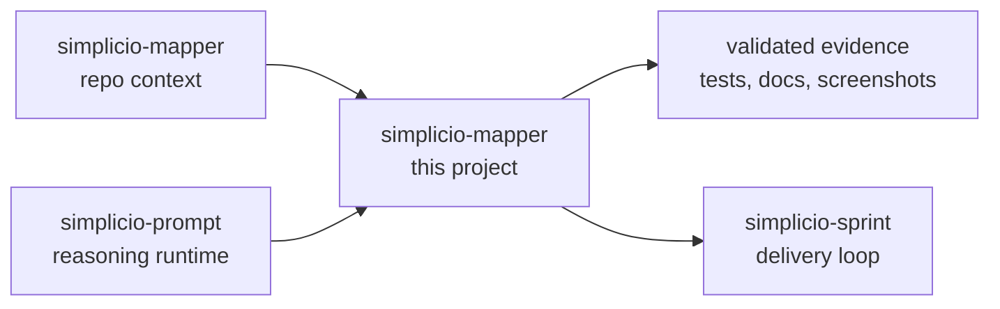

<h1 align="center">simplicio-mapper</h1>

<p align="center">
  <strong>Mapeie qualquer repositório em contexto legível por IA: project map, precedent index, inventário arquitetural, símbolos, call graph e docs.</strong><br />
  <em>Os comandos ficam em inglês para poder copiar exatamente.</em><br />
  <a href="https://wesleysimplicio.github.io/llm-project-mapper/">Docs ao vivo: wesleysimplicio.github.io/llm-project-mapper</a>
</p>

<p align="center">
<a href="https://github.com/wesleysimplicio/simplicio-mapper/stargazers"></a>
<a href="https://pypi.org/project/simplicio-mapper/"></a>
<a href="https://www.npmjs.com/package/@wesleysimplicio/llm-project-mapper"></a>
<a href="LICENSE"></a>
</p>

<p align="center">
<a href="README.md">English</a> | <a href="READMEs/README.pt-BR.md">Português</a> | <a href="READMEs/README.es-ES.md">Español</a> | <a href="READMEs/README.ja-JP.md">日本語</a> | <a href="READMEs/README.ko-KR.md">한국어</a> | <a href="READMEs/README.zh-CN.md">简体中文</a> | <a href="READMEs/README.it-IT.md">Italiano</a> | <a href="READMEs/README.fr-FR.md">Français</a> | <a href="READMEs/README.ru-RU.md">Русский</a> | <a href="READMEs/README.pl-PL.md">Polski</a> | <a href="READMEs/README.hi-IN.md">हिन्दी</a> | <a href="READMEs/README.ar-SA.md">العربية</a> | <a href="READMEs/README.he-IL.md">עברית</a> | <a href="READMEs/README.ms-MY.md">Bahasa Melayu</a> | <a href="READMEs/README.id-ID.md">Bahasa Indonesia</a>
</p>

<p align="center">
  
</p>

<p align="center">
  
</p>

---

## Resumo direto

Mapeie qualquer repositório em contexto legível por IA: project map, precedent index, inventário arquitetural, símbolos, call graph e docs.

## Começo rápido

```bash
pip install -U simplicio-mapper
simplicio-mapper index . --json
simplicio-mapper docs . --json
simplicio-mapper endpoints ./web --against ./api --json
```

## O que faz

- Generates versioned .simplicio artifacts agents can read before planning.
- Works as both Python CLI and npm starter package.
- Builds architecture, symbol and call graph artifacts without forcing a framework.
- Exports markdown docs for wiki/review workflows while keeping remote publishing opt-in.

## Por que este README foi feito para ganhar atenção

- promessa clara na primeira tela
- links de idioma antes do install
- badges e hero visual para confiança imediata
- quick start copiável
- seção de prova antes de detalhes longos
- gráfico de estrelas para social proof

## Como funciona



## Prova e validação

- Current local mapper version is 0.7.x with background indexing and docs-only modes.
- This repo is the canonical standard for visible, versioned .simplicio artifacts.
- It now carries the README globalization standard used across this workspace.

## Ecossistema Simplicio

- [simplicio-mapper](https://github.com/wesleysimplicio/simplicio-mapper) supplies repo context before interpretation.
- [simplicio-cli](https://github.com/wesleysimplicio/simplicio-dev-cli) executes focused code tasks with verification.
- [simplicio-prompt](https://github.com/wesleysimplicio/simplicio-prompt) provides fan-out and consensus runtime patterns.
- [simplicio-sprint](https://github.com/wesleysimplicio/simplicio-sprint) turns cards into draft PR delivery loops.

## Padrão de documentação

- [SIMPLICIO_INTEGRATION.md](SIMPLICIO_INTEGRATION.md)
- [docs/readme-globalization-standard.md](docs/readme-globalization-standard.md)
- [docs/readme-globalization-standard.md](docs/readme-globalization-standard.md)

## Histórico de estrelas

<a href="https://www.star-history.com/#wesleysimplicio/simplicio-mapper&Date">
  <picture>
    <source media="(prefers-color-scheme: dark)" srcset="https://api.star-history.com/svg?repos=wesleysimplicio/simplicio-mapper&type=Date&theme=dark" />
    <source media="(prefers-color-scheme: light)" srcset="https://api.star-history.com/svg?repos=wesleysimplicio/simplicio-mapper&type=Date" />
    
  </picture>
</a>

## Licença

MIT. See [LICENSE](LICENSE).
