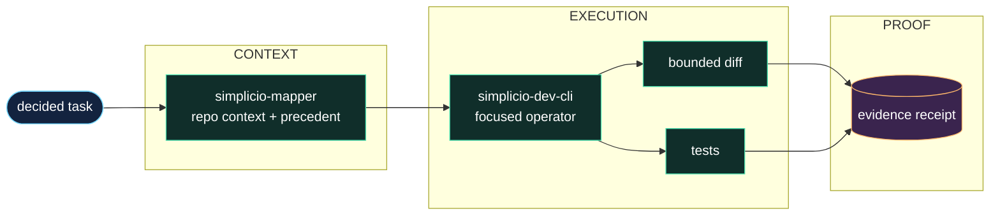

<h1 align="center">simplicio-cli</h1>

<p align="center">
  <strong>Turn a one-line task into a verified code change: mapper context, six-layer contract, diff, test, and evidence.</strong><br />
  <em>Commands stay in English so they can be copied exactly.</em>
</p>

<p align="center">
<a href="https://github.com/wesleysimplicio/simplicio-dev-cli/stargazers"></a>
<a href="https://pypi.org/project/simplicio-cli/"></a>
<a href="https://pypi.org/project/simplicio-cli/"></a>
<a href="../LICENSE"></a>
</p>

<p align="center">
<a href="../README.md">English</a> | <a href="README.pt-BR.md">Português</a> | <a href="README.es-ES.md">Español</a> | <a href="README.ja-JP.md">日本語</a> | <a href="README.ko-KR.md">한국어</a> | <a href="README.zh-CN.md">简体中文</a> | <a href="README.it-IT.md">Italiano</a> | <a href="README.fr-FR.md">Français</a> | <a href="README.ru-RU.md">Русский</a> | <a href="README.pl-PL.md">Polski</a> | <a href="README.hi-IN.md">हिन्दी</a> | <a href="README.ar-SA.md">العربية</a> | <a href="README.he-IL.md">עברית</a> | <a href="README.ms-MY.md">Bahasa Melayu</a> | <a href="README.id-ID.md">Bahasa Indonesia</a>
</p>

<p align="center">
  
</p>

<p align="center">
  
</p>

---

## The short version

Turn a one-line task into a verified code change: mapper context, six-layer contract, diff, test, and evidence.

## The operator boundary

The localized page keeps the fast path. The full restored technical guide lives in the root README so the project keeps its original voice and operating detail.

- Full restored guide: [../README.md](../README.md)
- `simplicio-dev-cli` is the focused implementation and verification operator. It receives a decided task, loads repository context, applies a bounded diff, runs tests, and emits inspectable evidence. It is not the runtime, mapper, or LLM; it is the disciplined execution layer between a plan and a trustworthy change.

## Quick Start

```bash
pip install -U simplicio-cli
simplicio-py detect "hide the Delete button for non-admins"
simplicio-py task "hide the Delete button for non-admins"
```

## What it does

- Accepts a focused task from the runtime, an agent, or the CLI.
- Loads simplicio-mapper context and relevant precedent before an edit.
- Applies a bounded diff, runs tests, and records a verification receipt.
- Leaves orchestration, model choice, and durable loop state to the surrounding layers.

## Why this README is built to earn attention

- clear first-screen promise
- language links before installation
- badges and a visual hero for fast trust
- copy-ready quick start
- proof before long reference material
- star history for social proof

## How it works



## Proof and validation

- Contract tests cover package metadata and mapper handoff.
- Build, lint, test, and packaging gates are recorded with releases when available.
- The operator can be called by simplicio-runtime, simplicio-loop, agents, or directly.

## Simplicio ecosystem

- [simplicio-mapper](https://github.com/wesleysimplicio/simplicio-mapper) supplies repo context before interpretation.
- [simplicio-cli](https://github.com/wesleysimplicio/simplicio-dev-cli) executes focused code tasks with verification.
- [simplicio-prompt](https://github.com/wesleysimplicio/simplicio-prompt) provides fan-out and consensus runtime patterns.
- [simplicio-sprint](https://github.com/wesleysimplicio/simplicio-sprint) turns cards into draft PR delivery loops.

## Documentation standard

- [docs/PYTHON_PACKAGE_INTERDEPENDENCE.md](../docs/PYTHON_PACKAGE_INTERDEPENDENCE.md)
- [docs/LLM_USAGE_POLICY.md](../docs/LLM_USAGE_POLICY.md)
- [docs/readme-globalization-standard.md](../docs/readme-globalization-standard.md)

## Star History

<a href="https://www.star-history.com/#wesleysimplicio/simplicio-dev-cli&Date">
  <picture>
    <source media="(prefers-color-scheme: dark)" srcset="https://api.star-history.com/svg?repos=wesleysimplicio/simplicio-dev-cli&type=Date&theme=dark" />
    <source media="(prefers-color-scheme: light)" srcset="https://api.star-history.com/svg?repos=wesleysimplicio/simplicio-dev-cli&type=Date" />
    
  </picture>
</a>

## License

MIT. See [LICENSE](../LICENSE).
