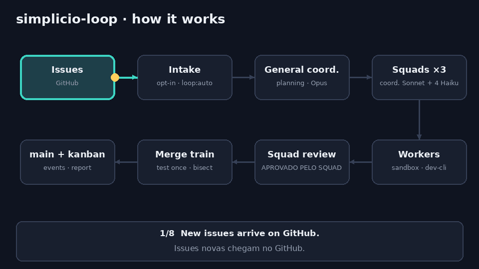
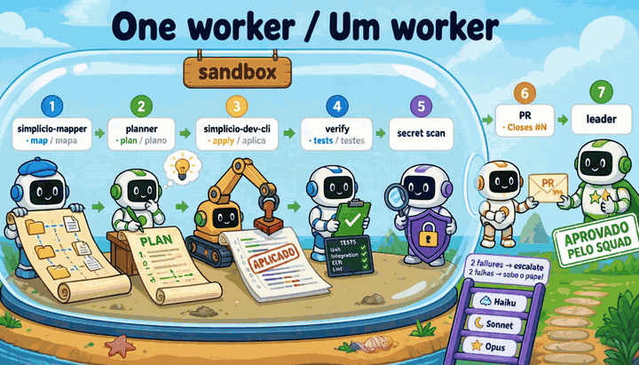
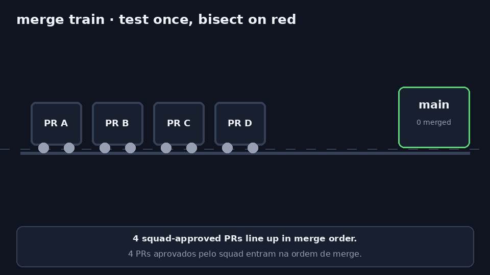
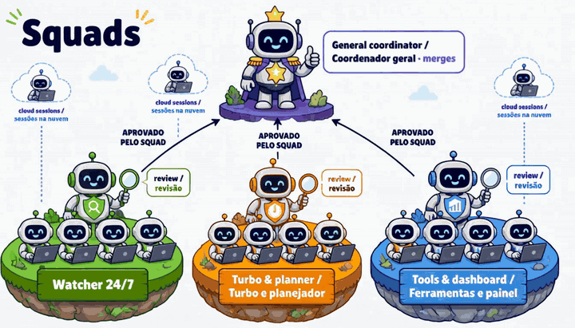

# 🔁 simplicio-loop

<p align="center">
  <a href="../docs/REPOSITORY_GOVERNANCE.md"></a>
  <a href="https://github.com/simpletibr/simplicio-loop/stargazers"></a>
  <a href="../docs/EXTENSION_POINTS_SERVICE.md"></a>
  <a href="../LICENSE"></a>
  <a href="https://discord.gg/wM6tr7xVb"></a>
</p>

<p align="center">
  <a href="../README.md">🇬🇧 English</a> |
  <a href="README.pt-BR.md">🇧🇷 Português</a> |
  <a href="README.es-ES.md">🇪🇸 Español</a> |
  <a href="README.fr-FR.md">🇫🇷 Français</a> |
  <a href="README.de-DE.md">🇩🇪 Deutsch</a> |
  <a href="README.it-IT.md">🇮🇹 Italiano</a> |
  <a href="README.ja-JP.md">🇯🇵 日本語</a> |
  <a href="README.ko-KR.md">🇰🇷 한국어</a> |
  <a href="README.zh-CN.md">🇨🇳 简体中文</a> |
  <a href="README.ru-RU.md">🇷🇺 Русский</a> |
  <a href="README.pl-PL.md">🇵🇱 Polski</a> |
  <a href="README.tr-TR.md">🇹🇷 Türkçe</a> |
  <a href="README.nl-NL.md">🇳🇱 Nederlands</a> |
  <a href="README.hi-IN.md">🇮🇳 हिन्दी</a> |
  <a href="README.ar-SA.md">🇸🇦 العربية</a>
</p>

**simplicio-loop convierte las issues de GitHub en PRs probados: mapea el repo, una IA planifica, un editor determinista aplica, los tests verifican y los squads revisan.**

<p align="center">
  
</p>

## Qué hace

Tres operadores: `simplicio-mapper` (mapa), el modelo planificador (plan), `simplicio-dev-cli` (aplicación determinista).

- **Mapea primero:** `simplicio-mapper` mapea el repo (archivos, símbolos, tests) en un mapa del proyecto, y el planificador solo recibe la porción que necesita.
- **Planifica, nunca escribe:** una IA (un CLI exec como claude, codex, grok o gemini) planifica cada cambio dentro de un sandbox; solo el `dev-cli` determinista edita archivos.
- **Demuestra antes de abrir el PR:** `turbo --apply - --verify` ejecuta tus tests, y un escaneo de secretos corre antes del push.
- **Los squads revisan y hacen merge por lotes** (en curso: [#1502](https://github.com/simpletibr/simplicio-loop/issues/1502), [#1504](https://github.com/simpletibr/simplicio-loop/issues/1504), [#1505](https://github.com/simpletibr/simplicio-loop/issues/1505)). Hoy el watcher se detiene en el PR abierto.

## Instalación

Requiere Python 3.11+, `git` y un `gh` autenticado para las issues de GitHub.

```bash
pip install simplicio-loop
simplicio-loop install            # skills + hooks in this project (--global: user-wide, --host <name>: another host)
simplicio-loop doctor             # check the installed stack
```

## Uso

**En Claude Code o VS Code:**

```text
/simplicio-loop finish all the open issues
```

**Como watcher 24/7** (un servicio que vigila los repos `simpletibr/simplicio-*` y abre PRs):

```bash
simplicio-loop watch247 --once --dry-run          # one simulated tick, changes nothing
simplicio-loop watch247 login-check               # are the exec CLIs logged in?
# from a repo checkout, as root, after creating the non-root user simplicio-loop:
sudo cp packaging/systemd/simplicio-loop-247.service /etc/systemd/system/
sudo cp packaging/systemd/simplicio-loop-247.env.example /etc/simplicio-loop-247.env   # edit it, then chmod 600
sudo systemctl enable --now simplicio-loop-247
```

- **Opt-in por repo:** añade `.simplicio/loop.toml` con `enabled = true`.
- **Opt-in por issue:** la etiqueta `loop:auto`, de un autor de confianza (owner, member o collaborator).
- **El auto-merge está desactivado.** El watcher solo abre PRs; `SIMPLICIO_247_AUTO_MERGE=1` está en curso ([#1505](https://github.com/simpletibr/simplicio-loop/issues/1505)).

Detalles: [docs/WATCHER_247.md](../docs/WATCHER_247.md).

## Cómo funciona

**El loop del worker** (en `main` hoy): `simplicio-mapper` mapea el repo → el planificador (un CLI exec, en el sandbox) recibe la porción del mapa y escribe un plan → `simplicio-dev-cli` lo aplica (`turbo --apply - --verify`) → los tests verifican (dos fallos suben el rol del modelo) → escaneo de secretos → PR. La revisión del squad y el merge train están en curso ([#1502](https://github.com/simpletibr/simplicio-loop/issues/1502), [#1504](https://github.com/simpletibr/simplicio-loop/issues/1504)).

<p align="center">
  
</p>

**El merge train** (en curso: [#1504](https://github.com/simpletibr/simplicio-loop/issues/1504)): los PRs aprobados se prueban una vez como lote; si falla, hace bisección hasta el PR malo y hace merge del resto.

<p align="center">
  
</p>

**Los squads** (en curso: [#1502](https://github.com/simpletibr/simplicio-loop/issues/1502)): un coordinador general, un coordinador por squad, hasta 4 workers cada uno. Por qué: [un coordinador frente a squads](../docs/assets/readme/agents-before-after-cartoon.webp).

<p align="center">
  
</p>


## Los 50 puntos de extensión

El camino del servicio 24/7 conecta 11 de los 50 (24 parciales, 15 ausentes): [docs/EXTENSION_POINTS_SERVICE.md](../docs/EXTENSION_POINTS_SERVICE.md). El plan para conectar el resto es la [#1509](https://github.com/simpletibr/simplicio-loop/issues/1509).

## Más información

- [INSTALL.md](../INSTALL.md) · [docs/CLI_COMMANDS.md](../docs/CLI_COMMANDS.md) · [docs/WATCHER_247.md](../docs/WATCHER_247.md)
- [docs/MODEL_ROLES.md](../docs/MODEL_ROLES.md) · [docs/DASHBOARD.md](../docs/DASHBOARD.md) · [CHANGELOG.md](../CHANGELOG.md)
- **Todo lo demás: [docs/GUIDE.md](../docs/GUIDE.md)** (skills, runtimes, el loop, economía de tokens, seguridad, tests; en inglés)
