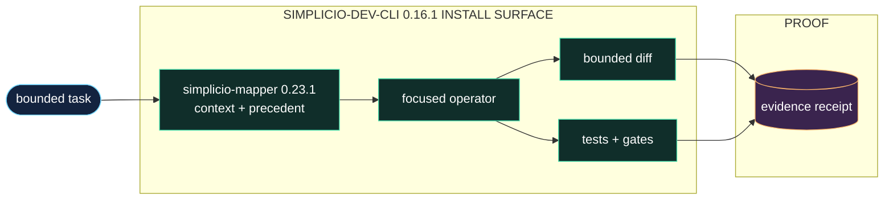

<h1 align="center">simplicio-cli</h1>

<p align="center">
  <strong>एक लाइन की task को verified code change में बदलता है: mapper context, six-layer contract, diff, test और evidence.</strong><br />
  <em>कमांड अंग्रेज़ी में रखे गए हैं ताकि उन्हें ठीक से कॉपी किया जा सके।</em>
</p>

<p align="center">
<a href="https://github.com/wesleysimplicio/simplicio-dev-cli/stargazers"></a>
<a href="https://pypi.org/project/simplicio-cli/"></a>
<a href="https://pypi.org/project/simplicio-cli/"></a>
<a href="../LICENSE"></a>
</p>

<p align="center">
<a href="../README.md">English</a> | <a href="README.pt-BR.md">Português</a> | <a href="README.es-ES.md">Español</a> | <a href="README.ja-JP.md">日本語</a> | <a href="README.ko-KR.md">한국어</a> | <a href="README.zh-CN.md">简体中文</a> | <a href="README.it-IT.md">Italiano</a> | <a href="README.fr-FR.md">Français</a> | <a href="README.ru-RU.md">Русский</a> | <a href="README.pl-PL.md">Polski</a> | <a href="README.hi-IN.md">हिन्दी</a> | <a href="README.ar-SA.md">العربية</a> | <a href="README.he-IL.md">עברית</a> | <a href="README.ms-MY.md">Bahasa Melayu</a> | <a href="README.id-ID.md">Bahasa Indonesia</a>
</p>

<p align="center">
  
</p>
<p align="center">
  
</p>

---

## संक्षेप में

एक लाइन की task को verified code change में बदलता है: mapper context, six-layer contract, diff, test और evidence.

## प्रोजेक्ट DNA

यह localized पेज fast path रखता है। पूरा restored technical guide root README में है ताकि project की original voice और operating detail बनी रहे।

- Full restored guide: [../README.md](../README.md)

## त्वरित शुरुआत

```bash
pip install -U simplicio-cli
simplicio-py detect "hide the Delete button for non-admins"
simplicio-py task "hide the Delete button for non-admins"
```

## यह क्या करता है

- runtime, agent या CLI से केंद्रित कार्य स्वीकार करता है।
- संपादन से पहले `simplicio-mapper` का संदर्भ और संबंधित precedent लोड करता है।
- सीमित diff लागू करता है, परीक्षण चलाता है और जाँच का निरीक्षण योग्य receipt दर्ज करता है।
- orchestration, मॉडल चयन और स्थायी loop state को Simplicio की आसपास की परतों के लिए छोड़ता है।

## यह README ध्यान खींचने के लिए क्यों बनाया गया है

- पहली स्क्रीन पर साफ़ promise
- install से पहले language links
- badges और hero से trust
- copy-ready quick start
- लंबे details से पहले proof
- star history से social proof

## यह कैसे काम करता है



## प्रमाण और सत्यापन

- Benchmark docs compare plain prompting vs the Simplicio contract on real code tasks.
- Package metadata tests pin ecosystem dependency floors.
- The CLI is the executor layer used by SendSprint and SimplicioCode flows.

## Simplicio इकोसिस्टम

- [simplicio-mapper](https://github.com/wesleysimplicio/simplicio-mapper) supplies repo context before interpretation.
- [simplicio-cli](https://github.com/wesleysimplicio/simplicio-dev-cli) executes focused code tasks with verification.
- [simplicio-prompt](https://github.com/wesleysimplicio/simplicio-prompt) provides fan-out and consensus runtime patterns.
- [simplicio-sprint](https://github.com/wesleysimplicio/simplicio-sprint) turns cards into draft PR delivery loops.

## दस्तावेज़ मानक

- [docs/PYTHON_PACKAGE_INTERDEPENDENCE.md](../docs/PYTHON_PACKAGE_INTERDEPENDENCE.md)
- [docs/LLM_USAGE_POLICY.md](../docs/LLM_USAGE_POLICY.md)
- [docs/readme-globalization-standard.md](../docs/readme-globalization-standard.md)

## स्टार इतिहास

<a href="https://www.star-history.com/#wesleysimplicio/simplicio-dev-cli&Date">
  <picture>
    <source media="(prefers-color-scheme: dark)" srcset="https://api.star-history.com/svg?repos=wesleysimplicio/simplicio-dev-cli&type=Date&theme=dark" />
    <source media="(prefers-color-scheme: light)" srcset="https://api.star-history.com/svg?repos=wesleysimplicio/simplicio-dev-cli&type=Date" />
    
  </picture>
</a>

## लाइसेंस

MIT. See [LICENSE](../LICENSE).
