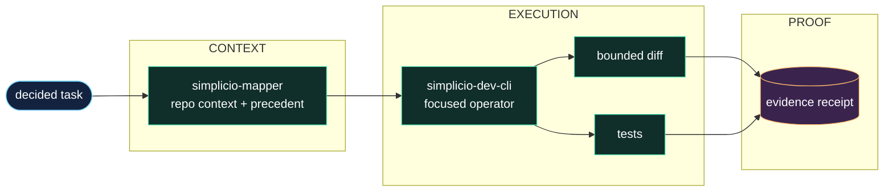

<h1 align="center">simplicio-cli</h1>

<p align="center">
  <strong>Mengubah tugas satu baris menjadi perubahan kode terverifikasi: konteks mapper, kontrak enam lapis, diff, test, dan bukti.</strong><br />
  <em>Perintah tetap dalam bahasa Inggris agar bisa disalin persis.</em>
</p>

<p align="center">
<a href="https://github.com/wesleysimplicio/simplicio-dev-cli/stargazers"></a>
<a href="https://pypi.org/project/simplicio-cli/"></a>
<a href="https://pypi.org/project/simplicio-cli/"></a>
<a href="../LICENSE"></a>
</p>

<p align="center">
<a href="../README.md">English</a> | <a href="README.pt-BR.md">Português</a> | <a href="README.es-ES.md">Español</a> | <a href="README.ja-JP.md">日本語</a> | <a href="README.ko-KR.md">한국어</a> | <a href="README.zh-CN.md">简体中文</a> | <a href="README.it-IT.md">Italiano</a> | <a href="README.fr-FR.md">Français</a> | <a href="README.ru-RU.md">Русский</a> | <a href="README.pl-PL.md">Polski</a> | <a href="README.hi-IN.md">हिन्दी</a> | <a href="README.ar-SA.md">العربية</a> | <a href="README.he-IL.md">עברית</a> | <a href="README.ms-MY.md">Bahasa Melayu</a> | <a href="README.id-ID.md">Bahasa Indonesia</a>
</p>

<p align="center">
  
</p>
<p align="center">
  
</p>

---

## Ringkasnya

Mengubah tugas satu baris menjadi perubahan kode terverifikasi: konteks mapper, kontrak enam lapis, diff, test, dan bukti.

## DNA proyek

Halaman lokal ini mempertahankan jalur cepat. Panduan teknis lengkap yang dipulihkan ada di README utama agar suara asli dan detail operasional proyek tetap hidup.

- Full restored guide: [../README.md](../README.md)

## Mulai cepat

```bash
pip install -U simplicio-cli
simplicio-py detect "hide the Delete button for non-admins"
simplicio-py task "hide the Delete button for non-admins"
```

## Apa yang dilakukan

- Menerima tugas terfokus dari runtime, agen, atau CLI.
- Memuat konteks `simplicio-mapper` dan preseden yang relevan sebelum mengedit.
- Menerapkan diff terbatas, menjalankan pengujian, dan mencatat tanda terima verifikasi yang dapat diperiksa.
- Menyerahkan orkestrasi, pemilihan model, dan state loop jangka panjang kepada lapisan Simplicio di sekitarnya.

## Mengapa README ini dibuat agar mudah menarik perhatian

- janji nilai yang jelas di layar pertama
- tautan bahasa sebelum instalasi
- badge dan hero untuk kepercayaan
- quick start siap salin
- bukti sebelum detail panjang
- grafik bintang sebagai social proof

## Cara kerjanya



## Bukti dan validasi

- Benchmark docs compare plain prompting vs the Simplicio contract on real code tasks.
- Package metadata tests pin ecosystem dependency floors.
- The CLI is the executor layer used by SendSprint and SimplicioCode flows.

## Ekosistem Simplicio

- [simplicio-mapper](https://github.com/wesleysimplicio/simplicio-mapper) supplies repo context before interpretation.
- [simplicio-cli](https://github.com/wesleysimplicio/simplicio-dev-cli) executes focused code tasks with verification.
- [simplicio-prompt](https://github.com/wesleysimplicio/simplicio-prompt) provides fan-out and consensus runtime patterns.
- [simplicio-sprint](https://github.com/wesleysimplicio/simplicio-sprint) turns cards into draft PR delivery loops.

## Standar dokumentasi

- [docs/PYTHON_PACKAGE_INTERDEPENDENCE.md](../docs/PYTHON_PACKAGE_INTERDEPENDENCE.md)
- [docs/LLM_USAGE_POLICY.md](../docs/LLM_USAGE_POLICY.md)
- [docs/readme-globalization-standard.md](../docs/readme-globalization-standard.md)

## Riwayat bintang

<a href="https://www.star-history.com/#wesleysimplicio/simplicio-dev-cli&Date">
  <picture>
    <source media="(prefers-color-scheme: dark)" srcset="https://api.star-history.com/svg?repos=wesleysimplicio/simplicio-dev-cli&type=Date&theme=dark" />
    <source media="(prefers-color-scheme: light)" srcset="https://api.star-history.com/svg?repos=wesleysimplicio/simplicio-dev-cli&type=Date" />
    
  </picture>
</a>

## Lisensi

MIT. See [LICENSE](../LICENSE).
