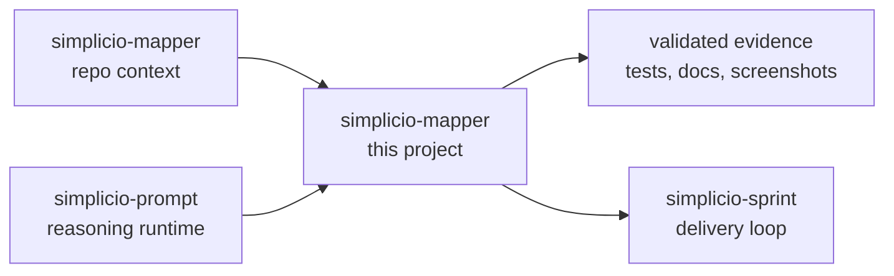

<h1 align="center">simplicio-mapper</h1>

<p align="center">
  <strong>あらゆるリポジトリを AI が読める文脈へ変換します: project map、precedent index、設計インベントリ、symbol index、call graph、docs。</strong><br />
  <em>コマンドはそのままコピーできるよう英語で記載しています。</em>
</p>

<p align="center">
<a href="https://github.com/wesleysimplicio/simplicio-mapper/stargazers"></a>
<a href="https://pypi.org/project/simplicio-mapper/"></a>
<a href="https://www.npmjs.com/package/@wesleysimplicio/llm-project-mapper"></a>
<a href="../LICENSE"></a>
</p>

<p align="center">
<a href="../README.md">English</a> | <a href="README.pt-BR.md">Português</a> | <a href="README.es-ES.md">Español</a> | <a href="README.ja-JP.md">日本語</a> | <a href="README.ko-KR.md">한국어</a> | <a href="README.zh-CN.md">简体中文</a> | <a href="README.it-IT.md">Italiano</a> | <a href="README.fr-FR.md">Français</a> | <a href="README.ru-RU.md">Русский</a> | <a href="README.pl-PL.md">Polski</a> | <a href="README.hi-IN.md">हिन्दी</a> | <a href="README.ar-SA.md">العربية</a> | <a href="README.he-IL.md">עברית</a> | <a href="README.ms-MY.md">Bahasa Melayu</a> | <a href="README.id-ID.md">Bahasa Indonesia</a>
</p>

<p align="center">
  
</p>

<p align="center">
  
</p>

---

## 短い概要

あらゆるリポジトリを AI が読める文脈へ変換します: project map、precedent index、設計インベントリ、symbol index、call graph、docs。

## プロジェクトのDNA

このローカライズ版は最短導線を保ちます。復元された詳細ガイドはルート README にあり、プロジェクト本来の声と運用情報を残します。

- Full restored guide: [../README.md](../README.md)
- Local project note: simplicio-mapper is the map before the plan. Its value is not only the artifact names; it is the habit it teaches agents: read the repository, preserve shared context, expose architecture, and make future work cheaper. The original guide explained that operational philosophy in detail, so this refresh restores it under the sharper global landing page.

## クイックスタート

```bash
pip install -U simplicio-mapper
simplicio-mapper index . --json
simplicio-mapper docs . --json
simplicio-mapper endpoints ./web --against ./api --json
```

## できること

- Generates versioned .simplicio artifacts agents can read before planning.
- Works as both Python CLI and npm starter package.
- Builds architecture, symbol and call graph artifacts without forcing a framework.
- Exports markdown docs for wiki/review workflows while keeping remote publishing opt-in.

## 注目される README にした理由

- 最初の画面で価値を明確に伝える
- インストール前に言語リンクを置く
- バッジと hero 画像で信頼を作る
- コピーできる quick start
- 長い説明より先に検証を置く
- スター履歴で社会的証明を見せる

## 仕組み



## 証拠と検証

- Current local mapper version is 0.7.x with background indexing and docs-only modes.
- This repo is the canonical standard for visible, versioned .simplicio artifacts.
- It now carries the README globalization standard used across this workspace.

## Simplicio エコシステム

- [simplicio-mapper](https://github.com/wesleysimplicio/simplicio-mapper) supplies repo context before interpretation.
- [simplicio-cli](https://github.com/wesleysimplicio/simplicio-dev-cli) executes focused code tasks with verification.
- [simplicio-prompt](https://github.com/wesleysimplicio/simplicio-prompt) provides fan-out and consensus runtime patterns.
- [simplicio-sprint](https://github.com/wesleysimplicio/simplicio-sprint) turns cards into draft PR delivery loops.

## ドキュメント標準

- [SIMPLICIO_INTEGRATION.md](../SIMPLICIO_INTEGRATION.md)
- [docs/readme-globalization-standard.md](../docs/readme-globalization-standard.md)

## スター履歴

<a href="https://www.star-history.com/#wesleysimplicio/simplicio-mapper&Date">
  <picture>
    <source media="(prefers-color-scheme: dark)" srcset="https://api.star-history.com/svg?repos=wesleysimplicio/simplicio-mapper&type=Date&theme=dark" />
    <source media="(prefers-color-scheme: light)" srcset="https://api.star-history.com/svg?repos=wesleysimplicio/simplicio-mapper&type=Date" />
    
  </picture>
</a>

## ライセンス

MIT. See [LICENSE](../LICENSE).
