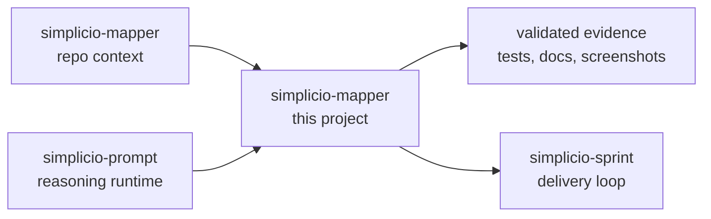

<h1 align="center">simplicio-mapper</h1>

<p align="center">
  <strong>모든 저장소를 AI가 읽을 수 있는 컨텍스트로 매핑합니다: project map, precedent index, architecture inventory, symbol index, call graph, docs.</strong><br />
  <em>명령어는 정확히 복사할 수 있도록 영어로 유지합니다.</em>
</p>

<p align="center">
<a href="https://github.com/wesleysimplicio/simplicio-mapper/stargazers"></a>
<a href="https://pypi.org/project/simplicio-mapper/"></a>
<a href="https://www.npmjs.com/package/@wesleysimplicio/llm-project-mapper"></a>
<a href="../LICENSE"></a>
</p>

<p align="center">
<a href="../README.md">English</a> | <a href="README.pt-BR.md">Português</a> | <a href="README.es-ES.md">Español</a> | <a href="README.ja-JP.md">日本語</a> | <a href="README.ko-KR.md">한국어</a> | <a href="README.zh-CN.md">简体中文</a> | <a href="README.it-IT.md">Italiano</a> | <a href="README.fr-FR.md">Français</a> | <a href="README.ru-RU.md">Русский</a> | <a href="README.pl-PL.md">Polski</a> | <a href="README.hi-IN.md">हिन्दी</a> | <a href="README.ar-SA.md">العربية</a> | <a href="README.he-IL.md">עברית</a> | <a href="README.ms-MY.md">Bahasa Melayu</a> | <a href="README.id-ID.md">Bahasa Indonesia</a>
</p>

<p align="center">
  
</p>

<p align="center">
  
</p>

---

## 짧은 요약

모든 저장소를 AI가 읽을 수 있는 컨텍스트로 매핑합니다: project map, precedent index, architecture inventory, symbol index, call graph, docs.

## 프로젝트 DNA

이 현지화 문서는 빠른 진입 경로를 유지합니다. 복원된 전체 기술 가이드는 루트 README에 있어 프로젝트의 원래 목소리와 운영 세부 정보를 보존합니다.

- Full restored guide: [../README.md](../README.md)
- Local project note: simplicio-mapper is the map before the plan. Its value is not only the artifact names; it is the habit it teaches agents: read the repository, preserve shared context, expose architecture, and make future work cheaper. The original guide explained that operational philosophy in detail, so this refresh restores it under the sharper global landing page.

## 빠른 시작

```bash
pip install -U simplicio-mapper
simplicio-mapper index . --json
simplicio-mapper docs . --json
simplicio-mapper endpoints ./web --against ./api --json
```

## 무엇을 하나요

- Generates versioned .simplicio artifacts agents can read before planning.
- Works as both Python CLI and npm starter package.
- Builds architecture, symbol and call graph artifacts without forcing a framework.
- Exports markdown docs for wiki/review workflows while keeping remote publishing opt-in.

## 주목받는 README 구조

- 첫 화면에서 가치를 명확히 전달
- 설치 전에 언어 링크 제공
- 배지와 hero 이미지로 신뢰 형성
- 복사 가능한 quick start
- 긴 설명보다 검증을 먼저 배치
- 스타 히스토리로 social proof 제공

## 작동 방식



## 증거와 검증

- Current local mapper version is 0.7.x with background indexing and docs-only modes.
- This repo is the canonical standard for visible, versioned .simplicio artifacts.
- It now carries the README globalization standard used across this workspace.

## Simplicio 생태계

- [simplicio-mapper](https://github.com/wesleysimplicio/simplicio-mapper) supplies repo context before interpretation.
- [simplicio-cli](https://github.com/wesleysimplicio/simplicio-dev-cli) executes focused code tasks with verification.
- [simplicio-prompt](https://github.com/wesleysimplicio/simplicio-prompt) provides fan-out and consensus runtime patterns.
- [simplicio-sprint](https://github.com/wesleysimplicio/simplicio-sprint) turns cards into draft PR delivery loops.

## 문서 표준

- [SIMPLICIO_INTEGRATION.md](../SIMPLICIO_INTEGRATION.md)
- [docs/readme-globalization-standard.md](../docs/readme-globalization-standard.md)

## 스타 히스토리

<a href="https://www.star-history.com/#wesleysimplicio/simplicio-mapper&Date">
  <picture>
    <source media="(prefers-color-scheme: dark)" srcset="https://api.star-history.com/svg?repos=wesleysimplicio/simplicio-mapper&type=Date&theme=dark" />
    <source media="(prefers-color-scheme: light)" srcset="https://api.star-history.com/svg?repos=wesleysimplicio/simplicio-mapper&type=Date" />
    
  </picture>
</a>

## 라이선스

MIT. See [LICENSE](../LICENSE).
