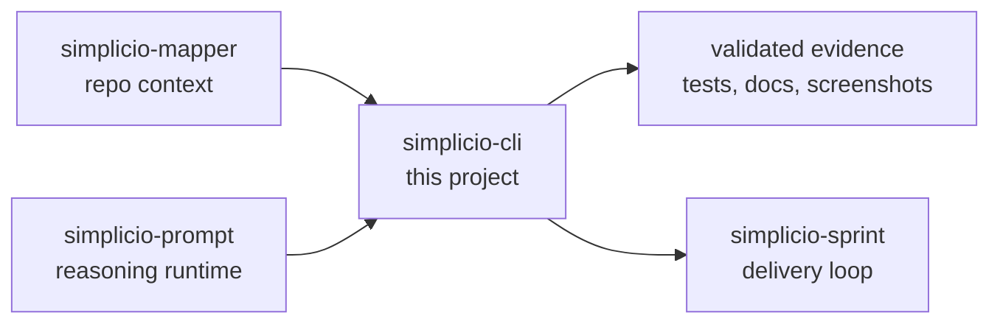

<h1 align="center">simplicio-cli</h1>

<p align="center">
  <strong>한 줄 작업을 mapper 컨텍스트, 6계층 계약, diff, 테스트, 증거가 있는 검증된 변경으로 바꿉니다.</strong><br />
  <em>명령어는 정확히 복사할 수 있도록 영어로 유지합니다.</em>
</p>

<p align="center">
<a href="https://github.com/wesleysimplicio/simplicio-dev-cli/stargazers"></a>
<a href="https://pypi.org/project/simplicio-cli/"></a>
<a href="https://pypi.org/project/simplicio-cli/"></a>
<a href="../LICENSE"></a>
</p>

<p align="center">
<a href="../README.md">English</a> | <a href="README.pt-BR.md">Português</a> | <a href="README.es-ES.md">Español</a> | <a href="README.ja-JP.md">日本語</a> | <a href="README.ko-KR.md">한국어</a> | <a href="README.zh-CN.md">简体中文</a> | <a href="README.it-IT.md">Italiano</a> | <a href="README.fr-FR.md">Français</a> | <a href="README.ru-RU.md">Русский</a> | <a href="README.pl-PL.md">Polski</a> | <a href="README.hi-IN.md">हिन्दी</a> | <a href="README.ar-SA.md">العربية</a> | <a href="README.he-IL.md">עברית</a> | <a href="README.ms-MY.md">Bahasa Melayu</a> | <a href="README.id-ID.md">Bahasa Indonesia</a>
</p>

<p align="center">
  
</p>

---

## 짧은 요약

한 줄 작업을 mapper 컨텍스트, 6계층 계약, diff, 테스트, 증거가 있는 검증된 변경으로 바꿉니다.

## 프로젝트 DNA

이 현지화 문서는 빠른 진입 경로를 유지합니다. 복원된 전체 기술 가이드는 루트 README에 있어 프로젝트의 원래 목소리와 운영 세부 정보를 보존합니다.

- Full restored guide: [../README.md](../README.md)
- Local project note: simplicio-cli is not just a command wrapper; it is the measured execution layer of the ecosystem. Its older README carried the hard proof: real hidden tests, benchmark tables, model comparisons, provider policy, and the honest boundary between better prompting and actual capability. That evidence belongs beside the new hero, not behind it.

## 빠른 시작

```bash
pip install -U simplicio-cli
simplicio detect "hide the Delete button for non-admins"
simplicio task "hide the Delete button for non-admins"
```

## 무엇을 하나요

- Classifies the task before execution so small fixes stay small and sprint-scale work becomes a plan.
- Loads simplicio-mapper artifacts before asking an LLM to edit.
- Keeps a verification loop around generated diffs instead of trusting the first answer.
- Works with local Simplicio1, OpenRouter, OpenAI, Anthropic, DeepSeek, Hermes, Codex and Claude-style hosts.

## 주목받는 README 구조

- 첫 화면에서 가치를 명확히 전달
- 설치 전에 언어 링크 제공
- 배지와 hero 이미지로 신뢰 형성
- 복사 가능한 quick start
- 긴 설명보다 검증을 먼저 배치
- 스타 히스토리로 social proof 제공

## 작동 방식



## 증거와 검증

- Benchmark docs compare plain prompting vs the Simplicio contract on real code tasks.
- Package metadata tests pin ecosystem dependency floors.
- The CLI is the executor layer used by SendSprint and SimplicioCode flows.

## Simplicio 생태계

- [simplicio-mapper](https://github.com/wesleysimplicio/simplicio-mapper) supplies repo context before interpretation.
- [simplicio-cli](https://github.com/wesleysimplicio/simplicio-dev-cli) executes focused code tasks with verification.
- [simplicio-prompt](https://github.com/wesleysimplicio/simplicio-prompt) provides fan-out and consensus runtime patterns.
- [simplicio-sprint](https://github.com/wesleysimplicio/simplicio-sprint) turns cards into draft PR delivery loops.

## 문서 표준

- [docs/PYTHON_PACKAGE_INTERDEPENDENCE.md](../docs/PYTHON_PACKAGE_INTERDEPENDENCE.md)
- [docs/LLM_USAGE_POLICY.md](../docs/LLM_USAGE_POLICY.md)
- [docs/readme-globalization-standard.md](../docs/readme-globalization-standard.md)

## 스타 히스토리

<a href="https://www.star-history.com/#wesleysimplicio/simplicio-dev-cli&Date">
  <picture>
    <source media="(prefers-color-scheme: dark)" srcset="https://api.star-history.com/svg?repos=wesleysimplicio/simplicio-dev-cli&type=Date&theme=dark" />
    <source media="(prefers-color-scheme: light)" srcset="https://api.star-history.com/svg?repos=wesleysimplicio/simplicio-dev-cli&type=Date" />
    
  </picture>
</a>

## 라이선스

MIT. See [LICENSE](../LICENSE).
