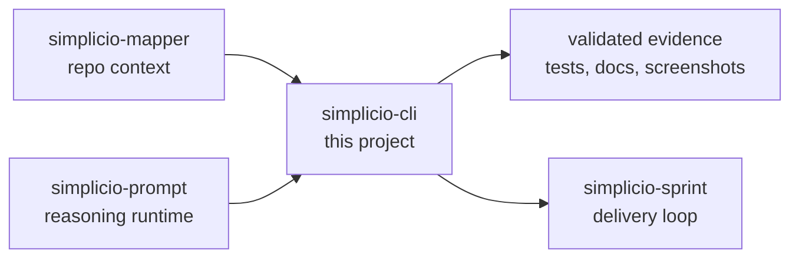

<h1 align="center">simplicio-cli</h1>

<p align="center">
  <strong>Превращает однострочную задачу в проверенное изменение: mapper-контекст, 6-слойный контракт, diff, тесты и доказательства.</strong><br />
  <em>Команды оставлены на английском, чтобы их можно было точно скопировать.</em>
</p>

<p align="center">
<a href="https://github.com/wesleysimplicio/simplicio-dev-cli/stargazers"></a>
<a href="https://pypi.org/project/simplicio-cli/"></a>
<a href="https://pypi.org/project/simplicio-cli/"></a>
<a href="../LICENSE"></a>
</p>

<p align="center">
<a href="../README.md">English</a> | <a href="README.pt-BR.md">Português</a> | <a href="README.es-ES.md">Español</a> | <a href="README.ja-JP.md">日本語</a> | <a href="README.ko-KR.md">한국어</a> | <a href="README.zh-CN.md">简体中文</a> | <a href="README.it-IT.md">Italiano</a> | <a href="README.fr-FR.md">Français</a> | <a href="README.ru-RU.md">Русский</a> | <a href="README.pl-PL.md">Polski</a> | <a href="README.hi-IN.md">हिन्दी</a> | <a href="README.ar-SA.md">العربية</a> | <a href="README.he-IL.md">עברית</a> | <a href="README.ms-MY.md">Bahasa Melayu</a> | <a href="README.id-ID.md">Bahasa Indonesia</a>
</p>

<p align="center">
  
</p>

---

## Кратко

Превращает однострочную задачу в проверенное изменение: mapper-контекст, 6-слойный контракт, diff, тесты и доказательства.

## Быстрый старт

```bash
pip install -U simplicio-cli
simplicio detect "hide the Delete button for non-admins"
simplicio task "hide the Delete button for non-admins"
```

## Что делает

- Classifies the task before execution so small fixes stay small and sprint-scale work becomes a plan.
- Loads simplicio-mapper artifacts before asking an LLM to edit.
- Keeps a verification loop around generated diffs instead of trusting the first answer.
- Works with local Simplicio1, OpenRouter, OpenAI, Anthropic, DeepSeek, Hermes, Codex and Claude-style hosts.

## Почему этот README лучше привлекает внимание

- четкое обещание в первом экране
- языки до установки
- бейджи и hero для доверия
- копируемый quick start
- доказательства до длинных деталей
- график звезд как social proof

## Как это работает



## Доказательства и проверка

- Benchmark docs compare plain prompting vs the Simplicio contract on real code tasks.
- Package metadata tests pin ecosystem dependency floors.
- The CLI is the executor layer used by SendSprint and SimplicioCode flows.

## Экосистема Simplicio

- [simplicio-mapper](https://github.com/wesleysimplicio/simplicio-mapper) supplies repo context before interpretation.
- [simplicio-cli](https://github.com/wesleysimplicio/simplicio-dev-cli) executes focused code tasks with verification.
- [simplicio-prompt](https://github.com/wesleysimplicio/simplicio-prompt) provides fan-out and consensus runtime patterns.
- [simplicio-sprint](https://github.com/wesleysimplicio/simplicio-sprint) turns cards into draft PR delivery loops.

## Стандарт документации

- [docs/PYTHON_PACKAGE_INTERDEPENDENCE.md](../docs/PYTHON_PACKAGE_INTERDEPENDENCE.md)
- [docs/LLM_USAGE_POLICY.md](../docs/LLM_USAGE_POLICY.md)
- [docs/readme-globalization-standard.md](../docs/readme-globalization-standard.md)

## История звезд

<a href="https://www.star-history.com/#wesleysimplicio/simplicio-dev-cli&Date">
  <picture>
    <source media="(prefers-color-scheme: dark)" srcset="https://api.star-history.com/svg?repos=wesleysimplicio/simplicio-dev-cli&type=Date&theme=dark" />
    <source media="(prefers-color-scheme: light)" srcset="https://api.star-history.com/svg?repos=wesleysimplicio/simplicio-dev-cli&type=Date" />
    
  </picture>
</a>

## Лицензия

MIT. See [LICENSE](../LICENSE).
