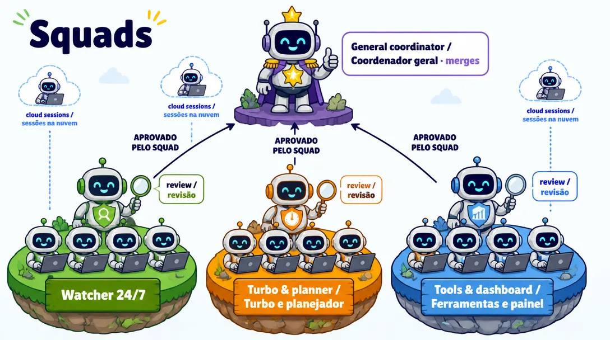

# 🔁 simplicio-loop

<p align="center">
  <a href="../docs/REPOSITORY_GOVERNANCE.md"></a>
  <a href="https://github.com/simpletibr/simplicio-loop/stargazers"></a>
  <a href="../docs/EXTENSION_POINTS_SERVICE.md"></a>
  <a href="../LICENSE"></a>
  <a href="https://discord.gg/wM6tr7xVb"></a>
</p>

<p align="center">
  <a href="../README.md">🇬🇧 English</a> |
  <a href="README.pt-BR.md">🇧🇷 Português</a> |
  <a href="README.es-ES.md">🇪🇸 Español</a> |
  <a href="README.fr-FR.md">🇫🇷 Français</a> |
  <a href="README.de-DE.md">🇩🇪 Deutsch</a> |
  <a href="README.it-IT.md">🇮🇹 Italiano</a> |
  <a href="README.ja-JP.md">🇯🇵 日本語</a> |
  <a href="README.ko-KR.md">🇰🇷 한국어</a> |
  <a href="README.zh-CN.md">🇨🇳 简体中文</a> |
  <a href="README.ru-RU.md">🇷🇺 Русский</a> |
  <a href="README.pl-PL.md">🇵🇱 Polski</a> |
  <a href="README.tr-TR.md">🇹🇷 Türkçe</a> |
  <a href="README.nl-NL.md">🇳🇱 Nederlands</a> |
  <a href="README.hi-IN.md">🇮🇳 हिन्दी</a> |
  <a href="README.ar-SA.md">🇸🇦 العربية</a>
</p>

**simplicio-loop, GitHub issue'larını test edilmiş PR'lara çevirir: depoyu haritalar, bir yapay zekâ planlar, deterministik bir editör uygular, testler doğrular, squad'lar gözden geçirir.**

<p align="center">
  
</p>

## Ne yapar

Üç operatör: `simplicio-mapper` (harita), planlayıcı model (plan), `simplicio-dev-cli` (deterministik uygulama).

- **Önce haritalar:** `simplicio-mapper` depoyu (dosyalar, semboller, testler) bir proje haritasına dönüştürür ve planlayıcı yalnızca ihtiyacı olan dilimi alır.
- **Planlar, asla yazmaz:** Bir yapay zekâ (claude, codex, grok veya gemini gibi bir exec CLI) her değişikliği sandbox içinde planlar; dosyaları yalnızca deterministik `dev-cli` düzenler.
- **PR açmadan önce kanıtlar:** `turbo --apply - --verify` testlerinizi çalıştırır ve push'tan önce bir gizli anahtar taraması çalışır.
- **Squad'lar gözden geçirir ve toplu merge eder** (devam ediyor: [#1502](https://github.com/simpletibr/simplicio-loop/issues/1502), [#1504](https://github.com/simpletibr/simplicio-loop/issues/1504), [#1505](https://github.com/simpletibr/simplicio-loop/issues/1505)). Bugün watcher açık bir PR'da durur.

## Kurulum

Python 3.11+, `git` ve GitHub issue'ları için kimliği doğrulanmış bir `gh` gerekir.

```bash
pip install simplicio-loop
simplicio-loop install            # skills + hooks in this project (--global: user-wide, --host <name>: another host)
simplicio-loop doctor             # check the installed stack
```

## Kullanım

**Claude Code veya VS Code'da:**

```text
/simplicio-loop finish all the open issues
```

**7/24 watcher olarak** (`simpletibr/simplicio-*` depolarını izleyip PR açan bir servis):

```bash
simplicio-loop watch247 --once --dry-run          # one simulated tick, changes nothing
simplicio-loop watch247 login-check               # are the exec CLIs logged in?
# from a repo checkout, as root, after creating the non-root user simplicio-loop:
sudo cp packaging/systemd/simplicio-loop-247.service /etc/systemd/system/
sudo cp packaging/systemd/simplicio-loop-247.env.example /etc/simplicio-loop-247.env   # edit it, then chmod 600
sudo systemctl enable --now simplicio-loop-247
```

- **Depo başına opt-in:** `.simplicio/loop.toml` ekleyin ve `enabled = true` yazın.
- **Issue başına opt-in:** güvenilir bir yazarın (owner, member veya collaborator) koyduğu `loop:auto` etiketi.
- **Otomatik merge kapalı.** Watcher yalnızca PR açar; `SIMPLICIO_247_AUTO_MERGE=1` devam ediyor ([#1505](https://github.com/simpletibr/simplicio-loop/issues/1505)).

Ayrıntılar: [docs/WATCHER_247.md](../docs/WATCHER_247.md).

## Nasıl çalışır

**Worker döngüsü** (bugün `main`'de): `simplicio-mapper` depoyu haritalar → planlayıcı (bir exec CLI, sandbox içinde) harita dilimini alır ve bir plan yazar → `simplicio-dev-cli` uygular (`turbo --apply - --verify`) → testler doğrular (iki başarısızlık model rolünü yükseltir) → gizli anahtar taraması → PR. Squad review ve merge train devam ediyor ([#1502](https://github.com/simpletibr/simplicio-loop/issues/1502), [#1504](https://github.com/simpletibr/simplicio-loop/issues/1504)).

<p align="center">
  
</p>

**Merge train** (devam ediyor: [#1504](https://github.com/simpletibr/simplicio-loop/issues/1504)): onaylanan PR'lar bir kez toplu olarak test edilir; kırmızı olursa ikili aramayla sorunlu PR bulunur ve geri kalanlar merge edilir.

<p align="center">
  
</p>

**Squad'lar** (devam ediyor: [#1502](https://github.com/simpletibr/simplicio-loop/issues/1502)): bir genel koordinatör, squad başına bir koordinatör, her birinde en fazla 4 worker. Neden: [tek koordinatöre karşı squad'lar](../docs/assets/readme/agents-before-after-cartoon.webp).

<p align="center">
  
</p>

<p align="center">
  
</p>

## 50 genişletme noktası

7/24 servis yolu 50 noktanın 11'ini bağlar (24'ü kısmi, 15'i yok): [docs/EXTENSION_POINTS_SERVICE.md](../docs/EXTENSION_POINTS_SERVICE.md). Geri kalanını bağlama planı [#1509](https://github.com/simpletibr/simplicio-loop/issues/1509).

## Daha fazlası

- [INSTALL.md](../INSTALL.md) · [docs/CLI_COMMANDS.md](../docs/CLI_COMMANDS.md) · [docs/WATCHER_247.md](../docs/WATCHER_247.md)
- [docs/MODEL_ROLES.md](../docs/MODEL_ROLES.md) · [docs/DASHBOARD.md](../docs/DASHBOARD.md) · [CHANGELOG.md](../CHANGELOG.md)
- **Geri kalan her şey: [docs/GUIDE.md](../docs/GUIDE.md)** (skills, runtimes, döngü, token tasarrufu, güvenlik, testler; İngilizce)
