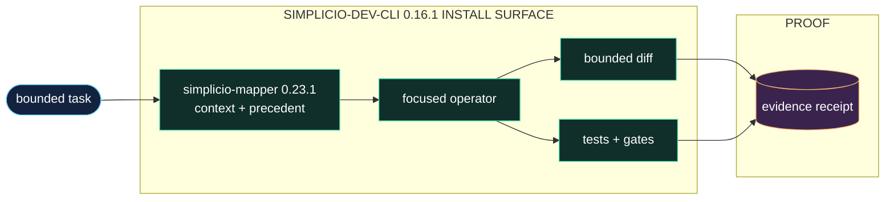

<h1 align="center">simplicio-cli</h1>

<p align="center">
  <strong>把一行任务变成经过验证的代码变更：mapper 上下文、六层契约、diff、测试和证据。</strong><br />
  <em>命令保持英文，方便直接复制。</em>
</p>

<p align="center">
<a href="https://github.com/wesleysimplicio/simplicio-dev-cli/stargazers"></a>
<a href="https://pypi.org/project/simplicio-cli/"></a>
<a href="https://pypi.org/project/simplicio-cli/"></a>
<a href="../LICENSE"></a>
</p>

<p align="center">
<a href="../README.md">English</a> | <a href="README.pt-BR.md">Português</a> | <a href="README.es-ES.md">Español</a> | <a href="README.ja-JP.md">日本語</a> | <a href="README.ko-KR.md">한국어</a> | <a href="README.zh-CN.md">简体中文</a> | <a href="README.it-IT.md">Italiano</a> | <a href="README.fr-FR.md">Français</a> | <a href="README.ru-RU.md">Русский</a> | <a href="README.pl-PL.md">Polski</a> | <a href="README.hi-IN.md">हिन्दी</a> | <a href="README.ar-SA.md">العربية</a> | <a href="README.he-IL.md">עברית</a> | <a href="README.ms-MY.md">Bahasa Melayu</a> | <a href="README.id-ID.md">Bahasa Indonesia</a>
</p>

<p align="center">
  
</p>
<p align="center">
  
</p>

---

## 简短说明

把一行任务变成经过验证的代码变更：mapper 上下文、六层契约、diff、测试和证据。

## 项目 DNA

此本地化页面保留快速路径。恢复后的完整技术指南位于根 README 中，用来保留项目原本的表达和运行细节。

- Full restored guide: [../README.md](../README.md)

## 快速开始

```bash
pip install -U simplicio-cli
simplicio-py detect "hide the Delete button for non-admins"
simplicio-py task "hide the Delete button for non-admins"
```

## 它做什么

- 接收来自 runtime、agent 或 CLI 的聚焦任务。
- 编辑前加载 `simplicio-mapper` 上下文和相关先例。
- 应用范围受控的 diff，运行测试，并记录可检查的验证凭证。
- 将编排、模型选择和持久 loop state 留给周围的 Simplicio 层。

## 为什么这个 README 更容易获得关注

- 首屏价值清晰
- 安装前提供语言入口
- 徽章和 hero 图建立信任
- 可复制的 quick start
- 先给证据再给长说明
- 用 Star 历史展示社会证明

## 工作方式



## 证据与验证

- Benchmark docs compare plain prompting vs the Simplicio contract on real code tasks.
- Package metadata tests pin ecosystem dependency floors.
- The CLI is the executor layer used by SendSprint and SimplicioCode flows.

## Simplicio 生态

- [simplicio-mapper](https://github.com/wesleysimplicio/simplicio-mapper) supplies repo context before interpretation.
- [simplicio-cli](https://github.com/wesleysimplicio/simplicio-dev-cli) executes focused code tasks with verification.
- [simplicio-prompt](https://github.com/wesleysimplicio/simplicio-prompt) provides fan-out and consensus runtime patterns.
- [simplicio-sprint](https://github.com/wesleysimplicio/simplicio-sprint) turns cards into draft PR delivery loops.
- [Simplicio Agent](https://github.com/wesleysimplicio/simplicio-agent) is the desktop/CLI host that runs this ecosystem's skills and tools end to end.

## 文档标准

- [docs/PYTHON_PACKAGE_INTERDEPENDENCE.md](../docs/PYTHON_PACKAGE_INTERDEPENDENCE.md)
- [docs/LLM_USAGE_POLICY.md](../docs/LLM_USAGE_POLICY.md)
- [docs/readme-globalization-standard.md](../docs/readme-globalization-standard.md)

## Star 历史

<a href="https://www.star-history.com/#wesleysimplicio/simplicio-dev-cli&Date">
  <picture>
    <source media="(prefers-color-scheme: dark)" srcset="https://api.star-history.com/svg?repos=wesleysimplicio/simplicio-dev-cli&type=Date&theme=dark" />
    <source media="(prefers-color-scheme: light)" srcset="https://api.star-history.com/svg?repos=wesleysimplicio/simplicio-dev-cli&type=Date" />
    
  </picture>
</a>

## 许可证

MIT. See [LICENSE](../LICENSE).
