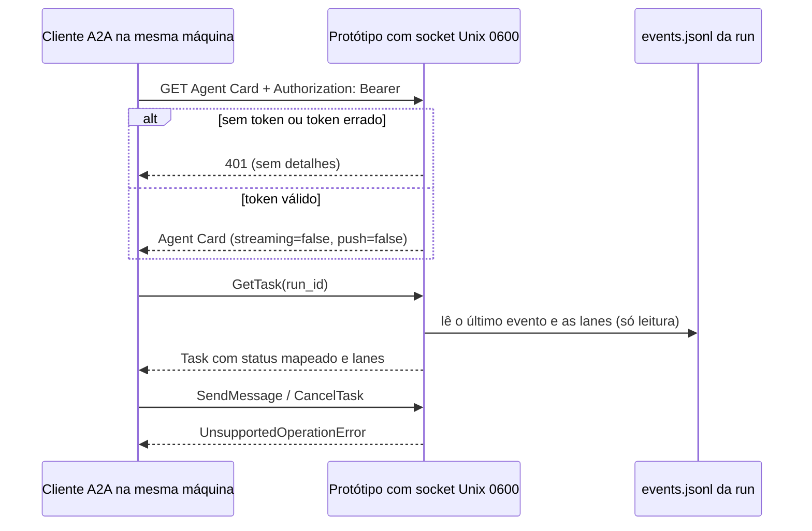

# Spike A2A — o loop como agente A2A?

> Spike da issue [simpletibr/simplicio-loop#1596](https://github.com/simpletibr/simplicio-loop/issues/1596).
> Só documento: nenhum código de produção. Status: **proposta para decisão**.
> Compara com o exportador Langfuse [#1595](https://github.com/simpletibr/simplicio-loop/issues/1595).

## 1. Resposta curta

**Não implementar A2A agora.** O loop roda na máquina do usuário e escuta só em loopback (ou não escuta).
Uma sessão na nuvem não alcança `127.0.0.1` da máquina, então um protótipo local não cumpre o motivo da
issue ("sessões em nuvem acompanharem e delegarem"). Recomendação: **exportador Langfuse (#1595)**.
Detalhes e riscos na seção 5.

## 2. Menor subconjunto útil da especificação

A especificação oficial está em **1.0.0** ([a2a-protocol.org/latest/specification](https://a2a-protocol.org/latest/specification/)).
A issue cita `tasks/send`; a 1.0 usa os nomes abaixo.

| Peça | Usar no spike? | Motivo |
|---|---|---|
| Agent Card (descoberta, `securitySchemes`) | Sim | Declara a autenticação obrigatória |
| `GetTask` | **Sim** | Único método de leitura: status da run |
| `SendMessage` | Não (responde `UnsupportedOperationError`) | Delegar exige escrita: fora do protótipo |
| `CancelTask` | Não | Escrita |
| `SendStreamingMessage` / push | Não | Opcionais na 1.0; exigem `capabilities` declarada |
| Cabeçalho `A2A-Version` | Sim, obrigatório | Sem ele, a 1.0 é tratada como 0.3 |

## 3. Protótipo somente leitura (descrito, não implementado)

**Escuta e acesso**
- Preferido: socket Unix em um diretório de execução com modo `0700` (o mesmo padrão do daemon),
  socket com modo `0600`, verificação de UID do peer (`SO_PEERCRED`).
- Alternativa: `127.0.0.1` apenas, com as mesmas regras de token. Nunca `0.0.0.0`, nunca porta pública.

**Autenticação obrigatória** (vale até para o Agent Card)
- Token aleatório em arquivo `0600`, comparação em tempo constante.
- Token **só** em `Authorization: Bearer`. Nunca em query string (URL vaza em histórico e logs).
  O dashboard aceita `?t=`; o protótipo não deve copiar isso.

**Dados expostos**
- Status e lanes vêm de `simplicio.dashboard-event/v1` (`events.jsonl`), que já redige segredos e
  não grava texto de prompt nem de comando.
- Campos de texto devolvidos são **dados**, não instruções para o chamador.

**Mapeamento de fase para estado A2A** (proposta; estados de tarefa a confirmar na spec)

| Fase do loop | Estado A2A |
|---|---|
| `intake`, `awaiting_decision` | `INPUT_REQUIRED` |
| `mapping`, `planning`, `executing`, `validating`, `watching`, `delivering` | `WORKING` |
| `blocked` | `INPUT_REQUIRED` (precisa de pessoa) |
| `done` | `COMPLETED` |
| `partial` | `FAILED` |
| `cancelled` | `CANCELED` |

**Reuso:** o dashboard já tem `guard()` (Host, Origin, token, só GET) e as leituras de `/api/runs`.
O protótipo deve reaproveitar essa lógica, não criar um segundo servidor HTTP.

**Testes que o protótipo teria (vermelho antes do código):** sem token → 401; token em query → rejeitado;
modo do socket diferente de `0600` → recusa; `SendMessage` → `UnsupportedOperationError`; segredo de
teste plantado em `payload` nunca aparece na resposta.

## 4. Comparação com o exportador Langfuse (#1595)

| Critério | A2A (leitura) | Langfuse (#1595) |
|---|---|---|
| Direção | **Entrada**: outro agente chama o loop | **Saída**: o loop envia dados |
| Superfície de ataque | Um socket que aceita conexões | Nenhuma porta aberta |
| Quem consome | Agentes (acompanhar, delegar) | Pessoas (traces, custos, scores) |
| Alcance pela nuvem | **Não** com loopback | Sim, se a máquina tiver saída para o host Langfuse |
| Protocolo | JSON-RPC 1.0, versão por cabeçalho | OTLP HTTP/protobuf (sem gRPC) ou SDK Python |
| Autenticação | Token próprio no socket | Basic auth com chave pública e secreta por ambiente |
| Dados | Status de run e lanes | Traces, generations, scores de gate |
| Reuso | Guard e leituras do dashboard | Dashboard integrado ao Langfuse (decisão do dono) |
| Dependência | Nenhuma nova | Extra opcional `[langfuse]` |

Fontes do lado Langfuse: [docs OpenTelemetry](https://langfuse.com/docs/opentelemetry) (endpoint
`/api/public/otel`, Basic auth, sem gRPC). A recomendação de usar o SDK Python em vez do OTel puro vem
da documentação buscada; os nomes de variáveis do SDK **não foram verificados** nesta spike.

## 5. Recomendação: **exportador Langfuse (#1595)**

Motivos:
1. Atende a necessidade real (observar runs, custos e gates) sem abrir porta.
2. O motivo do A2A (sessão na nuvem acompanhar e delegar) não cabe no requisito "só 127.0.0.1".
3. Menos código e menos protocolo para manter: o loop só envia; não aceita pedidos.

**Riscos desta recomendação**
- Langfuse observa e **não delega**. Se surgir caso medido de delegação, A2A volta com custo maior.
- O SDK Langfuse muda de versão. Mitigação: versão fixada no extra e teste contra servidor falso (já previsto em #1595).
- Conteúdo de prompt pode vazar. Mitigação: `langfuse_capture_content = false` por padrão e teste de token falso (#1595).

**Riscos se o dono optar por A2A mesmo assim**
- Superfície de entrada local: qualquer processo do mesmo usuário pode tentar conectar.
- Token: risco de vazamento se for aceito em URL (o dashboard hoje aceita).
- Versão: a 1.0 é recente; clientes 0.3 recebem `VersionNotSupportedError`.
- Alcance: sessão na nuvem **não** chega ao loop sem túnel ou relay, o que quebra a regra "nenhuma porta pública".

**Gatilho para reabrir A2A:** um caso de uso medido em que um agente remoto precise chamar o loop, com
um transporte alcançável já decidido em ADR própria (não loopback).

## 6. Fontes

- Especificação A2A 1.0.0 (lida em 2026-10-09): [a2a-protocol.org/latest/specification](https://a2a-protocol.org/latest/specification/)
- Caminho do Agent Card (`/.well-known/agent-card.json`) e estados de tarefa: fontes de terceiros, **a confirmar na seção de descoberta da spec**.
- Langfuse OpenTelemetry: [langfuse.com/docs/opentelemetry](https://langfuse.com/docs/opentelemetry)
- Código do repositório: `simplicio_loop/dashboard/server.py` (`guard`, `extract_token`, `start`), `docs/DAEMON.md`, `docs/DASHBOARD_EVENTS.md`.
