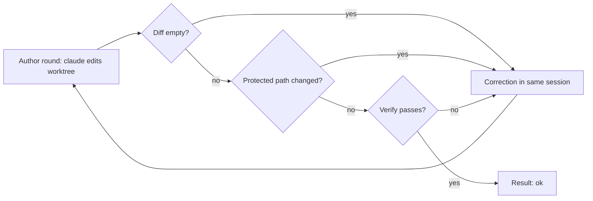

# Author flow

The author flow is a second executor. Use it for tasks that a JSON plan cannot do, for example a fix to simplicio-loop itself.

The plan flow (`host_mode.run_exec`) asks the model for a plan. Dev CLI applies the plan. The author flow is different. It opens the `claude` CLI with tools. The CLI edits files in a worktree. The loop runs verify on the work and sends each failure back to the same CLI session.



## Run it

```bash
git worktree add ../fix-x -b fix-x
simplicio-loop author --repo ../fix-x --task-file task.md --verify "python3 -m pytest tests/test_x.py -q" --rounds 3
```

Use an isolated worktree. The CLI edits files in `--repo`.

The command prints one JSON object: `status`, `rounds`, `session_id`, `changed`, `failures`, `usage`, `reason_code`.

| Exit code | Meaning |
|---|---|
| 0 | `ok` |
| 3 | `failed` |
| 69 | `unsupported` family |
| 2 | usage error |

## Rules for each round

1. Round 1 starts the session with `--session-id`. Each correction uses `--resume` with the same id.
2. Before round 1, the loop takes a snapshot of the worktree files: path, mode and SHA-256 of the content. After each round it takes another snapshot. `changed` is the difference. The loop never asks git. No change fails the round (`empty_diff`).
3. A changed path in `plan_paths.PROTECTED_PATHS` fails the round (`protected_path`). The loop does not run verify on that tree.
4. The loop runs the `--verify` command. A failure fails the round (`verify_failed`). Without `--verify` the reason code is `ok_unverified`.
5. The verify command runs code of the author. After it, the loop takes a third snapshot. A protected path that verify wrote fails the round (`protected_path`), even when verify passed.
6. A CLI error, a CLI that does not start or a timeout stops the run at once (`cli_error`, `cli_unavailable`, `argv_too_long`, `timeout`). A missing login stops it before the first round (`claude_login_missing`). `--rounds` must be from 1 to 10.

## Security model

What the author sees and writes:

- The worktree is the only place it writes. The sandbox (bwrap) makes the rest of the file system read-only. If there is no bwrap, the run stops with `sandbox_unavailable`.
- The CLI gets a private HOME in `~/.cache/simplicio-loop-author/<run>`. It holds only a copy of `~/.claude/.credentials.json` (mode 0600). The loop deletes it when the run ends, also after an error or a timeout.
- The real HOME is an empty tmpfs for the CLI and for verify. The CLI cannot see `~/.ssh`, `~/.config/gh` or the settings of your own Claude sessions.
- The verify command does not see the private HOME. The private HOME is not in the worktree, because the sandbox binds the whole worktree for verify.
- `--setting-sources user` reads the private HOME only, never `.claude/settings.json` of the worktree. Before each round the loop deletes settings, hooks, agents, skills and plugins from the private HOME.
- The child environment has no `GH_TOKEN` and no `GITHUB_TOKEN`. Only the provider key of the family stays.
- The tool list cannot change. Web tools, slash commands and MCP servers are off.
- Text that goes back to the CLI hides secrets and has a fixed size.
- The snapshot covers `.git/config`, `.git/hooks` and a `.git` file. A hook, a config line or a repointed `.git` file fails the round. Other `.git` files change on every `git add` and `git commit`, so the snapshot skips them.

Risks that stay, and that we accept:

- The sandbox keeps the network open. The author code can send data out.
- During a round, the private HOME holds a copy of the Claude login. The CLI needs it.
- The task text comes from an issue of an owner or a member. The loop does not prove that the text is safe.
- With `--allow-unsandboxed`, none of the file system limits apply. Use it for manual tests only.

## Usage numbers

`usage` holds the token counters that the CLI reports (`input_tokens`, `output_tokens`, `cache_read_tokens`), added over the rounds, and `measured_rounds`. If the CLI reports none, `usage` is `null`. The loop never estimates them.

The flow works with `claude` only. Other families return `unsupported`.
