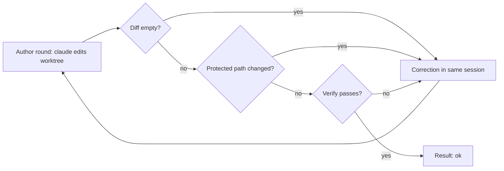

# Author flow

The author flow is a second executor. Use it for tasks that a JSON plan cannot do, for example a fix to simplicio-loop itself.

The plan flow (`host_mode.run_exec`) asks the model for a plan. Dev CLI applies the plan. The author flow is different. It opens the `claude` CLI with tools. The CLI edits files in a worktree. The loop runs verify on the work and sends each failure back to the same CLI session.



## Run it

```bash
git worktree add ../fix-x -b fix-x
simplicio-loop author --repo ../fix-x --task-file task.md --verify "python3 -m pytest tests/test_x.py -q" --rounds 3
```

Use an isolated worktree. The CLI edits files in `--repo`.

The command prints one JSON object: `status`, `rounds`, `session_id`, `changed`, `failures`, `usage`, `reason_code`.

| Exit code | Meaning |
|---|---|
| 0 | `ok` |
| 3 | `failed` |
| 69 | `unsupported` family |
| 2 | usage error |

## Use it in the 24/7 watcher

Set `SIMPLICIO_247_EXECUTOR=author` in the env file of the service. The default is `plan`. Any other value stops the service at start.

- The tick calls `run_author` in the worktree of the item (`<repo>.wt/<n>`) instead of `host_mode.run_exec`.
- `SIMPLICIO_247_AUTHOR_ROUNDS` sets the rounds. The default is 3. The maximum is 10.
- `SIMPLICIO_247_AUTHOR_TIMEOUT_S` sets the time limit of one CLI round, in seconds. The default is 900. The minimum is 60. The maximum is 3600. The value must be a whole number. The flow ignores any other value and uses 900.
- `SIMPLICIO_247_AUTHOR_RUN_TESTS=1` lets the CLI run `pytest` itself. Without it the CLI has only the file tools and no `Bash(...)` entry. The prompt says it cannot run tests. The host runs the verify and sends the failures back.
- **Warning.** With `SIMPLICIO_247_AUTHOR_RUN_TESTS=1` the CLI runs the pytest of the author in its own sandbox. That sandbox has the private HOME (a copy of the login) and an open network. A conftest can read the login and send it out, so a credential leak is possible. Turn it on only for repositories you trust.
- `SIMPLICIO_247_AUTHOR_HOME_BASE` sets the folder of the private HOMEs. It must be an absolute path inside the real HOME. The default is `~/.cache/simplicio-loop-author`. With `ProtectHome=read-only`, add this folder to `ReadWritePaths=` in the unit (for example `ReadWritePaths=/home/simplicio-loop/.simplicio/authors`).
- The snapshot skips the regular files in `.simplicio-loop/orchestrator/runs/` (the host writes its telemetry there). A symlink, a hard link, a fifo or a socket in that folder is a change (`protected_path`). Every other path in `.simplicio-loop` stays protected.
- The watcher passes the `verify` command of `loop.toml`, the first family that the flow supports, and no env. The flow deletes `GH_TOKEN`.
- On `ok`, the watcher delivers as in the plan flow: it commits, pushes, opens the pull request with `Parte de #N` and runs the squad review. The watcher makes no commit and no push before `ok`.
- On `failed` or `unsupported`, the watcher releases the claim. The retry rule does not change. The claim holds the `reason_code`.
- The watcher logs the rounds, the kinds of failure and the measured `usage`. `usage` is `none` when the CLI reported no counter.
- `SIMPLICIO_EXECUTOR` must be unset or `exec`. See `docs/WATCHER_247.md`.

## Rules for each round

1. Round 1 starts the session with `--session-id`. Each correction uses `--resume` with the same id.
2. Before round 1, the loop takes a snapshot of the worktree files: path, mode and SHA-256 of the content. After each round it takes another snapshot. `changed` is the difference. The loop never asks git. No change fails the round (`empty_diff`).
3. A changed path in `plan_paths.PROTECTED_PATHS` fails the round (`protected_path`). The loop does not run verify on that tree.
4. The loop runs the `--verify` command. A failure fails the round (`verify_failed`). Without `--verify` the reason code is `ok_unverified`.
5. The verify command runs code of the author. After it, the loop takes another snapshot. A protected path that verify wrote fails the round (`protected_path`), even when verify passed.
6. The `changed` field of the result is the first snapshot against the last one. The last one comes after verify, or after a CLI error.
7. These stop the run at once:
   - a CLI error (`cli_error`)
   - an output that is not a JSON object (`bad_envelope`)
   - a CLI that does not start (`cli_unavailable`, `argv_too_long`)

   A missing login stops it before the first round (`claude_login_missing`). `--rounds` must be from 1 to 10, in the command and in `run_author`.

8. A CLI round that does not end in the time limit is not fatal while rounds remain:
   - The loop keeps the worktree and takes a snapshot.
   - The next round uses `--resume` with the same session. Its prompt tells the CLI that the time limit stopped the last round. The CLI continues from the current state of the worktree. It does the remaining work, never redoes finished work, and then stops.
   - A timeout counts as a round. The loop does not run verify for that round.
   - If the last round also times out, the result is `failed` with the reason `timeout`. `changed` still lists the files, so you can look at the work.
9. The time limit of one round is 900 s. Set `SIMPLICIO_247_AUTHOR_TIMEOUT_S` or `--timeout SECONDS` to change it (60 to 3600). The flag wins over the variable. The flag stops the command with exit code 2 when the value is outside the limits. The variable does not stop the command: the loop ignores a bad value.

## Snapshot limits

- A file over 64 MiB is not hashed. The snapshot records its mode, size, mtime and inode. The author can make a sparse file of any size, and a hash would read all of it. No protected path is that big. A rewrite of a big file with the same size, mtime and inode is not seen.
- The snapshot has a time budget of 120 s. When it runs out, the run stops with `snapshot_timeout`.
- The snapshot sees `__pycache__`. Every file in it is a change, also a file that is not a `.pyc`.
- A `.pyc` or `.pyo` file that appears, changes or goes away fails the round (`protected_path`), in any folder. Python runs an unchecked `.pyc` in place of its `.py` file, without a read of the source. Your own pytest does the same outside the sandbox.
- The CLI and verify run with `PYTHONDONTWRITEBYTECODE=1`. They do not make bytecode, so a bytecode change is always the work of the author. The correction asks the author to delete these files.
- The snapshot does not see `.pytest_cache`. Pytest writes it on every run and nothing imports it.

## Security model

What the author sees and writes:

- The worktree is the only place it writes. The sandbox (bwrap) makes the rest of the file system read-only. If there is no bwrap, the run stops with `sandbox_unavailable`.
- The CLI gets a private HOME in `~/.cache/simplicio-loop-author/<run>`. It holds only a copy of `~/.claude/.credentials.json` (mode 0600) and an `.owner` file with the pid of the run. The loop deletes it when the run ends, also after an error, a timeout, SIGINT, SIGTERM or SIGHUP. After SIGKILL the next run deletes each private HOME whose pid is gone. The folder `~/.cache/simplicio-loop-author` stays, because another run can use it.
- The real HOME is an empty tmpfs for the CLI and for verify. The CLI cannot see `~/.ssh`, `~/.config/gh` or the settings of your own Claude sessions.
- The verify command does not see the private HOME. The private HOME is not in the worktree, because the sandbox binds the whole worktree for verify.
- `--setting-sources user` reads the private HOME only, never `.claude/settings.json` of the worktree. Before each round the loop deletes settings, hooks, agents, skills and plugins from the private HOME.
- The child environment has no `GH_TOKEN`, no `GITHUB_TOKEN` and no `ANTHROPIC_API_KEY`. The login is the credentials file. An API key is not a login for this flow yet. This is a known limit.
- The tool list cannot change. It has no `git add` and no `git commit`: in the sandbox a commit never ends. Web tools, slash commands and MCP servers are off.
- The loop denies Read, Grep, Glob, Edit and Write on the private HOME and on the login file. It uses `--disallowedTools` rules like `Read(//abs/path/**)`. The same rules cover the `.claude` folder and the login file of the real HOME.
- After each round and after verify, the loop reads the login file and its `accessToken` and `refreshToken` values into memory. A changed file that holds one of these byte strings fails the round (`secret_in_diff`). The detail names the file and never the secret. The loop never logs the secret.
- Text that goes back to the CLI hides secrets and has a fixed size.
- The snapshot covers `.git/config`, `.git/hooks` and a `.git` file. A hook, a config line or a repointed `.git` file fails the round. Other `.git` files change on every `git add` and `git commit`, so the snapshot skips them.
- The snapshot sees `__pycache__` and fails the round on any bytecode change. It does not see `.pytest_cache`. Git ignores these files, so the reviewer of a pull request does not see them either.

Risks that stay, and that we accept:

- The sandbox keeps the network open. The author code can send data out.
- During a round, the private HOME holds a copy of the Claude login. The CLI needs it. The login is visible, the network is open and `python -m pytest` runs code of the author. Together, these let the author send the login out during a round. We accept this risk. The mitigation is that the repository and the task come from an owner or a member.
- The task text comes from an issue of an owner or a member. The loop does not prove that the text is safe.
- The CLI reads the `CLAUDE.md` of the project. A hostile repository can inject a prompt this way. `claude --safe-mode` exists. It turns off `CLAUDE.md`, hooks, skills and plugins. We evaluated it as an alternative and we do not use it.
- With `--allow-unsandboxed`, none of the file system limits apply. Use it for manual tests only.

## Usage numbers

`usage` holds the token counters that the CLI reports (`input_tokens`, `output_tokens`, `cache_read_tokens`), added over the rounds, and `measured_rounds`. If the CLI reports none, `usage` is `null`. The loop never estimates them.

The flow works with `claude` only. Other families return `unsupported`.
