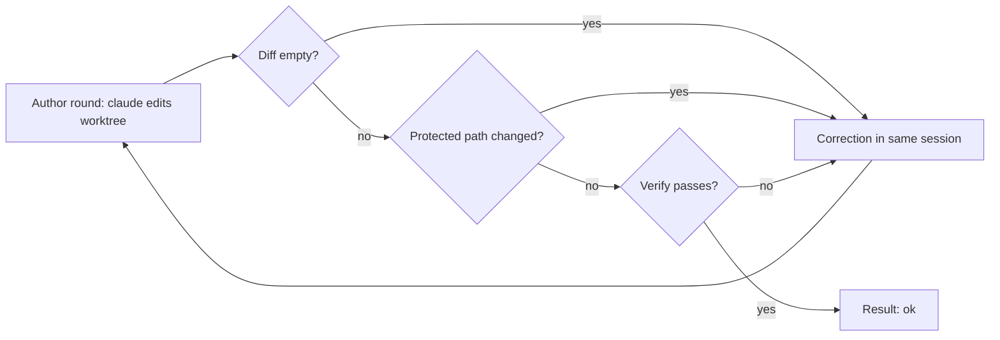

# Author flow

The author flow is a second executor. Use it for tasks that a JSON plan cannot do, for example a fix to simplicio-loop itself.

The plan flow (`host_mode.run_exec`) asks the model for a plan. Dev CLI applies the plan. The author flow is different. It opens the `claude` CLI with tools. The CLI edits files in a worktree. The loop runs verify on the work and sends each failure back to the same CLI session.



## Run it

```bash
git worktree add ../fix-x -b fix-x
simplicio-loop author --repo ../fix-x --task-file task.md --verify "python3 -m pytest tests/test_x.py -q" --rounds 3
```

Use an isolated worktree. The CLI edits files in `--repo`.

The command prints one JSON object: `status`, `rounds`, `session_id`, `changed`, `failures`, `usage`, `reason_code`.

| Exit code | Meaning |
|---|---|
| 0 | `ok` |
| 3 | `failed` |
| 69 | `unsupported` family |
| 2 | usage error |

## Rules for each round

1. Round 1 starts the session with `--session-id`. Each correction uses `--resume` with the same id.
2. The loop reads the changed paths against the commit where the run started. No change fails the round (`empty_diff`).
3. A changed path in `plan_paths.PROTECTED_PATHS` fails the round (`protected_path`). The loop does not run verify on that tree.
4. The loop runs the `--verify` command in the worktree. A failure fails the round (`verify_failed`). Without `--verify` the reason code is `ok_unverified`.
5. A CLI error or timeout stops the run at once (`cli_error`, `timeout`).

## Safety

- The CLI and the verify command run in the watcher sandbox (bwrap). If there is no bwrap, the run stops with `sandbox_unavailable`. Use `--allow-unsandboxed` only for manual tests.
- The child environment has no `GH_TOKEN` and no `GITHUB_TOKEN`. Only the provider key of the family stays.
- The tool list cannot change. Web tools, slash commands and MCP servers are off.
- Failure text that goes back to the CLI has secrets removed and is cut to a fixed size.
- Git ignores some files. A protected path that git ignores is not in the diff, so the loop does not see it.

## Usage numbers

`usage` holds the token counters that the CLI reports (`input_tokens`, `output_tokens`, `cache_read_tokens`), added over the rounds, and `measured_rounds`. If the CLI reports none, `usage` is `null`. The loop never estimates them.

The flow works with `claude` only. Other families return `unsupported`.
