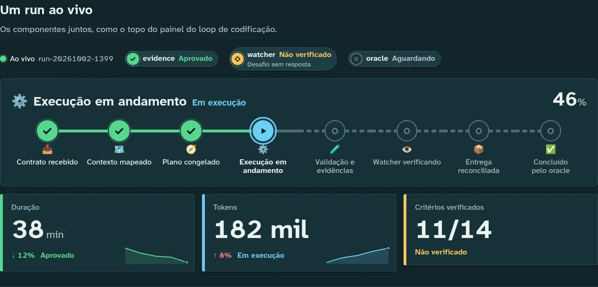
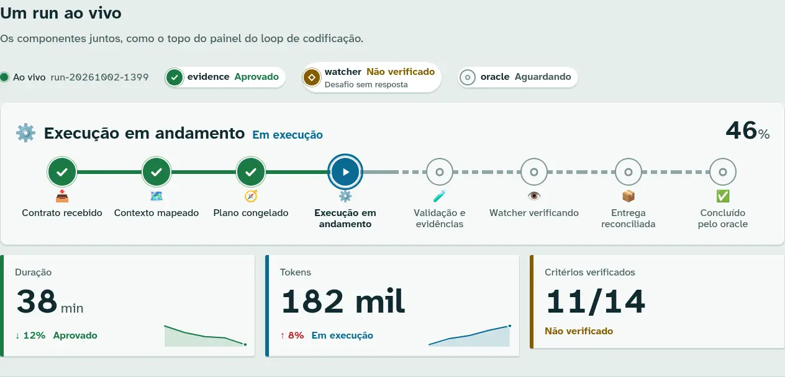
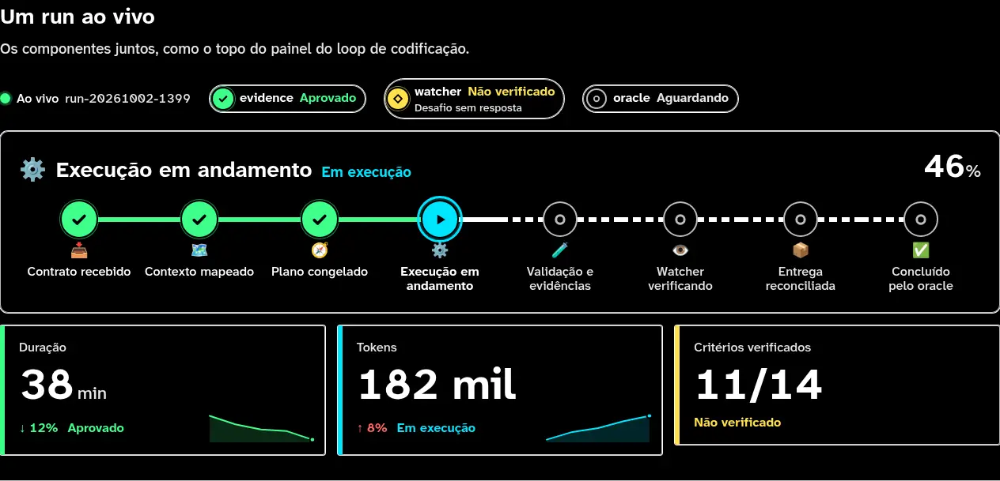
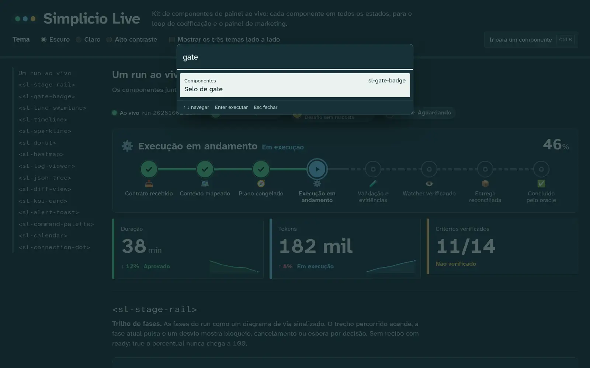

# Simplicio Live: dashboard design direction and component kit

Issue #1399 (epic #1397). The output of the `frontend-design` skill
(`.claude/skills/frontend-design/`, copied unmodified from
[anthropics/skills](https://github.com/anthropics/skills/tree/main/skills/frontend-design) at
commit `41bbe19`, Apache-2.0, licence kept in `LICENSE.txt`) for the live dashboards of
`simplicio-loop` (coding loop) and `simplicio-loop-marketing` (distribution).

The kit lives in `simplicio_loop/dashboard/static/components/` and ships in the wheel. The
catalog is `simplicio_loop/dashboard/static/components.html`.

## Brief, as the skill asks

- **Subject:** an autonomous coding loop seen live. Runs move through phases, lanes (worktrees)
  run in parallel, and gates (evidence, watcher, oracle, DoD, quality-gate) open or stay shut.
  The marketing panel uses the same kit for a publishing calendar.
- **Audience:** the operator. Usually that's Wesley, on a large monitor or a wall screen, often
  across the room, sometimes at night.
- **Primary job:** answer "what is moving, what is stuck, and what is not proven yet" in one
  glance. Honest state comes before pretty state: `UNVERIFIED`, `STALLED` and `BLOCKED` must never
  look like success.

## Aesthetic direction

**Signal box.** The loop's own vocabulary is railway vocabulary: stage *rail*, *lanes*, *gates*,
blocked, a route that is set. The direction takes the mimic panel of a railway signal box
(an enamel panel with a track diagram and lit lamps) and uses it as the visual grammar:

- the run's phases are a **track**: the stretch already travelled is lit, the road ahead is
  dashed, and the current station is a lamp ringed like a route that has been set;
- a run that leaves the main line (blocked, cancelled, awaiting decision) goes onto a
  **siding** that ends at a buffer plate with the reason;
- every state is a **lamp**: a coloured disc *plus its own shape* (check, cross, play, hollow
  diamond, pause bars, barred circle, empty ring), so colour is never the only signal;
- surfaces are **enamel** at night and a **track drawing** by day, never generic grey cards.

The bold move goes in one place, the stage rail (`<sl-stage-rail>`). Everything else stays
quiet: plates with a lamp edge, thin hairlines, and no gradients used as decoration.

## Token system

All tokens are CSS custom properties in `components/simplicio-live.css`. They inherit into every
shadow root.

### Colour (4–6 named base values per theme)

| Name | Dark: enamel | Light: track drawing | Role |
|---|---|---|---|
| Panel ground | `#11252a` | `#e6edeb` | page background (`--sl-bg`) |
| Enamel | `#173137` | `#f6f9f8` | panels (`--sl-panel`) |
| Raised plate | `#1e3d44` | `#ffffff` | badges, toasts (`--sl-raised`) |
| Track | `#4a6c73` | `#8ea5a7` | rails, borders (`--sl-line`) |
| Ink | `#ebf3f0` | `#0f2a30` | text (`--sl-ink`) |
| Ink, quiet | `#a9c1bf` | `#43605f` | secondary text (`--sl-ink-muted`) |

The state lamps (`--sl-state-*`) all meet 4.5:1 as text on enamel and raised plates in both
themes. axe-core verifies this in the e2e test.

| State | Dark | Light | High contrast | Shape |
|---|---|---|---|---|
| RUNNING | `#6ccff6` | `#0a6a92` | `#00e5ff` | play, pulsing ring |
| PASS | `#57d68d` | `#1b7a44` | `#3dff8a` | check |
| FAIL | `#ff8080` | `#b62828` | `#ff6262` | cross |
| UNVERIFIED | `#f4c55b` | `#835b00` | `#ffe14d` | hollow diamond |
| STALLED | `#c3a1ff` | `#6b3fb8` | `#e2b8ff` | pause bars |
| BLOCKED | `#ff9254` | `#a64200` | `#ffa24a` | barred circle on a hatched lamp |
| PENDING | `#5e7d83` | `#7d9597` | `#bdbdbd` | empty ring (lamp off) |

The themes are chosen automatically (`prefers-color-scheme`, `prefers-contrast: more`) or forced
with `data-sl-theme="dark" | "light" | "contrast"` on `<html>` or on any container. Dark and light
come from one declaration through `light-dark()`. High contrast uses a pure black housing, white
track, saturated lamps and a 4 px yellow focus ring. `forced-colors` is handled as well.

### Type

- **Atkinson Hyperlegible Next** (the Braille Institute's legibility face) for everything. It
  separates I/l/1 and O/0, which matters on a wall screen. It ships as a Latin subset variable
  font (weights 450–750, 18 KB).
- **Atkinson Hyperlegible Mono**, from the same family, only where the content really is code:
  logs, diffs, JSON and tag names. 8 KB.
- Scale: the classical scale (12, 14, 16, 18, 21, 24, 36, 48), fluid through
  `--sl-fluid: clamp(1rem, 0.86rem + 0.3vw, 1.3rem)`, so a 4K wall screen gets bigger type
  without zooming. Tabular figures throughout. Text is left aligned, and line length stays under
  70ch.
- Both fonts are SIL OFL 1.1 (licences in `components/fonts/`). They were subset with fonttools
  under the same family name, which the OFL permits because no Reserved Font Name is declared.

### Layout, space, radius, motion

- 4 px spacing grid (`--sl-space-1…7`).
- Radius follows hierarchy rather than one value everywhere: lamps are round, badges are pills,
  plates are cut metal at 3 px, and panel housings are 10 px.
- Components use container queries. The stage rail becomes vertical below 40rem and the
  calendar compacts.
- Motion: only live lamps pulse, plus a short toast entrance. Every animation sits inside
  `@media (prefers-reduced-motion: no-preference)`, and a unit test enforces this.

```
┌ Simplicio Live (wordmark with three lamps) ─ intro ─────────────────────────────────┐
│ Tema ( ) Escuro ( ) Claro ( ) Alto contraste   [ ] três temas lado a lado   [Ctrl K] │
├═════════════════════════════════════════════════════════════════════════════════════┤
│ <sl-...> toc │ Um run ao vivo: connection dot, gate badges                          │
│ (track-line  │ ●━━●━━●━━◉┅┅○┅┅○┅┅○┅┅○    stage rail (the one bold element)           │
│  index)      │ [kpi] [kpi] [kpi]                                                    │
│              │ <sl-stage-rail>: every state, then one section per component…        │
```

## Plan review

The skill asks for a check against the generic default. A first pass ("dark dashboard for
developers") came out as the cluster the skill warns about: near-black with one acid-green
accent, identical rounded cards with soft shadows, ALL-CAPS mono eyebrows and middle-dot meta
strings. Changes made:

| Generic default | What changed and why |
|---|---|
| Near-black `#0b0b0b` with one neon accent | Teal-slate enamel, with **seven** state lamps that carry meaning. Colour is information here, not brand decoration. |
| Identical rounded cards with grey shadows | Hierarchy of shapes: round lamps, pill badges, 3 px plates with a coloured lamp edge, 10 px housings. The shadow is a 1 px enamel bevel. |
| Progress bar plus a big percentage | A track diagram whose stations are the real `PHASE_META` phases. The percentage is honest and capped at 99 without `completion-receipt.json` `ready: true`. |
| Mono font for every small label, caps eyebrows | Sentence-case labels in the legibility face. Mono only for real code: logs, diff, JSON, tag names. |
| `A · B · C` meta strings, `→` on links | Removed from the catalog copy. Links say what they open ("Ver evidência"). |
| Colour-only status dots | Every state has its own shape and a text label, plus screen-reader text. |

## Components

All 15 are native Custom Elements with an open Shadow DOM, ES modules, no dependencies and no
build step. Import `components/index.js` once and load `components/simplicio-live.css`.
Structured data goes through a JS property or a same-named JSON attribute (the property wins).
All text is escaped. Links accept only `http(s)` or relative URLs. Rendering never emits inline
`style` attributes (custom properties go through the CSSOM), so the kit works under a strict
`style-src` CSP.

| Element | Inputs | Events / API |
|---|---|---|
| `<sl-stage-rail>` | `phase`, `status`, `percent`, `receipt-ready`, `at`, `reason`, `label` | `.model` (honest percent, stations) |
| `<sl-gate-badge>` | `gate`, `state`, `reason`, `href` | |
| `<sl-lane-swimlane>` | `lanes` [{label, detail, stages:{phase: state or {state, retries, duration}}}], `phases` | |
| `<sl-timeline>` | `items` [{time, title, state, detail}] | |
| `<sl-sparkline>` | `values`, `label`, `unit`, `state` | `.summary` (accessible name) |
| `<sl-donut>` | `segments` [{label, value, state}], `label`, `center` | |
| `<sl-heatmap>` | `columns`, `rows` [{label, values}], `label`, `unit`, `state`, `max` | arrow-key grid with a live readout |
| `<sl-log-viewer>` | `lines` (strings or {ts, level, source, text}), `label`, `follow` | `.append(line)` |
| `<sl-json-tree>` | `data`, `label`, `expand-depth` | ARIA tree, lazy children |
| `<sl-diff-view>` | `diff` (or text content), `label` | `parseUnifiedDiff()` |
| `<sl-kpi-card>` | `label`, `value`, `unit`, `delta`, `good`, `state`, `trend`, `detail` | |
| `<sl-alert-toast>` | `state`, `heading`, `href`, `link-label`, `timeout`, `persistent`; message as content | `sl-dismiss` (cancelable), `.dismiss()`, `SlAlertToast.notify()` |
| `<sl-command-palette>` | `commands` [{id, label, group, hint, keywords}], `label`, `placeholder`, `hotkey`, `no-trigger` | `sl-command`, `sl-open`, `sl-close`, `.open()`, `.close()` |
| `<sl-calendar>` | `events` [{date, title, state, channel}], `month`, `selected`, `today`, `locale`, `week-start` | `sl-select` {date, events} |
| `<sl-connection-dot>` | `status` (live, connecting, stale, offline), `label`, `detail` | |

States follow the contract states (`RUNNING`, `PASS`, `FAIL`, `UNVERIFIED`, `STALLED`,
`BLOCKED`) plus `PENDING` for work that has not started. Unknown values render as `PENDING`.
When the event contract (#1398) settles its field names, adapters map onto these attributes.
The marketing panel maps its own statuses the same way (for example scheduled → `PENDING`,
publishing → `RUNNING`, published → `PASS`).

### Phase icons come from the CLI

`components/phase-meta.js` is generated from `simplicio_loop/progress.py` `PHASE_META`/`PHASES`
by `python -m simplicio_loop.dashboard.phase_meta`. `--check` exits 1 on drift, and a unit test
fails if the two disagree. `awaiting_decision` (⏸️ "Aguardando decisão") was added to
`PHASE_META`, so the CLI and the panel now cover every lifecycle phase.

### Distribution

- **Wheel:** `simplicio_loop/dashboard/static/**` is package data (`pyproject.toml`).
  `simplicio_loop.dashboard.COMPONENTS_DIR` and `CATALOG_PAGE` give the backend (#1400) the paths.
- **npm:** `components/package.json` describes `@simplicio/live-components` (ESM `exports`, no
  dependencies). It is `"private": true` until the publish decision. Publishing is a release step
  that needs the npm scope and a token. Until then the marketing panel can vendor the folder or
  serve it from the installed wheel.

### Weight budget

Measured with gzip -9 over every file in `components/`, fonts and licences included: about
66 KB, under the 80 KB budget. A unit test enforces the budget. The catalog page itself
(`components.html`, `catalog.js`, `catalog.css`) adds about 8 KB and is not part of the kit.

## Accessibility

- axe-core runs in the e2e test in every theme, with the command palette closed and open, and in
  compare mode. Zero serious or critical violations. The single-theme pages report zero
  violations of any impact.
- Full keyboard use: a skip link. Composite widgets have one tab stop each with roving tabindex:
  the heatmap grid (arrows, Home/End, Ctrl+Home/End), the JSON tree (WAI-ARIA tree pattern) and
  the calendar date grid (arrows, Home/End, PageUp/PageDown, Enter). The command palette uses the
  native modal `<dialog>`: focus stays inside, Escape closes it and focus returns where it was.
  Scrollable regions are focusable and named. The e2e test walks the whole page with Tab and
  checks that focus never gets trapped.
- Toasts for failures use `role="alert"` and stay until dismissed. Timed toasts pause on hover
  and focus (WCAG 2.2.1).
- Reduced motion stops every pulse, and the e2e test checks `getAnimations()`.

## Screenshots

Rendered headless (Chrome through Playwright) from the catalog in compare mode, so each image
shows the dark, light and high-contrast themes. Regenerate them with
`SL_SCREENSHOT_DIR=<dir> python -m pytest tests/test_live_components_e2e_system.py -k capture`.

| | |
|---|---|
| Hero, dark |  |
| Hero, light |  |
| Hero, high contrast |  |
| Command palette open |  |

Per component: [stage rail](assets/dashboard/sl-stage-rail.webp),
[gate badge](assets/dashboard/sl-gate-badge.webp), [swimlane](assets/dashboard/sl-lane-swimlane.webp),
[timeline](assets/dashboard/sl-timeline.webp), [sparkline](assets/dashboard/sl-sparkline.webp),
[donut](assets/dashboard/sl-donut.webp), [heatmap](assets/dashboard/sl-heatmap.webp),
[log viewer](assets/dashboard/sl-log-viewer.webp), [JSON tree](assets/dashboard/sl-json-tree.webp),
[diff](assets/dashboard/sl-diff-view.webp), [KPI card](assets/dashboard/sl-kpi-card.webp),
[alert toast](assets/dashboard/sl-alert-toast.webp), [command palette](assets/dashboard/sl-command-palette.webp),
[calendar](assets/dashboard/sl-calendar.webp), [connection dot](assets/dashboard/sl-connection-dot.webp).

## Running the catalog and tests

```bash
python -m http.server -d simplicio_loop/dashboard/static 8765   # open /components.html
python -m pytest -q tests/test_live_components_unit.py
pip install -e ".[e2e]"   # Playwright + axe-core; uses bundled Chromium or a system Chrome
python -m pytest -q tests/test_live_components_e2e_system.py tests/test_live_components_wheel_integration.py
```
