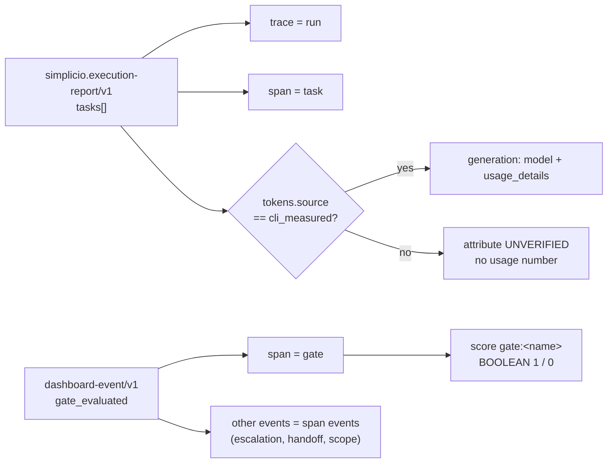

# Langfuse exporter (opt-in)

The loop is the deterministic CI. [Langfuse](https://github.com/langfuse/langfuse) only **observes** it:
the exporter reads the records the loop already writes and sends them to Langfuse in batches. It
runs nothing, changes nothing, and is off by default (issue #1595).

## Mapping



| Loop record | Langfuse |
|---|---|
| run (`run_id`) | trace; root span `simplicio-loop run` |
| task (`task_id`) | span `task <id>` under the root |
| gate (`gate_evaluated`) | span `gate <name>` under its task, plus a score `gate:<name>` (`1` passed, `0` failed, `BOOLEAN`) |
| tokens with `source = cli_measured` | generation span with `usage_details` (`input`, `output`) and the agent model |
| tokens of any other source | task attribute `simplicio.tokens.status = UNVERIFIED`; no usage is sent |
| other dashboard events | span events on their task (or on the run) |

Ids are derived from `run_id`, `task_id` and `event_id`, so a re-export of the same run reuses them.

## Enable it

1. Install the extra: `pip install "simplicio-loop[langfuse]"`. The exporter itself needs no third-party package (it speaks OTLP/JSON over stdlib HTTP); the extra is the documented install switch.
2. In `.simplicio-loop/loop.toml` of the repo:

   ```toml
   langfuse_enabled = true            # default false
   langfuse_host = "https://cloud.langfuse.com"   # or your self-hosted URL
   langfuse_capture_content = false   # default false: send sizes and hashes, not prompts or replies
   langfuse_batch_seconds = 60        # 1..3600
   ```

3. Keys, from the environment (preferred) or from `.simplicio-loop/langfuse/credentials.json` with mode `0600`:

   ```bash
   export LANGFUSE_PUBLIC_KEY=pk-lf-...
   export LANGFUSE_SECRET_KEY=sk-lf-...
   export LANGFUSE_HOST=https://cloud.langfuse.com   # overrides langfuse_host
   ```

   The host must be `https://`. Plain `http://` is accepted only for loopback (`127.0.0.1`, `localhost`, `::1`), so the Basic auth header never travels in cleartext.

4. Run one export cycle. Nothing in the loop calls it yet: it is not wired into the watcher.

   ```bash
   python -m simplicio_loop.langfuse_export --repo . --loop-toml path/to/loop.toml --run-dir <run dir>
   ```

   The loop.toml is the default branch's copy, passed explicitly; the exporter never reads a clone's file.
   The command prints one JSON line with `status`, `reports`, `enqueued`, `sent`, `dead`, `blocking` and `pending`. It exits 0 when the cycle is clean and 1 otherwise.

With `langfuse_enabled = false` (the default) nothing is imported, read or sent. With it on but no
keys, the cycle reports `blocked` / `missing_credentials` and writes nothing.

## Batches, queue and retries

- Every execution report of the repo is mapped (one trace per run). New rows are queued first, then sent when the batch window (`langfuse_batch_seconds`, default 60 s) has passed since the last flush. The first export opens the window and sends nothing until it has passed; a one-shot run needs `--force`.
- The queue is on disk in `.simplicio-loop/langfuse/queue/`, one file per HTTP request, named by time and a random suffix so names never collide. Files are written atomically and sent oldest first. Traces go out at most 200 spans per request.
- Each export cycle holds an exclusive `flock` on `.simplicio-loop/langfuse/.lock` (POSIX only; the exporter refuses to run where `fcntl` is missing).
- The server's answer decides what happens to a request:

| Answer | Meaning | Queue |
|---|---|---|
| 2xx | accepted | acked; its rows are recorded as sent |
| 408, 429, 5xx, network or protocol error | transient | kept; one attempt counted per window |
| 401, 403, 404, 3xx | wrong keys, host or path | **kept, nothing counted**; the cycle reports `blocking` and stops until fixed |
| other 4xx (400, 413, ...) | this body is refused | moved to `dead/` at once; never re-sent unless its content changes |

- After 8 counted attempts a transient request moves to `dead/` and its rows are not re-queued while the content stays the same.
- Redirects are not followed, so the auth header never reaches another host.
- `.simplicio-loop/langfuse/ledger.json` records what the server accepted, so re-exporting an unchanged run queues nothing.

## Known limits

- Task spans all start at the run's start and end after their `wall_ms`; the report records durations, not per-task start times.
- Gate scores are one `POST /api/public/scores` per gate, keyed by a deterministic `id`.
- Corrupt report or ledger JSON raises to the caller; the exporter does not guess.
- `sha256` digests of short content (when capture is off) can be guessed for a known value; they are a size-and-match signal, not a secret.

## Privacy

- Every string leaving the machine passes the loop's redaction (bearer tokens, `sk-`/`gh*_` tokens, URL credentials, e-mails) and the exact secret key the exporter holds.
- Dashboard payload keys named `prompt`, `response`, `content`, `input`, `output`, `text`, `message(s)`, `body` become `{bytes, sha256}` unless `langfuse_capture_content = true`.
- `login.json` and other loop state are never read by the exporter.

## Tests

`tests/test_langfuse_export.py` (34 tests) runs against the fake Langfuse server in `tests/_langfuse_fake_server.py` (Basic auth check; modes `ok`, `error`, `drop`, `garbage`, or any status code). The mutants run against the current code, each killed by at least one test:

- redaction removed; unmeasured tokens sent as usage; content sent with the flag off (top level and nested); exporter on by default; state under `.simplicio/`; no batch window; no dedupe; ledger not saved before the send;
- auth failure treated as permanent; `HTTPException` not caught; broad secret-key match (hides `tokens.status`); raw task title sent; only the newest report exported; other runs' events kept; plain http accepted; chunk limit removed; exhausted request not marked; attempt count written after the move.

Not covered by a test: the lock under real concurrent processes (the `flock` is in place, untested).

## Not verified

- **UNVERIFIED:** no run against a live Langfuse server, and no multi-process test of the lock. The OTLP/JSON path, the `x-langfuse-ingestion-version: 4` header and the Basic-auth scheme follow Langfuse's OpenTelemetry docs; the scores endpoint (`POST /api/public/scores`, one score per request, `id` for upsert) comes from third-party copies of the OpenAPI spec. Confirm both against your server before relying on the numbers.
