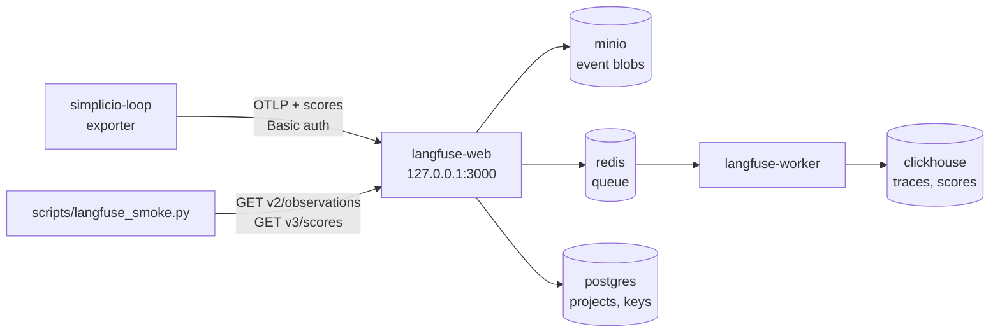

# Langfuse on your own machine

The loop is a deterministic CI that runs on your machine. [Langfuse](https://github.com/langfuse/langfuse) is open source and self-hostable, so it can run there too. The exporter (see `docs/LANGFUSE.md`) sends the loop's records to it. Nothing leaves the machine.

Checked on 2026-10-09: the latest Langfuse release is v4.56.0. The official Docker Compose file uses the image tag `:4`. This recipe pins `4.56.0`.



## 1. Start it

You need `git`, `docker` and `docker compose`. Follow the official self-hosting recipe:

```bash
git clone --depth 1 --branch v4.56.0 https://github.com/langfuse/langfuse.git
cd langfuse
```

Keys come from the environment, not from a file in a repository. Make them once and keep the file outside every git repository, because Langfuse creates the project with these keys at the first start only:

```bash
umask 077
mkdir -p ~/.config
cat > ~/.config/simplicio-langfuse.env <<EOF
export NEXTAUTH_SECRET=$(openssl rand -hex 32)
export SALT=$(openssl rand -hex 32)
export ENCRYPTION_KEY=$(openssl rand -hex 32)
export TELEMETRY_ENABLED=false
export LANGFUSE_PUBLIC_KEY=pk-lf-$(openssl rand -hex 16)
export LANGFUSE_SECRET_KEY=sk-lf-$(openssl rand -hex 16)
export LANGFUSE_HOST=http://127.0.0.1:3000
export LANGFUSE_INIT_ORG_ID=simplicio-local
export LANGFUSE_INIT_PROJECT_ID=simplicio-loop
export LANGFUSE_INIT_PROJECT_PUBLIC_KEY=\$LANGFUSE_PUBLIC_KEY
export LANGFUSE_INIT_PROJECT_SECRET_KEY=\$LANGFUSE_SECRET_KEY
export LANGFUSE_INIT_USER_EMAIL=local@example.com
export LANGFUSE_INIT_USER_PASSWORD=$(openssl rand -hex 12)
EOF
. ~/.config/simplicio-langfuse.env
```

`LANGFUSE_INIT_*` is Langfuse's headless initialization: it creates the organization, the project, the API keys and one user (password in `$LANGFUSE_INIT_USER_PASSWORD`). Do not put quotes around these values in a compose file. `TELEMETRY_ENABLED=false` turns off the anonymous usage report that the upstream file turns on.

Create `docker-compose.override.yml` next to the upstream file. It pins the two Langfuse images and binds the two public ports to loopback (the upstream file opens ports 3000 and 9090 on every interface):

```yaml
services:
  langfuse-web:
    image: docker.langfuse.com/langfuse/langfuse:4.56.0
    ports: !override
      - 127.0.0.1:3000:3000
  langfuse-worker:
    image: docker.langfuse.com/langfuse/langfuse-worker:4.56.0
  minio:
    ports: !override
      - 127.0.0.1:9090:9000
      - 127.0.0.1:9091:9001
```

Then start it and wait. The official guide says the `langfuse-web` container logs "Ready" after about 2-3 minutes:

```bash
docker compose up -d
curl -fsS http://127.0.0.1:3000/api/public/health
```

Postgres, ClickHouse, Redis and MinIO keep the upstream default passwords (the `CHANGEME` lines). That is fine while every port is on loopback. Change them if other people can reach the machine.

## 2. Point the loop at it

```toml
# .simplicio-loop/loop.toml
langfuse_enabled = true
langfuse_host = "http://127.0.0.1:3000"   # plain http is allowed for loopback only
```

The keys are `LANGFUSE_PUBLIC_KEY` and `LANGFUSE_SECRET_KEY` in the environment (`. ~/.config/simplicio-langfuse.env`), and `LANGFUSE_HOST` overrides `langfuse_host`. Then run an export cycle as in `docs/LANGFUSE.md`. Open http://127.0.0.1:3000 and log in with `local@example.com`.

## 3. Smoke test

```bash
python scripts/langfuse_smoke.py            # reads LANGFUSE_HOST and the two keys
python scripts/langfuse_smoke.py --timeout 700   # if the scores are slow, see below
```

It sends one synthetic run (one task, two gates, no real data) with a fresh run id. Then it reads the trace back through the Langfuse API. It looks for five observations and for the scores `gate:tests` (true) and `gate:lint` (false). It prints one JSON line.

| Status | Exit | Meaning |
|---|---|---|
| `OK` | 0 | the script read back the observations and both scores |
| `FAILED` | 1 | the export, the keys, the read API or the data did not work. `reason` says which |
| `UNVERIFIED` | 0 | nothing to test against: no Docker and no `LANGFUSE_HOST` (`docker_not_installed`), no `LANGFUSE_HOST` (`langfuse_host_not_set`), or no keys (`missing_credentials`) |

It never reports `OK` without reading the data back. Langfuse v4 reads through `GET /api/public/v2/observations` and `GET /api/public/v3/scores`. The old `GET /api/public/traces/{id}` is not available in v4. The Langfuse API reference names `v2/observations` and the Metrics API v2 as the real-time read paths. It says other endpoints can lag by about 10 minutes. The default wait is 120 s. If the observations arrive and only the scores are missing, run it again with `--timeout 700` before you call it a failure.

The unit test runs against a fake server and needs no Docker: `python -m pytest tests/test_langfuse_smoke.py`.

## 4. Stop it and delete the data

```bash
cd langfuse
docker compose stop          # pause; data stays
docker compose down          # remove containers; data stays in the volumes
docker compose down -v       # remove containers AND all data (5 volumes)
docker compose down -v --rmi all   # also remove the images
```

The five volumes are `langfuse_postgres_data`, `langfuse_clickhouse_data`, `langfuse_clickhouse_logs`, `langfuse_minio_data` and `langfuse_redis_data`. After `down -v`, also delete two things. First, delete `.simplicio-loop/langfuse/` in the repository. The ledger there remembers what the server accepted, so the exporter would not send those runs again. Second, delete `~/.config/simplicio-langfuse.env`, because the old keys do not exist on a new stack.

## 5. Disk and memory

| Item | Value | Status |
|---|---|---|
| Download of the 6 images, compressed, amd64 (from the registry manifests, 2026-10-09) | 1183.7 MB | MEASURED |
| langfuse-worker / langfuse-web / clickhouse / postgres / minio / redis, each | 363.6 / 302.3 / 246.7 / 161.3 / 63.8 / 45.9 MB | MEASURED |
| Disk on the machine after pull and start | not run | UNVERIFIED |
| Memory of the running stack | not run | UNVERIFIED |
| Langfuse's sizing for a VM host (docs, not measured here) | 4 cores, 16 GiB memory, 100 GiB storage | quoted |

The author did not start the stack. The machine had about 7 GiB of free disk and other jobs shared it. To measure on your machine, run `docker compose images`, `docker system df` and `docker stats --no-stream` while the stack is up, and replace the two UNVERIFIED rows.

## Not verified

- **UNVERIFIED:** no run against a live Langfuse server. The unit test uses a fake server that follows the v4 OpenAPI spec (`https://cloud.langfuse.com/generated/api/openapi.yml`, read on 2026-10-09). The first real run can still show a difference in a response field.
- Checked without starting containers: `docker compose config` renders the override above with the pinned images and the loopback ports.
