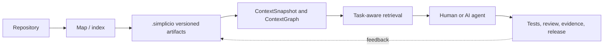
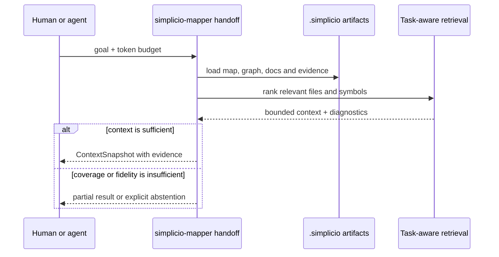
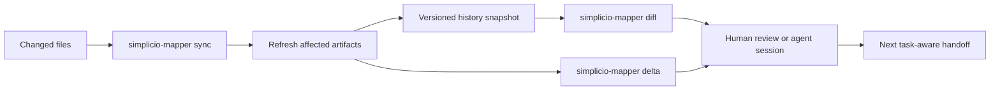
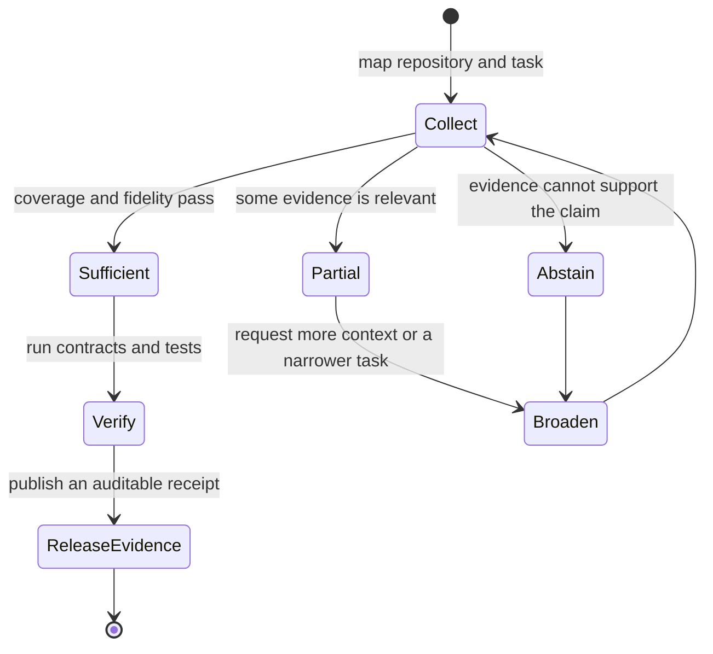

# simplicio-mapper

> Turn a repository into bounded, queryable context that people and AI agents can trust.

[](https://pypi.org/project/simplicio-mapper/) [](https://pypi.org/project/simplicio-mapper/) [](https://github.com/simpletibr/simplicio-loop/releases/latest) [](LICENSE)

[Docs site](https://wesleysimplicio.github.io/simplicio-mapper/)

**Languages:** [English](README.md) · [Português](READMEs/README.pt-BR.md) · [Español](READMEs/README.es-ES.md) · [Français](READMEs/README.fr-FR.md) · [Italiano](READMEs/README.it-IT.md) · [Polski](READMEs/README.pl-PL.md) · [Русский](READMEs/README.ru-RU.md) · [中文](READMEs/README.zh-CN.md) · [日本語](READMEs/README.ja-JP.md) · [한국어](READMEs/README.ko-KR.md) · [हिन्दी](READMEs/README.hi-IN.md) · [العربية](READMEs/README.ar-SA.md) · [עברית](READMEs/README.he-IL.md) · [Bahasa Indonesia](READMEs/README.id-ID.md) · [Bahasa Melayu](READMEs/README.ms-MY.md)

<p align="center">
  <a href="video/assets/simplicio-mapper-ink-press.en.mp4">
    
  </a>
  <br>
  <strong><a href="video/assets/simplicio-mapper-ink-press.en.mp4">Watch the 36-second product film</a></strong>
</p>

`simplicio-mapper` is the mapping engine in the Simplicio ecosystem. It reads a codebase once, produces versioned artifacts under `.simplicio/`, and gives a human or an agent a small, explainable context pack instead of an unbounded dump of files. The result is useful for orientation, implementation planning, review, impact analysis, onboarding, and handoffs.

## What it delivers

| Need | Mapper output |
| --- | --- |
| Understand a new repository | Project map, architecture inventory, symbols, routes, flows, business rules, and onboarding survey |
| Find the smallest useful context | Task-aware `handoff` and `orient` packs with relevance, coverage, token budget, and fidelity diagnostics |
| Keep context current | Incremental map/sync, history snapshots, semantic diffs, and deterministic graph deltas |
| Verify a claim before relying on it | Versioned JSON contracts, artifact validation, confidence tags, behavioral receipts, and evidence certificates |

The Mapper does not replace tests, code review, or judgment. It makes the evidence those practices need easier to locate, bounded enough to inspect, and explicit when the available context is not sufficient.

## Quick start

Requires Python 3.10 or newer.

```bash
pip install -U simplicio-mapper

# Create or refresh machine-readable artifacts in ./.simplicio
simplicio-mapper index . --json

# Produce architecture docs from the artifacts
simplicio-mapper docs . --json

# Build a compact, task-aware context handoff
simplicio-mapper handoff . \
  --goal "trace the authentication flow and its tests" \
  --token-budget 1200 \
  --json
```
By default, `handoff` and `orient` emit TOON for the LLM-facing context path. Use `--json` for machine-readable output or set `SIMPLICIO_TOON=0` to disable the default; canonical artifacts under `.simplicio/` remain JSON.

For a fast shallow skeleton before the deep pass, use `simplicio-mapper macro . --json`. For a repository whose files changed, use `simplicio-mapper sync . --check --json` to see whether artifacts are stale, then `simplicio-mapper sync . --json` to refresh only what the diff affects.

## A map is more than a file list



The diagram is deliberately a loop: mapping gives an agent a bounded starting point, while verified work returns new facts to the next map instead of turning an old prompt into assumed truth.

### Retrieval with an actual budget

<p align="center">
  
</p>

`handoff` ranks artifacts against an explicit goal or task file. Its output reports the selected context, coverage, token budget, penalties, and fidelity state. If the map cannot support the requested claim, the contract can abstain or mark the context as partial instead of manufacturing confidence.



```bash
# Inspect the mapped repository as structured data
simplicio-mapper inspect . --json

# Ask graph questions without loading the whole repository into a prompt
simplicio-mapper ask . impact "UserService" --json
simplicio-mapper ask . tests-for "authentication" --json
```

### ContextGraph that stays current

<p align="center">
  
</p>

The artifacts are designed for change: snapshots keep history, `diff` compares two snapshot IDs semantically, and `delta` emits a deterministic update for downstream consumers. This lets separate agents or sessions share a stable view of a repository without repeatedly rediscovering the same files.



```bash
simplicio-mapper history . --json
simplicio-mapper diff . --from <snapshot-id> --to <snapshot-id> --json
simplicio-mapper delta . --changed-paths src/auth.py,tests/test_auth.py --json
```

### Evidence that survives the handoff

<p align="center">
  
</p>

Artifacts are not just prompts. They have versioned schemas under [`contracts/`](contracts/), validation commands, compatibility fixtures, and evidence records. This makes it possible to distinguish a measured result from an operator assertion and to audit the path from repository facts to a release decision.



```bash
# Validate generated mapper artifacts against the public schemas
simplicio-mapper contract validate .simplicio

# Validate the repository contract fixtures
simplicio-mapper doctor --contracts
```

## Two complementary surfaces

- **Python package — `simplicio-mapper`:** the canonical, installable mapping engine and contract surface.
- **npm package — [`@wesleysimplicio/llm-project-mapper`](https://www.npmjs.com/package/@wesleysimplicio/llm-project-mapper):** a project starter/scaffolder that can include Mapper in a new workflow.

If you already have a repository, install the Python package. If you are bootstrapping a project, the npm starter is the convenient entry point; it is not a substitute for a fresh mapper index after the project evolves.

## Ecosystem

`mapper` provides grounded repository context to the rest of Simplicio:

```text
simplicio-mapper → simplicio-runtime → simplicio-dev-cli → simplicio-loop
      facts            execution          delivery           sustained work
```

- [`simplicio-runtime`](https://github.com/simpletibr/simplicio-runtime) executes governed agent work.
- [`simplicio-dev-cli`](https://github.com/simpletibr/simplicio-loop/tree/main/packages/dev-cli) turns plans and checks into a developer workflow.
- [`simplicio-loop`](https://github.com/simpletibr/simplicio-loop) keeps a bounded body of work moving with receipts and stop conditions.

## Documentation and release notes

- [Documentation site](https://wesleysimplicio.github.io/simplicio-mapper/)
- [Integration guide](SIMPLICIO_INTEGRATION.md)
- [Artifact contracts](contracts/)
- [Architecture and evidence docs](docs/)
- [Changelog](CHANGELOG.md)
- [PyPI publishing notes](PYPI.md)
- [GitHub releases](https://github.com/simpletibr/simplicio-loop/releases)
- [Release verification guide](.specs/workflow/RELEASE.md)

## License

MIT. See [LICENSE](LICENSE).

<p align="center">
  <a href="https://star-history.com/#simpletibr/simplicio-mapper&Date">
    
  </a>
</p>
